# Arbre des Widgets - app_main_screen.dart

## 📚 Table des matières
1. [Vue d'ensemble](#vue-densemble)
2. [Hiérarchie complète des widgets](#hiérarchie-complète-des-widgets)
3. [Détail par composant](#détail-par-composant)
4. [Relations et flux de données](#relations-et-flux-de-données)

---

## Vue d'ensemble

Le fichier `app_main_screen.dart` contient **3 classes principales** de widgets :
1. **AppMainScreen** - Widget racine avec navigation bottom bar
2. **MyAppHomeScreen** - Écran d'accueil avec les recettes
3. **BannerToExplore** - Banner promotionnel

---

## Hiérarchie complète des widgets

### Arbre global

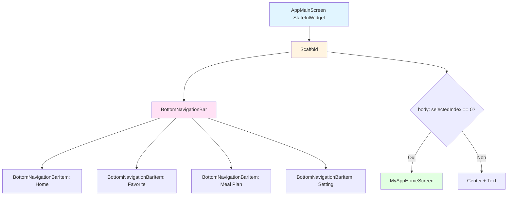

---

### Arbre détaillé de MyAppHomeScreen

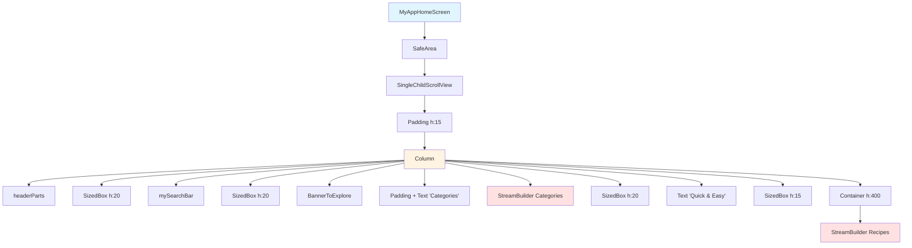

---

## Détail par composant

### 1. AppMainScreen - Structure complète

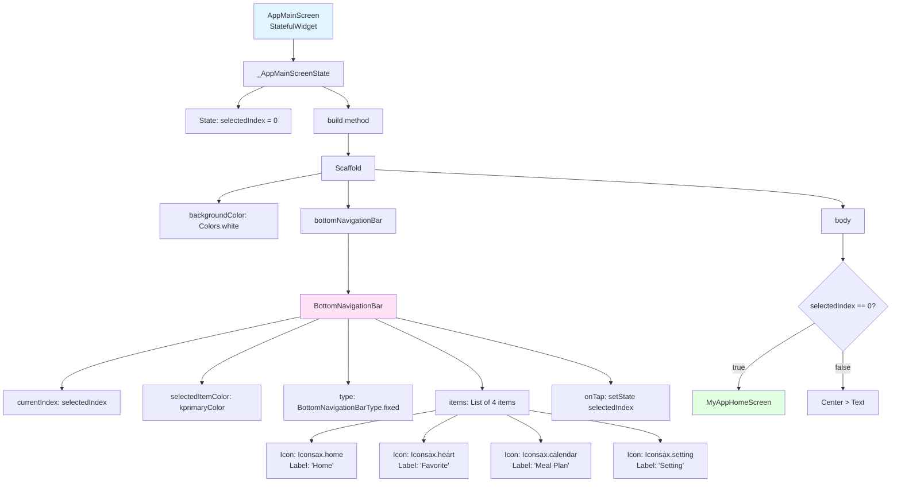

---

### 2. MyAppHomeScreen - headerParts()

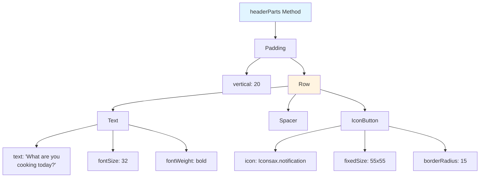

---

### 3. MyAppHomeScreen - mySearchBar()

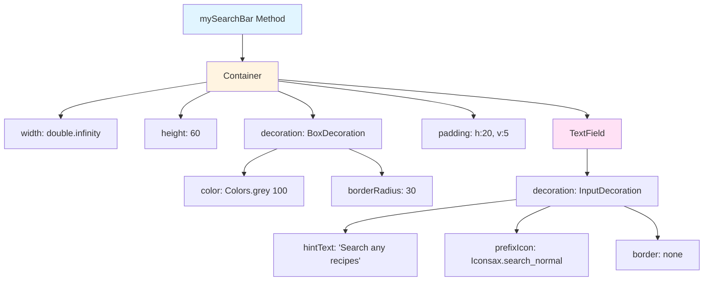

---

### 4. BannerToExplore - Structure complète

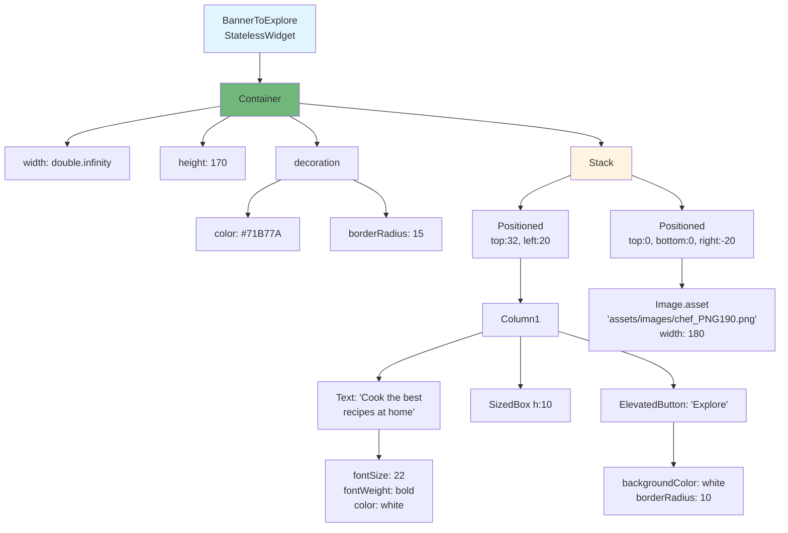

---

### 5. StreamBuilder Categories - Détail complet

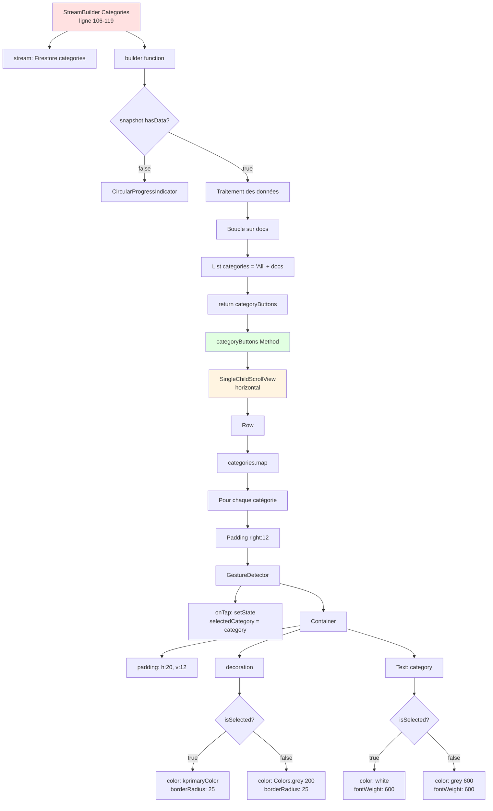

---

### 6. StreamBuilder Recipes - Détail complet

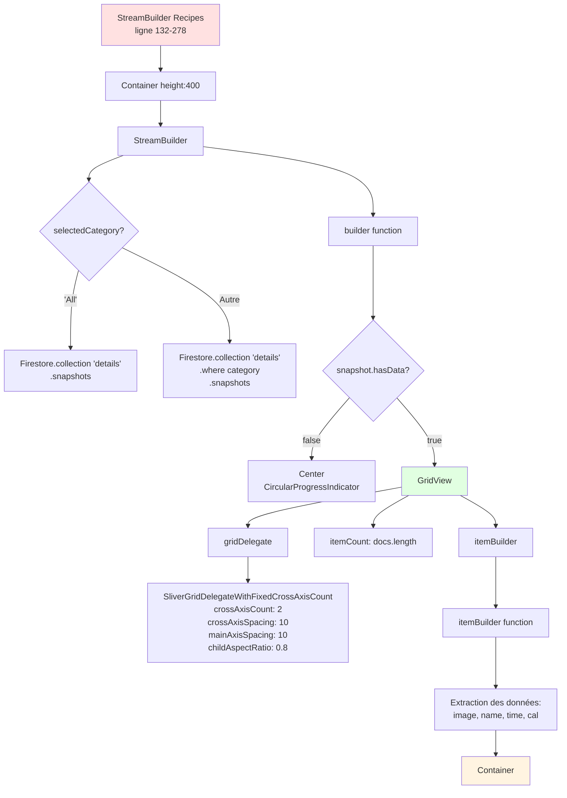

---

### 7. Item de recette (GridView) - Structure détaillée

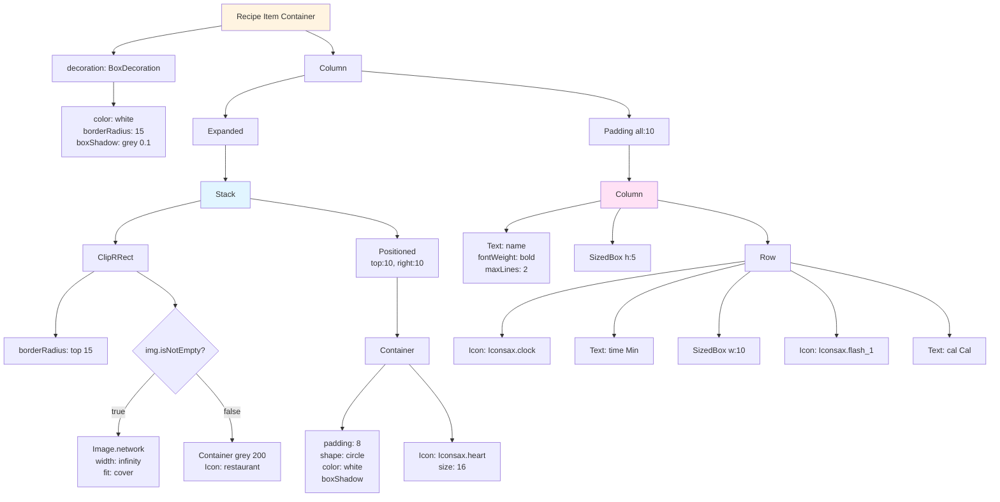

---

## Relations et flux de données

### Flux de navigation

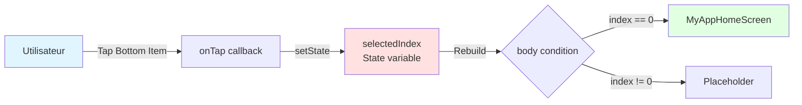

---

### Flux des catégories

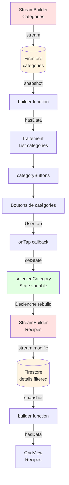

---

### Flux complet de l'état

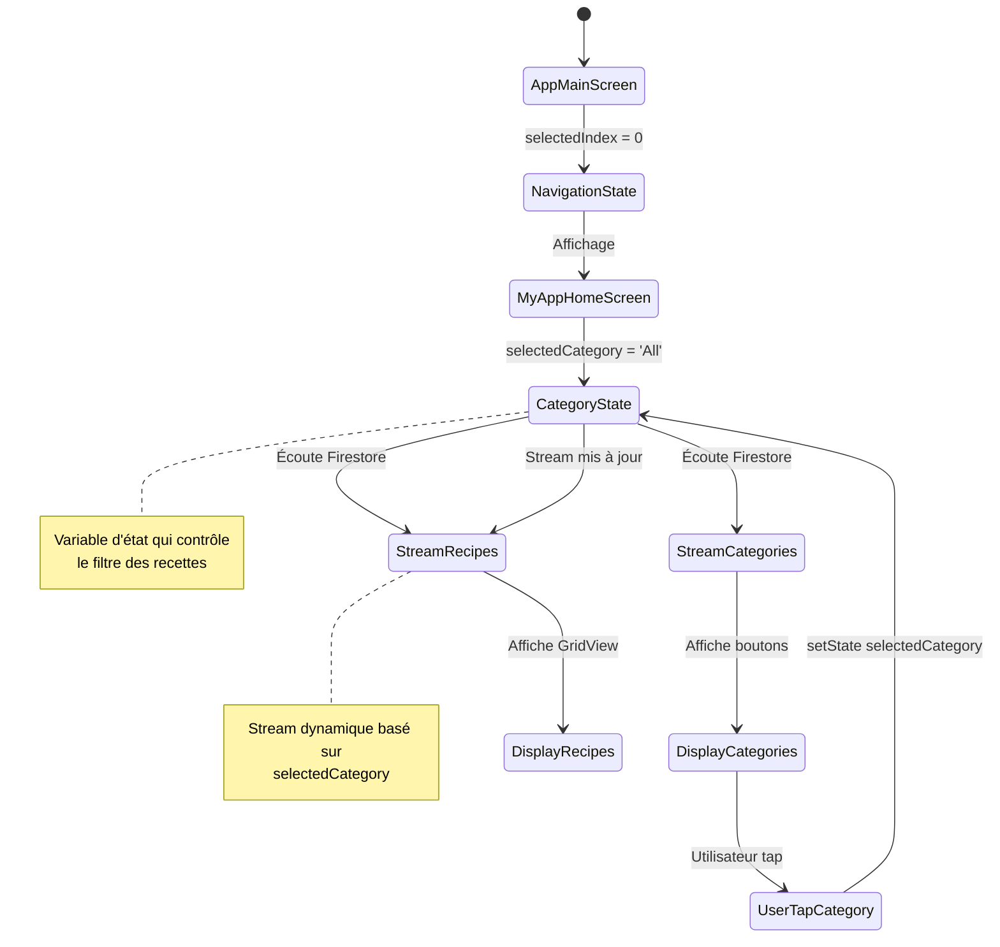

---

### Relations de dépendance entre widgets

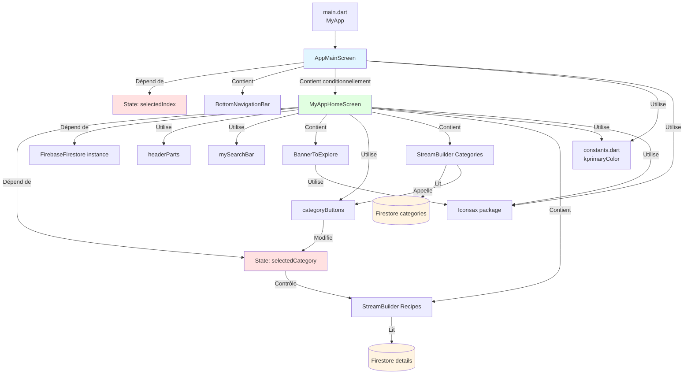

---

### Hiérarchie des StatefulWidgets et leur State

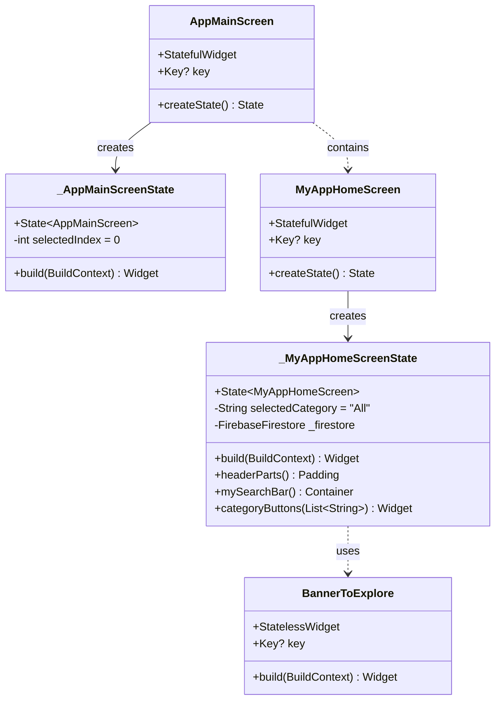

---

## Récapitulatif visuel

### Carte mentale de la structure

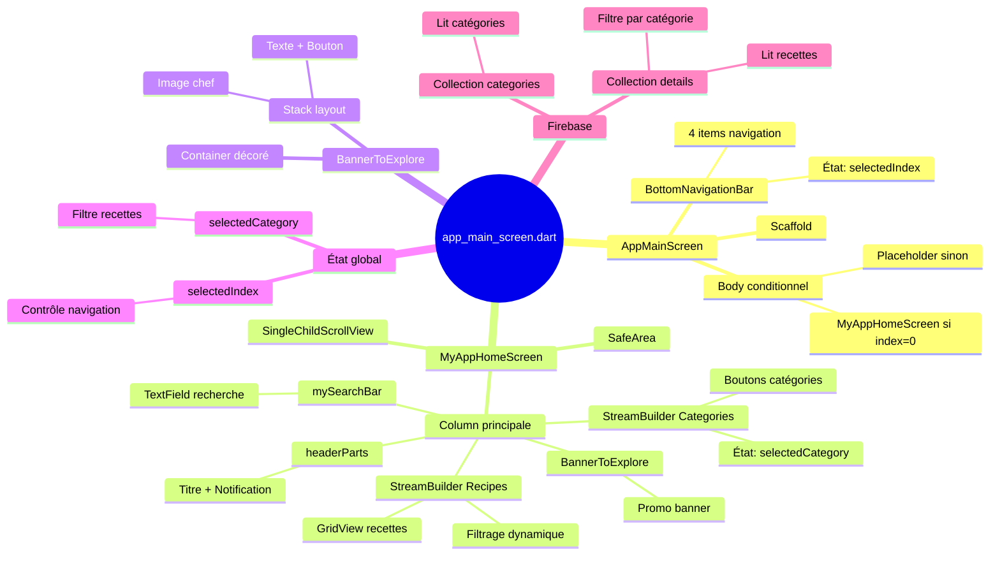

---

## Points clés à retenir

### Structure hiérarchique
1. **AppMainScreen** = Widget racine avec navigation
   - État : `selectedIndex` (int)
   - Rôle : Gérer la navigation entre pages

2. **MyAppHomeScreen** = Page d'accueil
   - État : `selectedCategory` (String)
   - Rôle : Afficher et filtrer les recettes

3. **BannerToExplore** = Widget sans état
   - Rôle : Affichage statique promotionnel

### Relations importantes
- **selectedIndex** (dans AppMainScreen) → Contrôle quelle page afficher
- **selectedCategory** (dans MyAppHomeScreen) → Contrôle quel Stream Firestore utiliser
- **StreamBuilder Categories** → Modifie selectedCategory via callbacks
- **selectedCategory** → Déclenche rebuild du StreamBuilder Recipes

### Flux de données
```
Firestore → StreamBuilder → UI → User interaction → setState → Rebuild → Firestore
```

---

**Document créé pour visualiser l'arbre des widgets de app_main_screen.dart**
*Tous les widgets et leurs relations sont documentés avec des diagrammes Mermaid*

