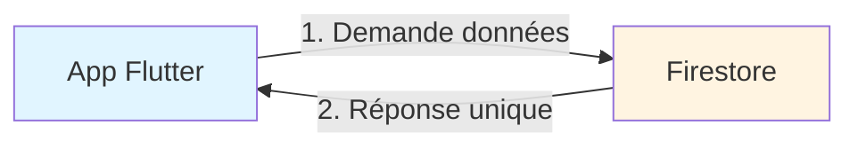
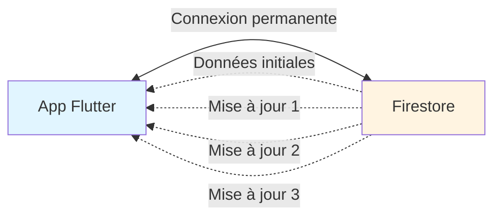
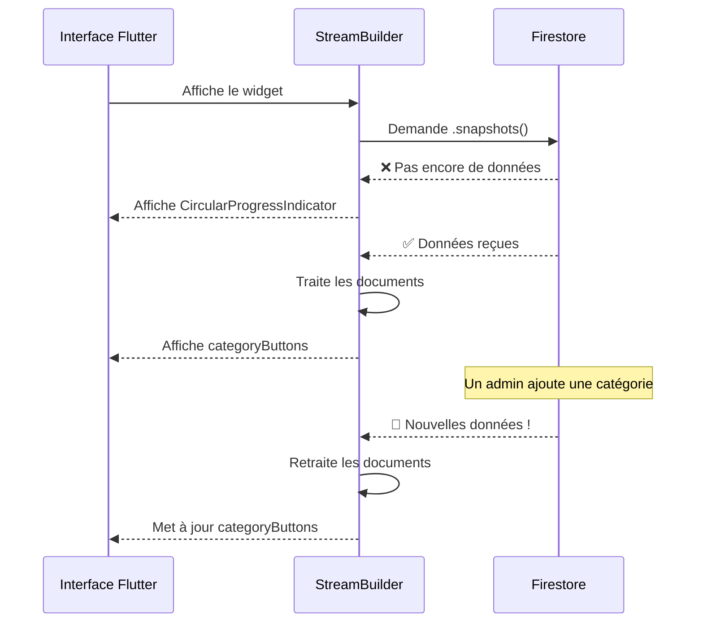
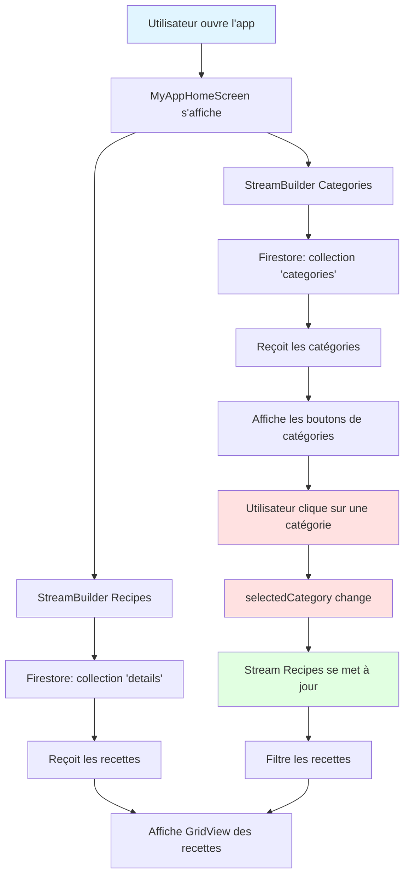
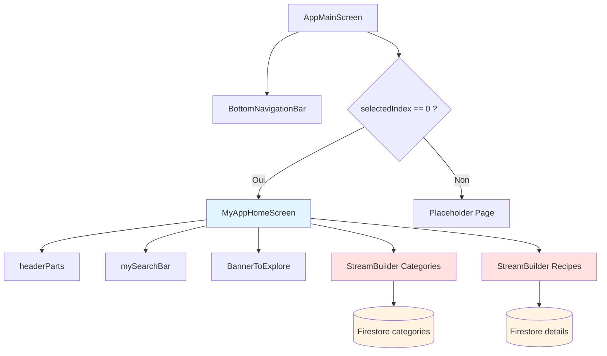
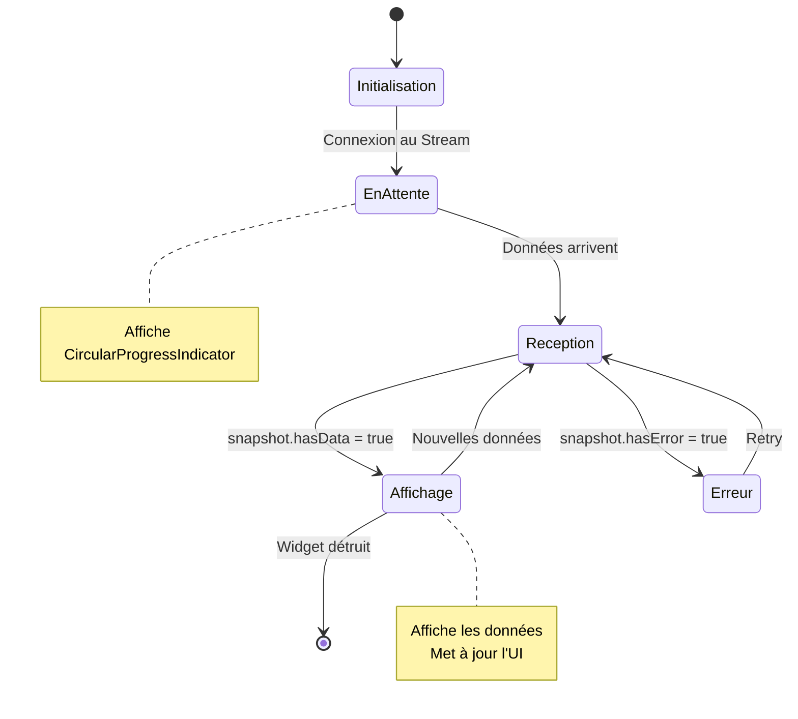
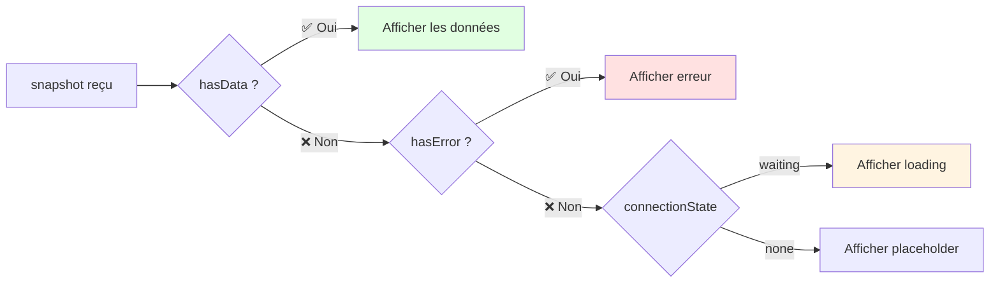
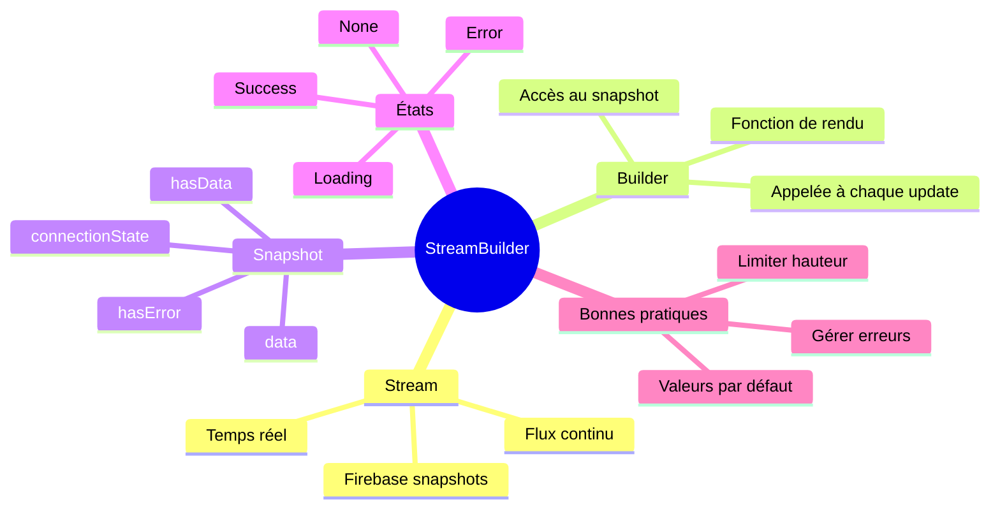

# Documentation : StreamBuilder et Firebase dans app_main_screen.dart

## 📚 Table des matières
1. [Vue d'ensemble](#vue-densemble)
2. [Qu'est-ce qu'un Stream ?](#quest-ce-quun-stream)
3. [StreamBuilder : Le pont entre Stream et UI](#streambuilder--le-pont-entre-stream-et-ui)
4. [Analyse du code](#analyse-du-code)
5. [Diagrammes](#diagrammes)
6. [Bonnes pratiques](#bonnes-pratiques)

> 📖 **Voir aussi** : [Arbre des widgets complet](01-arbre_widgets.md) pour une visualisation détaillée de la hiérarchie des widgets

---

## Vue d'ensemble

Dans votre application de recettes, vous utilisez **Firebase Firestore** pour stocker et récupérer des données en temps réel. Le `StreamBuilder` est l'outil qui permet à votre interface Flutter de se mettre à jour automatiquement quand les données dans Firestore changent.

### Analogie simple 🎯
Imaginez une **station de radio** :
- **Firestore** = La station qui diffuse de la musique (les données)
- **Stream** = Les ondes radio qui transportent la musique
- **StreamBuilder** = Votre radio qui capte les ondes et joue la musique

Quand la station change de chanson, votre radio la joue instantanément. Pareil pour vos données !

---

## Qu'est-ce qu'un Stream ?

### Définition
Un **Stream** est un flux de données qui arrive au fil du temps. Contrairement à une requête classique qui donne une réponse unique, un Stream reste ouvert et envoie des données à chaque changement.

### Diagramme : Requête classique vs Stream


**Requête classique** : Une question, une réponse, terminé.


**Stream** : Connexion continue, données envoyées à chaque changement.

---

## StreamBuilder : Le pont entre Stream et UI

### Rôle du StreamBuilder

Le `StreamBuilder` est un widget Flutter qui :
1. **Écoute** un Stream
2. **Reconstruit** automatiquement l'interface quand de nouvelles données arrivent
3. **Gère** les différents états (chargement, données, erreur)

### Anatomie d'un StreamBuilder

```dart
StreamBuilder<TypeDeDonnées>(
  stream: sourceDesDonnées,      // D'où viennent les données ?
  builder: (context, snapshot) { // Comment afficher les données ?
    // Logic ici
  },
)
```

---

## Analyse du code

### Exemple 1 : Récupération des catégories

```dart
StreamBuilder<QuerySnapshot>(
  stream: _firestore.collection('categories').snapshots(),
  builder: (context, snapshot) {
    if (snapshot.hasData) {
      List<String> categories = ["All"];
      for (var doc in snapshot.data!.docs) {
        categories.add(doc['name']);
      }
      return categoryButtons(categories);
    } else {
      return CircularProgressIndicator();
    }
  },
)
```

#### Décortiquons ce code pas à pas :

| Partie | Explication |
|--------|-------------|
| `StreamBuilder<QuerySnapshot>` | Type de données attendues : un "snapshot" (photo) de la base de données |
| `stream: _firestore.collection('categories').snapshots()` | Source : la collection 'categories' dans Firestore. `.snapshots()` crée le Stream |
| `builder: (context, snapshot)` | Fonction appelée à chaque nouveau snapshot reçu |
| `snapshot.hasData` | Vérifie si des données sont disponibles |
| `snapshot.data!.docs` | Liste de tous les documents de la collection |
| `doc['name']` | Accès au champ 'name' de chaque document |

### Diagramme : Flux des catégories



---

### Exemple 2 : Récupération des recettes avec filtre

```dart
StreamBuilder<QuerySnapshot>(
  stream: selectedCategory == "All" 
      ? _firestore.collection('details').snapshots()
      : _firestore.collection('details')
          .where('category', isEqualTo: selectedCategory)
          .snapshots(),
  builder: (context, snapshot) {
    if (snapshot.hasData) {
      return GridView.builder(
        // Configuration du GridView
        itemCount: snapshot.data!.docs.length,
        itemBuilder: (context, index) {
          final recipe = snapshot.data!.docs[index];
          final img = (recipe['image'] ?? '').toString();
          final name = (recipe['name'] ?? 'Sans nom').toString();
          // ... Affichage de la recette
        },
      );
    } else {
      return Center(child: CircularProgressIndicator());
    }
  },
)
```

#### Points clés :

**1. Stream conditionnel**
```dart
selectedCategory == "All" 
    ? _firestore.collection('details').snapshots()  // Toutes les recettes
    : _firestore.collection('details')
        .where('category', isEqualTo: selectedCategory)
        .snapshots()  // Recettes filtrées
```

**2. Gestion des données manquantes**
```dart
final img = (recipe['image'] ?? '').toString();
final name = (recipe['name'] ?? 'Sans nom').toString();
```
L'opérateur `??` dit : "Si la valeur est null, utilise cette valeur par défaut"

---

### Diagramme : Flux complet de l'application



---

## Diagrammes

### Architecture de l'écran principal



---

### Cycle de vie d'un StreamBuilder



---

### États du snapshot



---

## Bonnes pratiques

### ✅ À FAIRE

**1. Toujours gérer les cas d'erreur**
```dart
StreamBuilder<QuerySnapshot>(
  stream: _firestore.collection('data').snapshots(),
  builder: (context, snapshot) {
    if (snapshot.hasError) {
      return Text('Erreur: ${snapshot.error}');
    }
    
    if (snapshot.hasData) {
      return ListView(...);
    }
    
    return CircularProgressIndicator();
  },
)
```

**2. Utiliser des valeurs par défaut pour les données manquantes**
```dart
final name = (recipe['name'] ?? 'Sans nom').toString();
final time = (recipe['time'] ?? '').toString();
```

**3. Limiter la hauteur des widgets scrollables dans un StreamBuilder**
```dart
Container(
  height: 400,  // ✅ Hauteur fixe
  child: StreamBuilder(...),
)
```

---

### ❌ À ÉVITER

**1. Oublier de gérer l'absence de données**
```dart
// ❌ MAUVAIS
builder: (context, snapshot) {
  return ListView.builder(
    itemCount: snapshot.data!.docs.length,  // Crash si pas de données !
  );
}

// ✅ BON
builder: (context, snapshot) {
  if (!snapshot.hasData) {
    return CircularProgressIndicator();
  }
  return ListView.builder(
    itemCount: snapshot.data!.docs.length,
  );
}
```

**2. Créer plusieurs StreamBuilders pour la même collection**
```dart
// ❌ MAUVAIS - Plusieurs connexions inutiles
StreamBuilder(stream: _firestore.collection('data').snapshots(), ...)
StreamBuilder(stream: _firestore.collection('data').snapshots(), ...)

// ✅ BON - Utiliser un Stream unique ou state management
```

**3. Ne pas limiter les requêtes**
```dart
// ❌ MAUVAIS - Récupère toutes les recettes
_firestore.collection('details').snapshots()

// ✅ BON - Limite si beaucoup de données
_firestore.collection('details').limit(20).snapshots()
```

---

## Résumé visuel



---

## Conclusion

Le `StreamBuilder` est un outil puissant qui simplifie énormément la gestion des données en temps réel dans Flutter. Dans votre application :

1. **Premier StreamBuilder** récupère les catégories et les affiche comme boutons
2. **Deuxième StreamBuilder** récupère les recettes, filtrées selon la catégorie sélectionnée
3. Les deux se mettent à jour automatiquement quand les données changent dans Firestore

**Points à retenir :**
- Un Stream = un flux de données continu
- StreamBuilder = widget qui écoute un Stream et reconstruit l'UI
- Toujours gérer les états : chargement, données, erreur
- Firebase `.snapshots()` crée automatiquement un Stream

---

**Document créé pour expliquer le fonctionnement de StreamBuilder dans app_main_screen.dart**
*Destiné aux développeurs souhaitant comprendre l'architecture de l'application*

