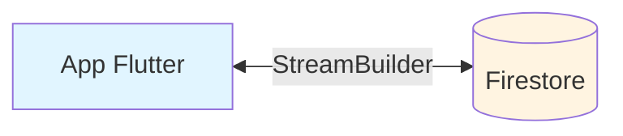
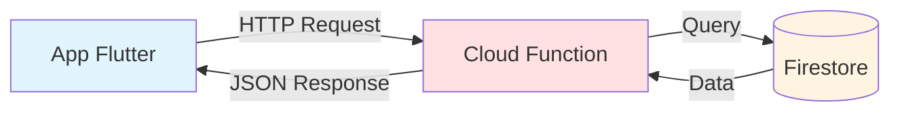
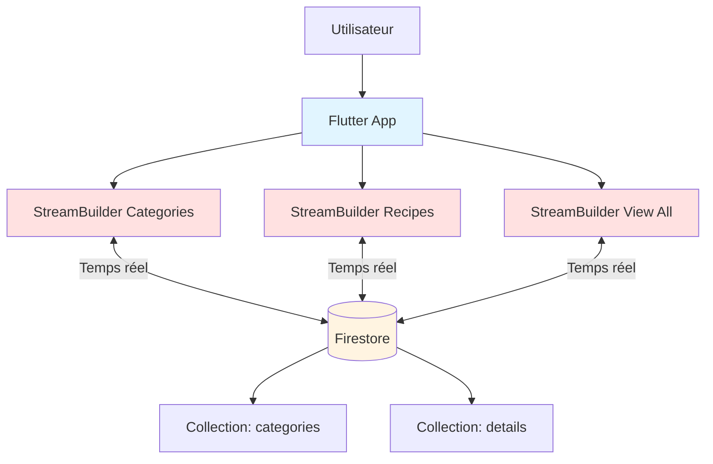
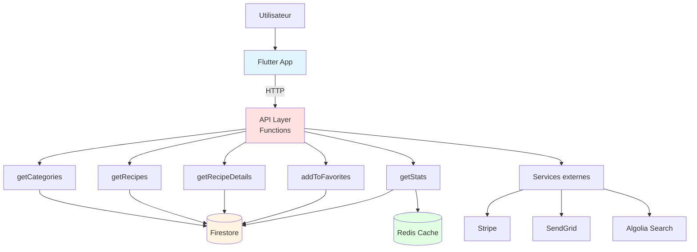

# Analyse Critique : StreamBuilder Direct vs Firebase Functions

## Introduction

Un débat pédagogique intéressant : **Devrait-on utiliser Firebase Functions au lieu de StreamBuilder direct avec Firestore ?**

Cette documentation analyse les deux approches de manière objective, sans parti pris.

**Spoiler** : Les deux approches sont valides. Le choix dépend du contexte, des besoins, et de l'échelle du projet.

---

## Table des matières

1. [Les deux approches expliquées](#les-deux-approches-expliquées)
2. [Analyse comparative](#analyse-comparative)
3. [Quand utiliser chaque approche](#quand-utiliser-chaque-approche)
4. [Architecture actuelle de l'application](#architecture-actuelle-de-lapplication)
5. [Architecture avec Firebase Functions](#architecture-avec-firebase-functions)
6. [Exemples de code comparés](#exemples-de-code-comparés)
7. [Verdict pédagogique](#verdict-pédagogique)

---

## Les deux approches expliquées

### Approche 1 : StreamBuilder Direct (Actuelle)

**Principe**
- L'application Flutter se connecte DIRECTEMENT à Firestore
- Les données transitent directement entre Firestore et l'app
- Pas de serveur intermédiaire

**Schéma**



**Code actuel**

```dart
StreamBuilder<QuerySnapshot>(
  stream: _firestore.collection('details').snapshots(),
  builder: (context, snapshot) {
    // Affichage direct
  },
)
```

---

### Approche 2 : Firebase Functions (Alternative)

**Principe**
- L'application Flutter appelle une API (Cloud Function)
- La Cloud Function interroge Firestore
- La fonction traite et retourne les données
- Un serveur intermédiaire (function) gère la logique

**Schéma**



**Code avec Functions**

```dart
// App Flutter
Future<List<Recipe>> getRecipes() async {
  final response = await http.get(
    Uri.parse('https://region-project.cloudfunctions.net/getRecipes'),
  );
  return parseRecipes(response.body);
}
```

```javascript
// Cloud Function (Node.js)
exports.getRecipes = functions.https.onRequest(async (req, res) => {
  const snapshot = await admin.firestore().collection('details').get();
  const recipes = snapshot.docs.map(doc => doc.data());
  res.json(recipes);
});
```

---

## Analyse comparative

### Tableau comparatif complet

| Critère | StreamBuilder Direct | Firebase Functions |
|---------|---------------------|-------------------|
| **Simplicité code** | Très simple | Plus complexe |
| **Temps de développement** | Rapide | Plus long |
| **Courbe d'apprentissage** | Facile | Moyenne à difficile |
| **Temps réel** | Natif et automatique | Nécessite WebSocket/Polling |
| **Performances (petit dataset)** | Excellentes | Bonnes |
| **Performances (gros dataset)** | Peut être lent | Meilleures (filtrage serveur) |
| **Sécurité** | Rules Firestore | Logique serveur complète |
| **Scalabilité** | Limitée | Excellente |
| **Coûts (petite app)** | Bas | Plus élevés |
| **Coûts (grande app)** | Élevés (lecture docs) | Optimisables |
| **Logique métier** | Côté client | Côté serveur |
| **Testabilité** | Difficile | Facile (backend isolé) |
| **Hors ligne** | Cache Firestore natif | Cache manuel |
| **Agrégations complexes** | Difficile/impossible | Facile |
| **Maintenance** | Simple | Plus complexe |

---

## Analyse détaillée par critère

### 1. SIMPLICITÉ ET RAPIDITÉ DE DÉVELOPPEMENT

**StreamBuilder Direct : GAGNANT pour prototypes et petites apps**

Avantages :
- 3 lignes de code pour lire des données en temps réel
- Pas besoin d'apprendre Node.js ou autre backend
- Pas de configuration serveur
- Déploiement instantané

Inconvénients :
- Peut devenir complexe avec beaucoup de logique
- Tout le code métier est dans l'app

**Exemple actuel (simple)**
```dart
StreamBuilder<QuerySnapshot>(
  stream: _firestore.collection('details').snapshots(),
  builder: (context, snapshot) {
    if (snapshot.hasData) {
      return ListView(...);
    }
    return CircularProgressIndicator();
  },
)
```

**Avec Firebase Functions (plus complexe)**
```dart
// 1. Créer la fonction
// 2. Déployer la fonction
// 3. Appeler depuis Flutter
Future<void> loadRecipes() async {
  setState(() => isLoading = true);
  final response = await http.get(url);
  final recipes = parseRecipes(response.body);
  setState(() {
    this.recipes = recipes;
    isLoading = false;
  });
}
```

---

### 2. TEMPS RÉEL

**StreamBuilder Direct : GAGNANT absolu**

StreamBuilder avec Firestore :
- Temps réel natif
- Mises à jour automatiques
- Pas de code supplémentaire

Firebase Functions :
- Pas de temps réel par défaut
- Nécessite WebSocket ou polling
- Code complexe pour simuler le temps réel

**Cas d'usage** : Application de chat, tableau de bord live
→ StreamBuilder est imbattable

---

### 3. SÉCURITÉ

**Firebase Functions : GAGNANT pour logique complexe**

**StreamBuilder Direct**
```javascript
// Firestore Rules
match /details/{document} {
  allow read: if request.auth != null;
  allow write: if request.auth.uid == resource.data.userId;
}
```

Limites :
- Rules complexes difficiles à écrire
- Pas de logique métier avancée possible
- Validation limitée

**Firebase Functions**
```javascript
exports.createRecipe = functions.https.onCall(async (data, context) => {
  // Vérification utilisateur
  if (!context.auth) {
    throw new functions.https.HttpsError('unauthenticated', 'User must be logged in');
  }
  
  // Logique métier complexe
  if (data.calories < 0 || data.calories > 5000) {
    throw new functions.https.HttpsError('invalid-argument', 'Invalid calories');
  }
  
  // Vérification dans d'autres collections
  const userDoc = await admin.firestore().collection('users').doc(context.auth.uid).get();
  if (!userDoc.data().isPremium && data.isPrivate) {
    throw new functions.https.HttpsError('permission-denied', 'Premium required');
  }
  
  // Opérations multiples
  const batch = admin.firestore().batch();
  // ... logique complexe
  await batch.commit();
  
  return { success: true };
});
```

---

### 4. PERFORMANCE ET SCALABILITÉ

**Dépend du cas d'usage**

**Scénario 1 : 100 recettes, 1000 utilisateurs**
→ StreamBuilder Direct GAGNANT
- Performance excellente
- Pas de latence serveur
- Cache Firestore efficace

**Scénario 2 : 100,000 recettes, 100,000 utilisateurs**
→ Firebase Functions GAGNANT
- Filtrage côté serveur
- Agrégations possibles
- Pagination efficace
- Cache Redis possible

**Exemple problématique actuel**

```dart
// PROBLÈME : Charge TOUTES les recettes
stream: _firestore.collection('details').snapshots()

// Si 10,000 recettes :
// - 10,000 documents lus
// - Bande passante importante
// - Coût élevé
```

**Solution avec Functions**

```javascript
// Charge seulement ce qui est nécessaire
exports.getRecipesPaginated = functions.https.onRequest(async (req, res) => {
  const page = req.query.page || 0;
  const limit = 20;
  
  const snapshot = await admin.firestore()
    .collection('details')
    .limit(limit)
    .offset(page * limit)
    .get();
    
  // Agrégation côté serveur
  const stats = {
    total: await admin.firestore().collection('details').count().get(),
    avgCalories: calculateAverage(snapshot.docs)
  };
  
  res.json({ recipes: snapshot.docs, stats });
});
```

---

### 5. COÛTS FIREBASE

**Analyse des coûts**

**StreamBuilder Direct**

Facturation Firestore :
- Lecture de document : 0.036 $ / 100,000 lectures
- Écriture de document : 0.108 $ / 100,000 écritures

Exemple app actuelle (10,000 utilisateurs actifs/jour) :
- Chaque utilisateur charge 50 recettes = 500,000 lectures/jour
- 500,000 × 30 jours = 15,000,000 lectures/mois
- Coût : 15M × 0.036 / 100,000 = **5.40 $/mois**

**Firebase Functions**

Facturation :
- Invocations : 0.40 $ / million
- CPU-secondes : 0.0000025 $ / GHz-seconde
- Réseau : 0.12 $ / GB

Même exemple avec Functions :
- 300,000 appels API/jour (utilisateurs chargent 1 fois)
- 9,000,000 appels/mois
- Coût Functions : 9M × 0.40 / 1M = **3.60 $/mois**
- Coût Firestore (backend lit) : **2 $/mois**
- **Total : 5.60 $/mois**

**Verdict** : Coûts similaires pour petite échelle, Functions plus optimisable à grande échelle

---

### 6. LOGIQUE MÉTIER ET AGRÉGATIONS

**Firebase Functions : GAGNANT pour logique complexe**

**Cas impossible avec StreamBuilder seul**

```dart
// ❌ IMPOSSIBLE avec StreamBuilder direct
// "Donne-moi les 10 recettes les plus populaires du mois, 
//  avec le nombre moyen de likes par catégorie,
//  et le temps de préparation moyen par chef"
```

**Possible avec Functions**

```javascript
exports.getPopularRecipes = functions.https.onRequest(async (req, res) => {
  const startOfMonth = new Date();
  startOfMonth.setDate(1);
  
  // Agrégation complexe
  const recipes = await admin.firestore()
    .collection('details')
    .where('createdAt', '>=', startOfMonth)
    .orderBy('likes', 'desc')
    .limit(10)
    .get();
  
  // Calculs serveur
  const stats = await Promise.all(
    categories.map(async cat => {
      const snapshot = await admin.firestore()
        .collection('details')
        .where('category', '==', cat)
        .get();
      
      return {
        category: cat,
        avgLikes: calculateAverage(snapshot.docs.map(d => d.data().likes)),
        avgPrepTime: calculateAverage(snapshot.docs.map(d => d.data().time))
      };
    })
  );
  
  res.json({ recipes, stats });
});
```

---

### 7. TESTABILITÉ

**Firebase Functions : GAGNANT**

**StreamBuilder Direct**
- Difficile à tester (dépend de Firebase)
- Tests nécessitent émulateur Firestore
- Mock complexe

**Firebase Functions**
```javascript
// Facile à tester avec Jest
describe('getRecipes', () => {
  it('should return recipes list', async () => {
    const req = { query: { category: 'Breakfast' } };
    const res = { json: jest.fn() };
    
    await getRecipes(req, res);
    
    expect(res.json).toHaveBeenCalledWith(
      expect.arrayContaining([
        expect.objectContaining({ category: 'Breakfast' })
      ])
    );
  });
});
```

---

## Quand utiliser chaque approche

### Utilisez StreamBuilder Direct si :

1. Prototype ou MVP rapide
2. Application simple avec peu de logique métier
3. Équipe uniquement Flutter/Dart
4. Budget de développement limité
5. Besoin de temps réel absolu
6. Dataset petit à moyen (< 10,000 documents actifs)
7. Application d'apprentissage ou projet étudiant
8. Logique de validation simple

**Exemples** :
- Application de recettes (notre cas actuel)
- Todo list collaborative
- Chat simple
- Tableau de bord personnel
- Portfolio

---

### Utilisez Firebase Functions si :

1. Application production à grande échelle
2. Logique métier complexe
3. Besoin d'agrégations et statistiques
4. Intégration avec services tiers (Stripe, SendGrid, etc.)
5. Traitement de données sensibles
6. Opérations planifiées (cron jobs)
7. Validation complexe côté serveur
8. API publique pour plusieurs clients (web, mobile, etc.)
9. Dataset très large (> 50,000 documents)
10. Besoin de caching avancé

**Exemples** :
- E-commerce
- Réseau social
- Application bancaire
- Plateforme de réservation
- Système de notifications complexe

---

## Architecture actuelle de l'application

### Diagramme de l'architecture actuelle



### Points forts de l'approche actuelle

1. **Simplicité extrême**
   - Code compréhensible par un débutant
   - Pas de configuration serveur
   - Déploiement instantané

2. **Temps réel natif**
   - Mises à jour automatiques
   - Si quelqu'un ajoute une recette, elle apparaît instantanément

3. **Développement rapide**
   - Application fonctionnelle en quelques heures
   - Idéal pour apprendre Flutter et Firebase

4. **Coûts bas pour usage actuel**
   - Petite échelle = coûts minimaux
   - Pas de coût de serveur

---

### Points faibles de l'approche actuelle

1. **Pas de logique métier serveur**
   ```dart
   // Toute la logique est dans l'app
   // Si on veut changer la logique, il faut mettre à jour l'app
   if (recipe['cal'] > 500) {
     // Logique dans l'app = risque de hack
   }
   ```

2. **Pas d'agrégations**
   ```dart
   // Impossible de faire :
   // - Moyenne des calories par catégorie
   // - Top 10 recettes du mois
   // - Statistiques avancées
   ```

3. **Scalabilité limitée**
   ```dart
   // Si 100,000 recettes, l'app charge tout
   stream: _firestore.collection('details').snapshots()
   ```

4. **Sécurité basique**
   ```javascript
   // Rules Firestore limitées
   allow read: if request.auth != null;
   // Pas de validation complexe possible
   ```

---

## Architecture avec Firebase Functions

### Diagramme architecture alternative



### Exemple d'implémentation avec Functions

**1. Structure du projet**

```
functions/
├── index.js
├── package.json
└── src/
    ├── recipes.js
    ├── categories.js
    ├── favorites.js
    └── utils/
        ├── auth.js
        └── validation.js

flutter_app/
├── lib/
│   ├── services/
│   │   └── api_service.dart  (nouveau)
│   └── Views/
```

**2. Cloud Function exemple**

```javascript
// functions/src/recipes.js
const functions = require('firebase-functions');
const admin = require('firebase-admin');

// Fonction pour obtenir les recettes avec pagination
exports.getRecipes = functions.https.onCall(async (data, context) => {
  // Vérification authentification
  if (!context.auth) {
    throw new functions.https.HttpsError(
      'unauthenticated',
      'User must be authenticated'
    );
  }
  
  const { category, page = 0, limit = 20 } = data;
  
  try {
    let query = admin.firestore().collection('details');
    
    // Filtrage
    if (category && category !== 'All') {
      query = query.where('category', '==', category);
    }
    
    // Pagination
    query = query
      .orderBy('createdAt', 'desc')
      .limit(limit)
      .offset(page * limit);
    
    const snapshot = await query.get();
    
    // Transformation des données
    const recipes = snapshot.docs.map(doc => ({
      id: doc.id,
      ...doc.data(),
      // Ajout de données calculées
      isHighCalorie: doc.data().cal > 500,
      preparationLevel: doc.data().time > 60 ? 'Expert' : 'Easy'
    }));
    
    // Statistiques
    const totalCount = await admin.firestore()
      .collection('details')
      .count()
      .get();
    
    return {
      recipes,
      pagination: {
        page,
        limit,
        total: totalCount.data().count,
        hasMore: (page + 1) * limit < totalCount.data().count
      }
    };
    
  } catch (error) {
    throw new functions.https.HttpsError('internal', error.message);
  }
});

// Fonction pour obtenir les statistiques
exports.getRecipeStats = functions.https.onCall(async (data, context) => {
  const snapshot = await admin.firestore().collection('details').get();
  
  const stats = {
    total: snapshot.size,
    byCategory: {},
    avgCalories: 0,
    avgPrepTime: 0
  };
  
  let totalCal = 0;
  let totalTime = 0;
  
  snapshot.forEach(doc => {
    const data = doc.data();
    
    // Par catégorie
    stats.byCategory[data.category] = (stats.byCategory[data.category] || 0) + 1;
    
    // Moyennes
    totalCal += data.cal || 0;
    totalTime += data.time || 0;
  });
  
  stats.avgCalories = Math.round(totalCal / snapshot.size);
  stats.avgPrepTime = Math.round(totalTime / snapshot.size);
  
  return stats;
});

// Fonction déclenchée automatiquement
exports.onRecipeCreated = functions.firestore
  .document('details/{recipeId}')
  .onCreate(async (snap, context) => {
    const recipe = snap.data();
    
    // Envoyer notification aux utilisateurs
    // Mettre à jour les statistiques
    // Indexer dans Algolia pour recherche
    
    console.log(`New recipe created: ${recipe.name}`);
  });
```

**3. Service API dans Flutter**

```dart
// lib/services/api_service.dart
import 'package:cloud_functions/cloud_functions.dart';

class ApiService {
  final FirebaseFunctions _functions = FirebaseFunctions.instance;
  
  // Obtenir les recettes
  Future<Map<String, dynamic>> getRecipes({
    String? category,
    int page = 0,
    int limit = 20,
  }) async {
    try {
      final callable = _functions.httpsCallable('getRecipes');
      final result = await callable.call({
        'category': category,
        'page': page,
        'limit': limit,
      });
      
      return result.data as Map<String, dynamic>;
    } catch (e) {
      throw Exception('Failed to load recipes: $e');
    }
  }
  
  // Obtenir les statistiques
  Future<Map<String, dynamic>> getStats() async {
    final callable = _functions.httpsCallable('getRecipeStats');
    final result = await callable.call();
    return result.data as Map<String, dynamic>;
  }
}
```

**4. Utilisation dans le widget**

```dart
class MyAppHomeScreen extends StatefulWidget {
  const MyAppHomeScreen({Key? key}) : super(key: key);

  @override
  State<MyAppHomeScreen> createState() => _MyAppHomeScreenState();
}

class _MyAppHomeScreenState extends State<MyAppHomeScreen> {
  final ApiService _apiService = ApiService();
  List<Recipe> recipes = [];
  bool isLoading = false;
  int currentPage = 0;
  
  @override
  void initState() {
    super.initState();
    loadRecipes();
  }
  
  Future<void> loadRecipes() async {
    setState(() => isLoading = true);
    
    try {
      final result = await _apiService.getRecipes(
        category: selectedCategory,
        page: currentPage,
      );
      
      setState(() {
        recipes = (result['recipes'] as List)
            .map((json) => Recipe.fromJson(json))
            .toList();
        isLoading = false;
      });
    } catch (e) {
      setState(() => isLoading = false);
      // Gérer l'erreur
    }
  }
  
  @override
  Widget build(BuildContext context) {
    return Scaffold(
      body: isLoading
          ? CircularProgressIndicator()
          : GridView.builder(
              itemCount: recipes.length,
              itemBuilder: (context, index) {
                return RecipeCard(recipe: recipes[index]);
              },
            ),
    );
  }
}
```

---

## Exemples de code comparés

### Exemple 1 : Charger les recettes

**StreamBuilder Direct (actuel)**

```dart
StreamBuilder<QuerySnapshot>(
  stream: _firestore.collection('details').snapshots(),
  builder: (context, snapshot) {
    if (snapshot.hasData) {
      return GridView.builder(
        itemCount: snapshot.data!.docs.length,
        itemBuilder: (context, index) {
          final recipe = snapshot.data!.docs[index];
          return RecipeCard(recipe: recipe);
        },
      );
    }
    return CircularProgressIndicator();
  },
)
```

**Avec Firebase Functions**

```dart
// 1. Créer la fonction
exports.getRecipes = functions.https.onCall(async (data, context) => {
  const snapshot = await admin.firestore().collection('details').get();
  return snapshot.docs.map(doc => ({ id: doc.id, ...doc.data() }));
});

// 2. Appeler depuis Flutter
Future<void> loadRecipes() async {
  final callable = FirebaseFunctions.instance.httpsCallable('getRecipes');
  final result = await callable.call();
  setState(() {
    recipes = (result.data as List).map((e) => Recipe.fromJson(e)).toList();
  });
}
```

**Lignes de code** : 15 vs 25
**Temps réel** : Oui vs Non
**Complexité** : Facile vs Moyenne

---

### Exemple 2 : Validation et sécurité

**StreamBuilder + Rules (limité)**

```javascript
// Firestore Rules
match /details/{document} {
  allow read: if request.auth != null;
  allow write: if request.auth != null
              && request.resource.data.name.size() > 3
              && request.resource.data.cal > 0;
}
```

Problèmes :
- Validation limitée
- Pas de logique complexe
- Pas d'accès à d'autres collections facilement

**Firebase Functions (complet)**

```javascript
exports.createRecipe = functions.https.onCall(async (data, context) => {
  // 1. Authentification
  if (!context.auth) {
    throw new functions.https.HttpsError('unauthenticated', 'Auth required');
  }
  
  // 2. Validation complexe
  if (!data.name || data.name.length < 3) {
    throw new functions.https.HttpsError('invalid-argument', 'Name too short');
  }
  
  if (data.cal <= 0 || data.cal > 5000) {
    throw new functions.https.HttpsError('invalid-argument', 'Invalid calories');
  }
  
  // 3. Vérification croisée
  const userDoc = await admin.firestore()
    .collection('users')
    .doc(context.auth.uid)
    .get();
    
  if (!userDoc.exists || !userDoc.data().isVerified) {
    throw new functions.https.HttpsError('permission-denied', 'User not verified');
  }
  
  // 4. Vérification de quota
  const userRecipes = await admin.firestore()
    .collection('details')
    .where('userId', '==', context.auth.uid)
    .count()
    .get();
    
  if (userRecipes.data().count >= 10 && !userDoc.data().isPremium) {
    throw new functions.https.HttpsError('resource-exhausted', 'Upgrade to premium');
  }
  
  // 5. Validation métier
  const existingRecipe = await admin.firestore()
    .collection('details')
    .where('name', '==', data.name)
    .where('userId', '==', context.auth.uid)
    .get();
    
  if (!existingRecipe.empty) {
    throw new functions.https.HttpsError('already-exists', 'Recipe exists');
  }
  
  // 6. Création
  const recipeRef = await admin.firestore().collection('details').add({
    ...data,
    userId: context.auth.uid,
    createdAt: admin.firestore.FieldValue.serverTimestamp(),
    verified: false,
    views: 0
  });
  
  // 7. Actions supplémentaires
  await admin.firestore().collection('users').doc(context.auth.uid).update({
    recipeCount: admin.firestore.FieldValue.increment(1),
    lastRecipeAt: admin.firestore.FieldValue.serverTimestamp()
  });
  
  // 8. Notifications
  await sendNotificationToFollowers(context.auth.uid, recipeRef.id);
  
  return { success: true, recipeId: recipeRef.id };
});
```

---

### Exemple 3 : Agrégations et statistiques

**StreamBuilder (quasi impossible)**

```dart
// ❌ Impossible de faire efficacement :
// - Moyenne des calories
// - Recettes par catégorie (compteur)
// - Top 10 plus populaires
// Il faudrait tout charger et calculer côté client
```

**Firebase Functions (facile)**

```javascript
exports.getDashboardStats = functions.https.onCall(async (data, context) => {
  const [
    totalRecipes,
    totalUsers,
    recentRecipes,
    topRecipes
  ] = await Promise.all([
    // Total recettes
    admin.firestore().collection('details').count().get(),
    
    // Total utilisateurs
    admin.firestore().collection('users').count().get(),
    
    // Recettes récentes (24h)
    admin.firestore()
      .collection('details')
      .where('createdAt', '>=', new Date(Date.now() - 86400000))
      .count()
      .get(),
    
    // Top 10 populaires
    admin.firestore()
      .collection('details')
      .orderBy('views', 'desc')
      .limit(10)
      .get()
  ]);
  
  // Statistiques par catégorie
  const categoriesSnapshot = await admin.firestore()
    .collection('categories')
    .get();
    
  const categoryStats = await Promise.all(
    categoriesSnapshot.docs.map(async (categoryDoc) => {
      const count = await admin.firestore()
        .collection('details')
        .where('category', '==', categoryDoc.data().name)
        .count()
        .get();
        
      const recipesSnapshot = await admin.firestore()
        .collection('details')
        .where('category', '==', categoryDoc.data().name)
        .get();
        
      let totalCal = 0;
      let totalTime = 0;
      
      recipesSnapshot.forEach(doc => {
        totalCal += doc.data().cal || 0;
        totalTime += doc.data().time || 0;
      });
      
      return {
        name: categoryDoc.data().name,
        count: count.data().count,
        avgCalories: totalCal / recipesSnapshot.size,
        avgTime: totalTime / recipesSnapshot.size
      };
    })
  );
  
  return {
    totals: {
      recipes: totalRecipes.data().count,
      users: totalUsers.data().count,
      recentRecipes: recentRecipes.data().count
    },
    topRecipes: topRecipes.docs.map(doc => ({ id: doc.id, ...doc.data() })),
    categoryStats
  };
});
```

---

## Verdict pédagogique

### Question : Qui a raison ?

**Réponse : Les deux ont raison, selon le contexte**

### Votre choix (StreamBuilder Direct) est CORRECT si :

1. **Contexte d'apprentissage**
   - Vous apprenez Flutter et Firebase
   - Vous voulez comprendre les bases
   - Vous construisez un portfolio

2. **Projet simple**
   - Application de recettes sans logique complexe
   - Pas d'agrégations nécessaires
   - Dataset raisonnable

3. **Temps de développement limité**
   - Besoin d'un MVP rapide
   - Pas de budget pour backend complexe

4. **Besoin de temps réel**
   - Mises à jour instantanées essentielles

### L'étudiant a raison si :

1. **Perspective production**
   - Application destinée à scale
   - Milliers d'utilisateurs prévus
   - Monétisation future

2. **Logique métier complexe**
   - Validation avancée nécessaire
   - Intégrations tierces
   - Agrégations et statistiques

3. **Sécurité critique**
   - Données sensibles
   - Logique métier à protéger

---

## Recommandation finale

### Pour votre application actuelle

**Gardez StreamBuilder Direct MAIS :**

1. **Ajoutez des limites**
   ```dart
   .limit(20)  // Déjà fait
   ```

2. **Préparez la migration future**
   ```dart
   // Créez une couche d'abstraction
   abstract class RecipeRepository {
     Stream<List<Recipe>> getRecipes();
   }
   
   // Implémentation actuelle
   class FirestoreRecipeRepository implements RecipeRepository {
     @override
     Stream<List<Recipe>> getRecipes() {
       return _firestore.collection('details').snapshots()...
     }
   }
   
   // Implémentation future (avec Functions)
   class ApiRecipeRepository implements RecipeRepository {
     @override
     Stream<List<Recipe>> getRecipes() {
       // Appel API
     }
   }
   ```

3. **Documentez les limites**
   - Ne pas dépasser 10,000 recettes actives
   - Pas d'agrégations complexes
   - Validation simple uniquement

### Migration progressive

**Phase 1** : StreamBuilder (actuel) ✅
- Développement rapide
- Apprentissage
- MVP

**Phase 2** : Hybride (si succès)
- StreamBuilder pour listes
- Functions pour actions complexes
  - Créer une recette (validation)
  - Statistiques
  - Intégrations

**Phase 3** : Functions complet (si scale)
- API complète
- Cache Redis
- Recherche Algolia
- Analytics avancés

---

## Conclusion

### Les deux approches sont valides

**StreamBuilder Direct** :
- Parfait pour apprendre, prototyper, MVP
- Excellent pour applications simples
- Imbattable pour le temps réel

**Firebase Functions** :
- Nécessaire pour production à grande échelle
- Indispensable pour logique complexe
- Meilleur pour sécurité avancée

### Votre décision est pédagogiquement correcte

Pour un projet d'apprentissage :
1. StreamBuilder = compréhension directe
2. Moins de concepts à maîtriser
3. Résultats visibles rapidement
4. Focus sur Flutter, pas sur backend

L'étudiant a une vision production, mais :
- Trop complexe pour débuter
- Sur-engineering pour cas d'usage actuel
- Coût de développement plus élevé

### Phrase clé

**"Start simple, scale when needed"**

Commencez avec StreamBuilder.  
Migrez vers Functions quand vous en avez VRAIMENT besoin.

---

## Tableau de décision rapide

| Votre situation | Recommandation |
|----------------|----------------|
| Étudiant / Apprenant | StreamBuilder Direct |
| Freelance / MVP | StreamBuilder Direct |
| Startup (<1000 users) | StreamBuilder Direct |
| Startup (>10k users) | Hybride |
| Enterprise | Firebase Functions |
| Application bancaire | Firebase Functions obligatoire |
| Chat app | StreamBuilder (temps réel critique) |
| E-commerce | Firebase Functions |
| Blog / Portfolio | StreamBuilder Direct |
| Réseau social | Hybride puis Functions |

---

## Ressources pour aller plus loin

### StreamBuilder
- [Documentation officielle Flutter](https://api.flutter.dev/flutter/widgets/StreamBuilder-class.html)
- [Firestore Flutter](https://firebase.google.com/docs/firestore/quickstart)

### Firebase Functions
- [Documentation Functions](https://firebase.google.com/docs/functions)
- [Exemples Functions](https://github.com/firebase/functions-samples)
- [Best Practices Functions](https://firebase.google.com/docs/functions/best-practices)

---

**Document créé pour analyser objectivement les deux approches architecturales**  
*Les deux ont leurs avantages - choisissez selon votre contexte*

