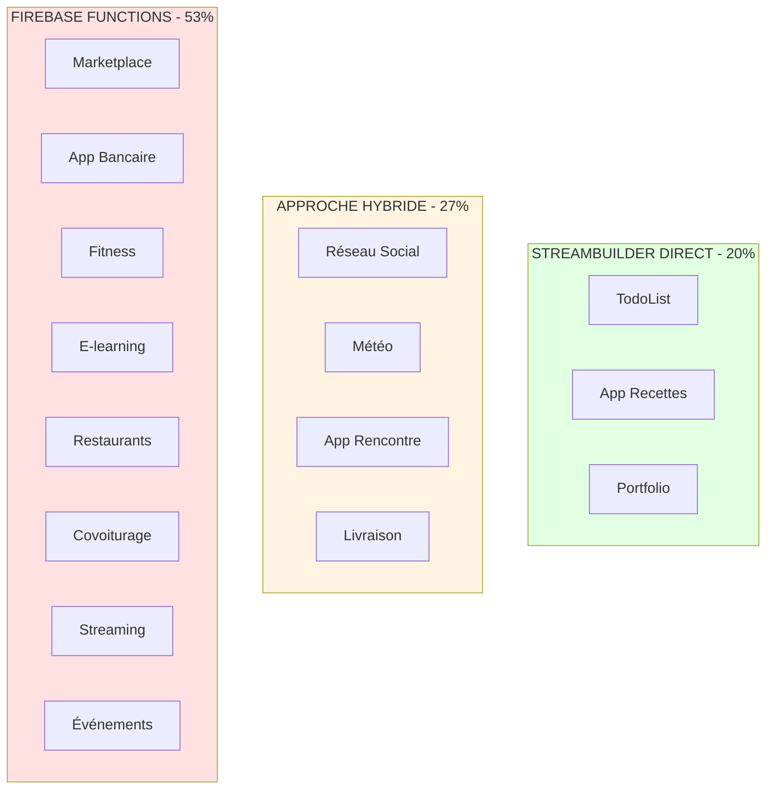
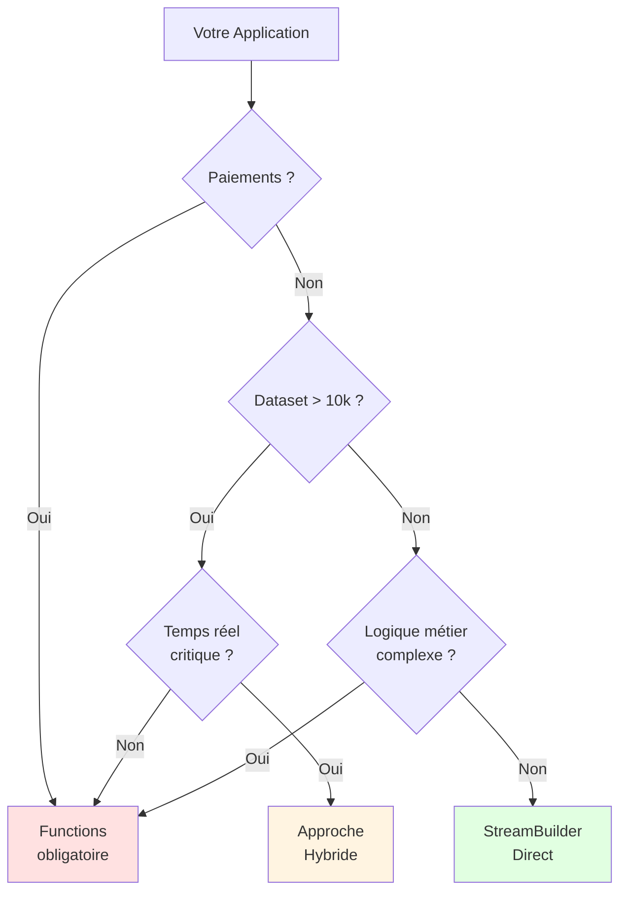

# Études de Cas Pratiques : Choisir la Bonne Architecture

## Rappel des concepts

### StreamBuilder Direct (Approche classique)

**C'est quoi ?** StreamBuilder est un widget Flutter qui écoute directement un flux de données depuis Firestore et reconstruit automatiquement l'interface quand les données changent. L'application communique directement avec la base de données sans passer par un serveur intermédiaire.

**Quand l'utiliser ?** Idéal pour des applications simples avec logique métier basique, besoin de temps réel critique, petit dataset, budget limité, et contexte d'apprentissage. Parfait quand vous voulez développer rapidement sans complexité backend.

**Avantages** : Développement ultra-rapide, temps réel natif, code simple, pas de serveur à gérer, gratuit jusqu'à 50k lectures/jour, excellent pour prototypes et MVP.

**Inconvénients** : Limité pour logique métier complexe, pas d'agrégations avancées, validation basique, difficile à scale au-delà de 10k utilisateurs actifs, toute la logique exposée côté client.

---

### Firebase Functions (Backend sécurisé)

**C'est quoi ?** Firebase Functions sont des fonctions JavaScript/TypeScript qui s'exécutent sur les serveurs de Google (backend). Votre application Flutter appelle ces fonctions via HTTP, et elles traitent la logique métier, calculs complexes, paiements, etc. avant de retourner les résultats.

**Quand l'utiliser ?** Nécessaire pour paiements sécurisés, validation complexe, agrégations et statistiques, intégrations tierces (Stripe, SendGrid, APIs), génération de documents (PDF), logique métier à protéger, conformité réglementaire, ou applications à grande échelle (>10k utilisateurs).

**Avantages** : Sécurité maximale (logique côté serveur), calculs complexes possibles, agrégations illimitées, intégrations multiples, scalabilité excellente, logs d'audit, conformité réglementaire.

**Inconvénients** : Développement plus long, besoin d'apprendre Node.js/backend, pas de temps réel natif, coûts plus élevés, déploiement et maintenance nécessaires, complexité accrue.

---

### Approche Hybride (Meilleur des deux mondes)

**C'est quoi ?** Combinaison intelligente de StreamBuilder pour les parties temps réel (feed, chat, notifications) et Firebase Functions pour les opérations critiques (paiements, calculs, validations complexes). Chaque outil est utilisé là où il excelle.

**Quand l'utiliser ?** Applications moyennes à grandes qui nécessitent à la fois du temps réel ET de la logique complexe. Par exemple : réseau social (feed temps réel + modération), e-commerce (catalogue temps réel + paiements sécurisés), fitness (historique temps réel + calculs IA).

**Avantages** : Flexibilité maximale, optimisation des coûts, performance optimale, expérience utilisateur supérieure, évolutivité progressive, chaque technologie utilisée à son meilleur.

---

## Instructions

Vous êtes consultant technique. Pour chaque application ci-dessous :

1. Analysez les besoins
2. Évaluez les contraintes
3. Choisissez entre :
   - **StreamBuilder Direct**
   - **Firebase Functions**
   - **Approche Hybride**
4. Justifiez votre choix

**Temps estimé** : 60-90 minutes

---

## Grille d'analyse (à utiliser pour chaque cas)

| Critère | Évaluation |
|---------|------------|
| Complexité logique métier | Simple / Moyenne / Élevée |
| Taille du dataset | Petit / Moyen / Grand |
| Besoin temps réel | Oui / Non / Partiel |
| Budget développement | Limité / Moyen / Élevé |
| Échelle prévue | <1k / 1k-10k / >10k utilisateurs |
| Sécurité | Basique / Moyenne / Critique |
| Agrégations nécessaires | Non / Simples / Complexes |
| Intégrations tierces | Non / Quelques / Nombreuses |

---

## CAS 1 : TodoList Collaborative pour Étudiants

### Description

Application de gestion de tâches pour groupes d'étudiants travaillant sur des projets.

**Fonctionnalités** :
- Créer, modifier, supprimer des tâches
- Assigner des tâches aux membres
- Marquer comme complété
- Voir les tâches en temps réel (quand un membre ajoute une tâche, les autres la voient)
- Commentaires sur les tâches
- Notifications push quand quelqu'un vous assigne une tâche

**Contraintes** :
- Budget : Projet étudiant (gratuit ou très bas coût)
- Échelle : 5-10 personnes par groupe, max 100 groupes (1000 utilisateurs)
- Délai : 4 semaines de développement
- Équipe : 2 étudiants (Flutter uniquement)

**Données** :
- ~50 tâches par groupe en moyenne
- ~5000 tâches totales dans la base

**Questions à analyser** :
1. Le temps réel est-il critique ?
2. Y a-t-il de la logique métier complexe ?
3. Faut-il des agrégations (statistiques) ?
4. Quel est le niveau de sécurité requis ?

### Votre réponse :
- [ ] StreamBuilder Direct
- [ ] Firebase Functions
- [ ] Approche Hybride

---

## CAS 2 : Marketplace de Services Locaux

### Description

Plateforme connectant des artisans (plombiers, électriciens, etc.) avec des clients.

**Fonctionnalités** :
- Inscription artisan (vérification documents professionnels)
- Recherche d'artisans par localisation et métier
- Système de réservation avec disponibilités
- Paiement en ligne (Stripe)
- Système de notation et avis
- Commission de 15% sur chaque transaction
- Génération de factures PDF
- Dashboard admin avec statistiques
- Notifications email et SMS

**Contraintes** :
- Budget : Startup avec levée de fonds
- Échelle : 500 artisans, 5000 clients prévus première année
- Délai : 3 mois pour MVP
- Équipe : 3 développeurs Flutter, possibilité d'embaucher backend

**Données** :
- ~500 artisans
- ~5000 clients
- ~2000 réservations/mois
- Historique des transactions à conserver

**Questions à analyser** :
1. Faut-il valider les documents professionnels ?
2. Comment gérer les paiements de manière sécurisée ?
3. Comment calculer les commissions ?
4. Les statistiques sont-elles complexes ?

### Votre réponse :
- [ ] StreamBuilder Direct
- [ ] Firebase Functions
- [ ] Approche Hybride

---

## CAS 3 : Application de Recettes (Projet Actuel)

### Description

Application mobile de partage de recettes de cuisine.

**Fonctionnalités** :
- Consulter des recettes avec filtres par catégorie
- Voir les détails d'une recette
- Ajouter aux favoris
- Rechercher des recettes
- Partager une recette
- Créer sa propre recette (utilisateurs vérifiés uniquement)

**Contraintes** :
- Budget : Projet d'apprentissage
- Échelle : Application personnelle, ~100-500 utilisateurs max
- Délai : 6 semaines (apprentissage inclus)
- Équipe : 1 étudiant débutant Flutter

**Données** :
- ~200 recettes dans la base
- ~50 catégories
- Croissance lente (10 nouvelles recettes/semaine)

**Questions à analyser** :
1. Y a-t-il besoin de calculs côté serveur ?
2. Le temps réel est-il important ?
3. La validation est-elle complexe ?
4. Faut-il des agrégations ?

### Votre réponse :
- [ ] StreamBuilder Direct
- [ ] Firebase Functions
- [ ] Approche Hybride

---

## CAS 4 : Application Bancaire Mobile

### Description

Application de banque en ligne permettant de gérer ses comptes.

**Fonctionnalités** :
- Consulter solde et transactions
- Virements entre comptes
- Virements vers autres bénéficiaires
- Paiement de factures
- Alertes de fraude
- Historique détaillé avec exports PDF
- Chat support sécurisé
- Authentification biométrique
- Limite de transactions selon profil utilisateur

**Contraintes** :
- Budget : Banque établie avec gros budget
- Échelle : 100,000 utilisateurs prévus
- Délai : 12 mois (production)
- Équipe : 10+ développeurs, équipe backend dédiée
- Conformité : Réglementations bancaires strictes

**Données** :
- 100,000 utilisateurs
- Milliers de transactions par jour
- Historique 10 ans à conserver
- Données hautement sensibles

**Questions à analyser** :
1. Niveau de sécurité requis ?
2. Validation des transactions ?
3. Logs d'audit nécessaires ?
4. Performance critique ?

### Votre réponse :
- [ ] StreamBuilder Direct
- [ ] Firebase Functions
- [ ] Approche Hybride

---

## CAS 5 : Réseau Social de Quartier

### Description

Application pour connecter les voisins d'un quartier (événements, entraide, petites annonces).

**Fonctionnalités** :
- Feed d'actualités du quartier en temps réel
- Créer des événements
- Petites annonces (vente/don d'objets)
- Messagerie privée entre voisins
- Système de recommandations (babysitters, etc.)
- Groupe de discussion par rue
- Alertes de sécurité temps réel

**Contraintes** :
- Budget : Association à but non lucratif (budget limité)
- Échelle : 1000 utilisateurs par quartier, 50 quartiers visés
- Délai : 2 mois pour beta test
- Équipe : 2 développeurs bénévoles

**Données** :
- 50,000 utilisateurs potentiels
- Posts/messages quotidiens
- Photos d'annonces
- Temps réel critique pour alertes

**Questions à analyser** :
1. Feed temps réel nécessaire ?
2. Modération de contenu ?
3. Recherche géolocalisée ?
4. Budget limité ?

### Votre réponse :
- [ ] StreamBuilder Direct
- [ ] Firebase Functions
- [ ] Approche Hybride

---

## CAS 6 : Application de Fitness et Coaching

### Description

App de suivi sportif avec programmes d'entraînement personnalisés.

**Fonctionnalités** :
- Suivi des entraînements (temps, distance, calories)
- Plans d'entraînement générés par IA
- Statistiques et graphiques de progression
- Objectifs personnalisés
- Classements et défis entre amis
- Synchronisation avec Apple Health / Google Fit
- Abonnement premium (9.99€/mois)
- Recommandations nutritionnelles

**Contraintes** :
- Budget : Startup (bootstrap)
- Échelle : 10,000 utilisateurs visés en 1 an
- Délai : 4 mois pour launch
- Équipe : 2 développeurs + 1 data scientist

**Données** :
- Historique d'entraînements (potentiellement des millions de points)
- Calculs complexes (calories, progression, IA)
- Synchronisation avec APIs tierces
- Génération de rapports hebdomadaires

**Questions à analyser** :
1. Calculs complexes nécessaires ?
2. Intégrations multiples ?
3. Génération de rapports ?
4. Modèle d'abonnement ?

### Votre réponse :
- [ ] StreamBuilder Direct
- [ ] Firebase Functions
- [ ] Approche Hybride

---

## CAS 7 : Portfolio Interactif pour Développeur

### Description

Site web personnel pour présenter projets et compétences.

**Fonctionnalités** :
- Page d'accueil avec présentation
- Galerie de projets avec filtres
- Blog technique
- Formulaire de contact
- Mode sombre/clair
- Compteur de visiteurs
- Commentaires sur articles de blog

**Contraintes** :
- Budget : Personnel (gratuit)
- Échelle : 100-500 visiteurs/mois
- Délai : 2 semaines
- Équipe : 1 personne (vous)

**Données** :
- ~20 projets
- ~10 articles de blog
- Commentaires modérés

**Questions à analyser** :
1. Site statique ou dynamique ?
2. Beaucoup de logique côté serveur ?
3. Temps réel important ?
4. Trafic élevé ?

### Votre réponse :
- [ ] StreamBuilder Direct
- [ ] Firebase Functions
- [ ] Approche Hybride

---

## CAS 8 : Plateforme d'E-learning

### Description

Plateforme de formation en ligne avec vidéos, quiz et certification.

**Fonctionnalités** :
- Catalogue de cours
- Lecture vidéo avec progression sauvegardée
- Quiz avec correction automatique
- Suivi de progression
- Certificats générés automatiquement (PDF)
- Forum de discussion par cours
- Paiement par cours ou abonnement
- Dashboard instructeur avec analytics
- Système de notes et feedback

**Contraintes** :
- Budget : Entreprise de formation établie
- Échelle : 5,000 étudiants, 50 instructeurs
- Délai : 6 mois
- Équipe : 5 développeurs

**Données** :
- Milliers d'heures de vidéos
- Progression de chaque étudiant
- Résultats de quiz
- Statistiques d'engagement
- Génération de certificats

**Questions à analyser** :
1. Calculs de progression complexes ?
2. Génération de documents (certificats) ?
3. Analytics avancés ?
4. Système de paiement ?

### Votre réponse :
- [ ] StreamBuilder Direct
- [ ] Firebase Functions
- [ ] Approche Hybride

---

## CAS 9 : Application Météo Locale Collaborative

### Description

App météo où les utilisateurs signalent les conditions en temps réel.

**Fonctionnalités** :
- Affichage météo temps réel par localisation
- Utilisateurs peuvent signaler: pluie, neige, soleil, etc.
- Carte interactive avec signalements
- Notifications d'alertes météo
- Historique météo
- Graphiques de température
- Prévisions API tierce (OpenWeather)

**Contraintes** :
- Budget : Projet personnel avec espoir de monétisation
- Échelle : Démarrage local (1 ville), expansion prévue
- Délai : 6 semaines
- Équipe : 1 développeur

**Données** :
- Signalements temps réel
- Données de géolocalisation
- Agrégation par zones
- API externe pour prévisions

**Questions à analyser** :
1. Temps réel critique ?
2. Agrégation géographique ?
3. Intégration API tierce ?
4. Calculs côté serveur ?

### Votre réponse :
- [ ] StreamBuilder Direct
- [ ] Firebase Functions
- [ ] Approche Hybride

---

## CAS 10 : Application de Réservation de Restaurants

### Description

Système de réservation de tables dans des restaurants.

**Fonctionnalités** :
- Recherche restaurants (filtres, localisation)
- Disponibilités en temps réel
- Réserver une table
- Système de confirmation par email/SMS
- Annulation avec politique de frais
- Programme de fidélité (points)
- Avis et photos
- Dashboard restaurant avec gestion des tables
- Rapports de fréquentation
- Intégration calendrier

**Contraintes** :
- Budget : Startup avec investisseurs
- Échelle : 200 restaurants, 10,000 utilisateurs
- Délai : 5 mois
- Équipe : 4 développeurs

**Données** :
- Disponibilités en temps réel
- Historique des réservations
- Gestion des conflits (double réservation)
- Calcul de points fidélité
- Notifications multiples

**Questions à analyser** :
1. Gestion de conflits nécessaire ?
2. Logique métier complexe (disponibilités) ?
3. Notifications multiples ?
4. Rapports pour restaurants ?

### Votre réponse :
- [ ] StreamBuilder Direct
- [ ] Firebase Functions
- [ ] Approche Hybride

---

## CAS 11 : Application de Rencontre (Dating App)

### Description

Application mobile de rencontre permettant de matcher avec des personnes selon des critères.

**Fonctionnalités** :
- Profils utilisateurs avec photos et bio
- Algorithme de matching basé sur localisation et préférences
- Swipe droite (like) / gauche (pass)
- Chat en temps réel après match mutuel
- Notifications push lors de match
- Abonnement premium (voir qui a liké, filtres avancés)
- Signalement de profils suspects
- Limite de swipes quotidiens (free : 50/jour, premium : illimité)
- Vérification de profil par selfie
- Boost de visibilité (payant)

**Contraintes** :
- Budget : Startup avec investisseurs
- Échelle : 50,000 utilisateurs visés première année
- Délai : 6 mois pour launch
- Équipe : 4 développeurs Flutter, 2 backend
- Modération : Contenu sensible à gérer

**Données** :
- Profils avec photos (plusieurs par utilisateur)
- Messages chiffrés
- Historique de swipes
- Géolocalisation en temps réel
- Analytics détaillés (taux de match, engagement)

**Questions à analyser** :
1. Algorithme de matching : client ou serveur ?
2. Comment gérer les likes quotidiens ?
3. Sécurité des données personnelles ?
4. Modération du contenu ?

### Votre réponse :
- [ ] StreamBuilder Direct
- [ ] Firebase Functions
- [ ] Approche Hybride

---

## CAS 12 : Application de Livraison de Nourriture

### Description

Plateforme de commande et livraison de repas à domicile (style Uber Eats).

**Fonctionnalités** :
- Parcourir restaurants par localisation
- Menu avec photos et prix
- Panier et commande
- Paiement en ligne
- Suivi de livraison en temps réel sur carte
- Système de notation restaurants et livreurs
- Commission sur chaque commande
- Gestion des stocks restaurants
- Attribution automatique de livreur
- Notifications à chaque étape (préparation, en route, livré)
- Codes promo et réductions

**Contraintes** :
- Budget : Entreprise établie avec budget conséquent
- Échelle : 100 restaurants, 50 livreurs, 10,000 clients
- Délai : 8 mois
- Équipe : 8 développeurs, équipe backend dédiée
- Performance : Attribution livreur doit être instantanée

**Données** :
- Localisation temps réel des livreurs
- États de commande (reçue, préparation, en livraison, livrée)
- Historique complet des commandes
- Calcul de commissions
- Optimisation des trajets

**Questions à analyser** :
1. Suivi temps réel du livreur : comment ?
2. Attribution automatique du livreur : logique où ?
3. Gestion des paiements ?
4. Calcul de distance et temps de livraison ?

### Votre réponse :
- [ ] StreamBuilder Direct
- [ ] Firebase Functions
- [ ] Approche Hybride

---

## CAS 13 : Application de Covoiturage

### Description

Application connectant conducteurs et passagers pour partager des trajets.

**Fonctionnalités** :
- Publier un trajet (conducteur)
- Rechercher trajet par itinéraire
- Réserver une place
- Paiement sécurisé avec répartition
- Vérification d'identité obligatoire
- Système d'avis bidirectionnel
- Chat entre conducteur et passagers
- Annulation avec politique de remboursement
- Géolocalisation du trajet en cours
- Historique et reçus
- Vérification permis de conduire et assurance

**Contraintes** :
- Budget : Startup bootstrap
- Échelle : 5,000 utilisateurs première année
- Délai : 5 mois
- Équipe : 3 développeurs
- Légal : Conformité transport de personnes

**Données** :
- Trajets avec points départ/arrivée
- Réservations avec statut
- Paiements avec splits complexes
- Vérifications documents
- GPS tracking pendant trajet

**Questions à analyser** :
1. Recherche de trajets : comment optimiser ?
2. Split de paiement : client ou serveur ?
3. Vérification documents : où ?
4. GPS tracking : temps réel critique ?

### Votre réponse :
- [ ] StreamBuilder Direct
- [ ] Firebase Functions
- [ ] Approche Hybride

---

## CAS 14 : Application de Streaming Musical

### Description

Plateforme d'écoute de musique en streaming avec playlists personnalisées.

**Fonctionnalités** :
- Bibliothèque de millions de chansons
- Recherche par artiste, album, genre
- Playlists personnalisées
- Recommandations basées sur goûts (IA)
- Mode hors ligne (téléchargement)
- Partage de playlists
- Statistiques d'écoute
- Abonnement mensuel (9.99€)
- Version gratuite avec publicités
- Paroles synchronisées
- Radio personnalisée

**Contraintes** :
- Budget : Grande entreprise
- Échelle : 500,000 utilisateurs prévus
- Délai : 12 mois
- Équipe : 15 développeurs
- Performance : Lecture fluide critique

**Données** :
- Millions de fichiers audio
- Historique d'écoute par utilisateur
- Playlists
- Recommandations IA
- Analytics d'engagement
- Gestion des droits d'auteur

**Questions à analyser** :
1. Recommandations IA : où calculer ?
2. Gestion du streaming : architecture ?
3. Mode hors ligne : sync comment ?
4. Analytics à grande échelle ?

### Votre réponse :
- [ ] StreamBuilder Direct
- [ ] Firebase Functions
- [ ] Approche Hybride

---

## CAS 15 : Application de Gestion d'Événements

### Description

Plateforme pour créer et gérer des événements (concerts, conférences, fêtes).

**Fonctionnalités** :
- Créer un événement avec détails
- Vente de billets avec QR code
- Scan de billets à l'entrée
- Chat de groupe par événement
- Notifications rappels
- Partage sur réseaux sociaux
- Génération de billets PDF
- Statistiques pour organisateurs
- Remboursement en cas d'annulation
- Carte interactive des événements
- Système d'invitations

**Contraintes** :
- Budget : Projet personnel avec ambition commerciale
- Échelle : 1,000 événements/an visés
- Délai : 4 mois
- Équipe : 2 développeurs
- Fraude : Éviter revente/duplication billets

**Données** :
- Événements avec places limitées
- Billets avec codes uniques
- Transactions de vente
- Check-in en temps réel
- Analytics par événement

**Questions à analyser** :
1. Génération QR codes uniques : où ?
2. Validation billet à l'entrée : comment ?
3. Éviter double-scan : logique où ?
4. Remboursements : automatisés comment ?

### Votre réponse :
- [ ] StreamBuilder Direct
- [ ] Firebase Functions
- [ ] Approche Hybride

---

---

# RÉPONSES ET JUSTIFICATIONS

Cliquez sur chaque cas pour voir la réponse et la justification détaillée.

---

<details>
<summary><h2>CAS 1 : TodoList Collaborative - CLIQUEZ POUR VOIR LA RÉPONSE</h2></summary>

### Réponse : StreamBuilder Direct

### Score d'analyse

| Critère | Évaluation | Impact |
|---------|------------|--------|
| Complexité logique | Simple | ✅ StreamBuilder |
| Taille dataset | Petit (5k tâches) | ✅ StreamBuilder |
| Temps réel | Critique | ✅ StreamBuilder |
| Budget | Gratuit/Très limité | ✅ StreamBuilder |
| Échelle | <1k utilisateurs | ✅ StreamBuilder |
| Sécurité | Basique (Rules suffisent) | ✅ StreamBuilder |
| Agrégations | Non nécessaires | ✅ StreamBuilder |
| Intégrations | Notifications (FCM natif) | ✅ StreamBuilder |

**Score : 8/8 pour StreamBuilder Direct**

### Justification détaillée

**Pourquoi StreamBuilder Direct ?**

1. **Temps réel critique**
   ```dart
   // Quand membre A ajoute une tâche, membre B la voit instantanément
   StreamBuilder<QuerySnapshot>(
     stream: _firestore
       .collection('tasks')
       .where('groupId', isEqualTo: currentGroupId)
       .snapshots(),
   )
   ```
   StreamBuilder = temps réel natif et gratuit

2. **Dataset petit**
   - 5000 tâches totales
   - ~50 tâches par groupe
   - Pas de problème de performance

3. **Logique simple**
   ```dart
   // Créer tâche
   await _firestore.collection('tasks').add({
     'title': title,
     'assignedTo': userId,
     'completed': false,
     'groupId': groupId,
   });
   
   // Pas besoin de logique serveur complexe
   ```

4. **Budget zéro**
   - Projet étudiant
   - Firestore gratuit jusqu'à 50k lectures/jour
   - Pas de coût de Cloud Functions

5. **Sécurité avec Rules**
   ```javascript
   // Rules Firestore suffisantes
   match /tasks/{taskId} {
     allow read: if isGroupMember(resource.data.groupId);
     allow write: if isGroupMember(request.resource.data.groupId);
   }
   ```

**Pourquoi PAS Functions ?**

- Sur-engineering pour cas d'usage simple
- Coût supplémentaire inutile
- Temps de développement 3x plus long
- Pas de logique métier complexe à protéger

### Architecture recommandée

```dart
// Structure simple et efficace
class TaskRepository {
  final FirebaseFirestore _firestore = FirebaseFirestore.instance;
  
  Stream<List<Task>> getGroupTasks(String groupId) {
    return _firestore
      .collection('tasks')
      .where('groupId', isEqualTo: groupId)
      .snapshots()
      .map((snapshot) => 
        snapshot.docs.map((doc) => Task.fromFirestore(doc)).toList()
      );
  }
  
  Future<void> createTask(Task task) async {
    await _firestore.collection('tasks').add(task.toMap());
  }
  
  Future<void> updateTask(String taskId, Map<String, dynamic> updates) async {
    await _firestore.collection('tasks').doc(taskId).update(updates);
  }
}
```

### Verdict

**StreamBuilder Direct = Parfait pour ce cas** ✅

</details>

---

<details>
<summary><h2>CAS 2 : Marketplace de Services - CLIQUEZ POUR VOIR LA RÉPONSE</h2></summary>

### Réponse : Firebase Functions

### Score d'analyse

| Critère | Évaluation | Impact |
|---------|------------|--------|
| Complexité logique | Élevée | ❌ Besoin Functions |
| Taille dataset | Moyen-Grand | ⚠️ Peut gérer les deux |
| Temps réel | Partiel | ⚠️ Hybride possible |
| Budget | Élevé (startup) | ✅ Functions OK |
| Échelle | >5k utilisateurs | ❌ Besoin Functions |
| Sécurité | Critique (paiements) | ❌ Besoin Functions |
| Agrégations | Complexes (stats) | ❌ Besoin Functions |
| Intégrations | Multiples (Stripe, SMS, Email) | ❌ Besoin Functions |

**Score : 6/8 pour Firebase Functions**

### Justification détaillée

**Pourquoi Firebase Functions ?**

1. **Paiements sécurisés**
   ```javascript
   // OBLIGATOIRE côté serveur pour Stripe
   exports.createPaymentIntent = functions.https.onCall(async (data, context) => {
     // Vérification authentification
     if (!context.auth) {
       throw new functions.https.HttpsError('unauthenticated', 'Auth required');
     }
     
     // Récupération prix depuis Firestore (pas du client !)
     const bookingDoc = await admin.firestore()
       .collection('bookings')
       .doc(data.bookingId)
       .get();
     
     const amount = bookingDoc.data().price;
     const commission = amount * 0.15; // 15% commission
     
     // Création payment intent Stripe
     const paymentIntent = await stripe.paymentIntents.create({
       amount: amount * 100, // en centimes
       currency: 'eur',
       application_fee_amount: commission * 100,
       transfer_data: {
         destination: bookingDoc.data().artisanStripeAccountId,
       },
     });
     
     return { clientSecret: paymentIntent.client_secret };
   });
   ```
   **Impossible de faire ça côté client pour des raisons de sécurité**

2. **Vérification documents**
   ```javascript
   exports.verifyArtisan = functions.https.onCall(async (data, context) => {
     // Admin seulement
     if (!context.auth || !context.auth.token.admin) {
       throw new functions.https.HttpsError('permission-denied');
     }
     
     // Logique de vérification
     const documents = data.documents;
     
     // Vérifier avec service tiers (ex: service d'identité)
     const verificationResult = await externalVerificationService.verify(documents);
     
     if (verificationResult.success) {
       // Approuver artisan
       await admin.firestore()
         .collection('artisans')
         .doc(data.artisanId)
         .update({
           verified: true,
           verifiedAt: admin.firestore.FieldValue.serverTimestamp(),
           verificationDetails: verificationResult
         });
       
       // Envoyer email de confirmation
       await sendEmail(data.artisanEmail, 'Account Verified');
     }
     
     return verificationResult;
   });
   ```

3. **Statistiques complexes**
   ```javascript
   exports.generateArtisanStats = functions.https.onCall(async (data, context) => {
     const artisanId = data.artisanId;
     
     // Agrégations impossibles avec StreamBuilder
     const [
       totalBookings,
       totalRevenue,
       avgRating,
       completionRate,
       responseTime
     ] = await Promise.all([
       // Total réservations
       admin.firestore()
         .collection('bookings')
         .where('artisanId', '==', artisanId)
         .count().get(),
       
       // Revenu total
       calculateTotalRevenue(artisanId),
       
       // Moyenne notes
       calculateAverageRating(artisanId),
       
       // Taux de complétion
       calculateCompletionRate(artisanId),
       
       // Temps de réponse moyen
       calculateAvgResponseTime(artisanId)
     ]);
     
     return {
       totalBookings: totalBookings.data().count,
       totalRevenue,
       avgRating,
       completionRate,
       responseTime,
       monthlyData: await getMonthlyBreakdown(artisanId)
     };
   });
   ```

4. **Génération factures**
   ```javascript
   exports.generateInvoice = functions.https.onCall(async (data, context) => {
     const bookingId = data.bookingId;
     
     // Récupérer données
     const booking = await getBookingDetails(bookingId);
     
     // Générer PDF
     const pdfBuffer = await generatePDF({
       template: 'invoice',
       data: booking
     });
     
     // Upload sur Storage
     const bucket = admin.storage().bucket();
     const fileName = `invoices/${bookingId}.pdf`;
     await bucket.file(fileName).save(pdfBuffer);
     
     // URL téléchargement
     const downloadURL = await bucket.file(fileName).getSignedUrl({
       action: 'read',
       expires: Date.now() + 30 * 24 * 60 * 60 * 1000 // 30 jours
     });
     
     // Envoyer par email
     await sendInvoiceEmail(booking.customerEmail, downloadURL);
     
     return { invoiceUrl: downloadURL };
   });
   ```

5. **Notifications multiples**
   ```javascript
   exports.onBookingCreated = functions.firestore
     .document('bookings/{bookingId}')
     .onCreate(async (snap, context) => {
       const booking = snap.data();
       
       // Notification push à l'artisan
       await admin.messaging().send({
         token: booking.artisanFCMToken,
         notification: {
           title: 'Nouvelle réservation',
           body: `${booking.customerName} souhaite réserver`
         }
       });
       
       // Email à l'artisan
       await sendEmail(booking.artisanEmail, 'Nouvelle réservation', {...});
       
       // SMS à l'artisan
       await sendSMS(booking.artisanPhone, 'Nouvelle réservation...');
       
       // Email de confirmation au client
       await sendEmail(booking.customerEmail, 'Réservation confirmée', {...});
     });
   ```

**Pourquoi PAS seulement StreamBuilder ?**

1. **Sécurité** : Paiements DOIVENT être côté serveur
2. **Logique métier** : Trop complexe pour Rules Firestore
3. **Intégrations** : Stripe, SMS, Email, PDF
4. **Agrégations** : Stats impossibles côté client
5. **Performance** : Calculs lourds ralentiraient l'app

### Architecture recommandée

**Approche Hybride** (le mieux) :

```dart
// Flutter : StreamBuilder pour listes temps réel
StreamBuilder<QuerySnapshot>(
  stream: _firestore
    .collection('artisans')
    .where('location', isEqualTo: userLocation)
    .snapshots(),
  // Affichage liste artisans
)

// Flutter : Functions pour actions critiques
Future<void> bookArtisan(String artisanId, DateTime date) async {
  final callable = FirebaseFunctions.instance.httpsCallable('createBooking');
  await callable.call({
    'artisanId': artisanId,
    'date': date.toIso8601String(),
  });
}

Future<void> processPayment(String bookingId) async {
  final callable = FirebaseFunctions.instance.httpsCallable('processPayment');
  final result = await callable.call({'bookingId': bookingId});
  // Stripe SDK côté client avec clientSecret de la function
}
```

### Verdict

**Firebase Functions = Obligatoire pour ce cas** ✅

StreamBuilder seul = Dangereux et non fonctionnel ❌

</details>

---

<details>
<summary><h2>CAS 3 : Application de Recettes - CLIQUEZ POUR VOIR LA RÉPONSE</h2></summary>

### Réponse : StreamBuilder Direct

### Score d'analyse

| Critère | Évaluation | Impact |
|---------|------------|--------|
| Complexité logique | Simple | ✅ StreamBuilder |
| Taille dataset | Petit (200 recettes) | ✅ StreamBuilder |
| Temps réel | Nice to have | ✅ StreamBuilder |
| Budget | Zéro (apprentissage) | ✅ StreamBuilder |
| Échelle | <500 utilisateurs | ✅ StreamBuilder |
| Sécurité | Basique | ✅ StreamBuilder |
| Agrégations | Non nécessaires | ✅ StreamBuilder |
| Intégrations | Aucune | ✅ StreamBuilder |

**Score : 8/8 pour StreamBuilder Direct**

### Justification détaillée

**C'est exactement le cas d'usage parfait pour StreamBuilder !**

1. **Projet d'apprentissage**
   - Focus sur Flutter, pas sur backend
   - StreamBuilder enseigne les concepts fondamentaux
   - Functions = sur-engineering

2. **Dataset minuscule**
   ```dart
   // 200 recettes = rien du tout
   StreamBuilder<QuerySnapshot>(
     stream: _firestore.collection('details').limit(20).snapshots(),
   )
   // Performances excellentes
   ```

3. **Logique ultra-simple**
   ```dart
   // Pas besoin de Functions pour ça
   final recipe = {
     'name': name,
     'calories': cal,
     'time': time,
     'category': category,
   };
   
   await _firestore.collection('details').add(recipe);
   ```

4. **Pas d'intégrations**
   - Pas de paiement
   - Pas d'email
   - Pas d'API tierce

5. **Validation simple**
   ```javascript
   // Firestore Rules suffisent largement
   match /details/{recipeId} {
     allow read: if true; // Public
     allow create: if request.auth != null 
                   && request.resource.data.name.size() > 3
                   && request.resource.data.cal > 0;
   }
   ```

**Si on utilisait Functions (mauvais choix) :**

```javascript
// Complexité inutile
exports.createRecipe = functions.https.onCall(async (data, context) => {
  if (!context.auth) throw new Error('Auth required');
  
  if (data.name.length < 3) throw new Error('Name too short');
  
  await admin.firestore().collection('details').add(data);
  
  return { success: true };
});
```

Résultat :
- 10x plus de code
- Déploiement nécessaire
- Pas d'avantage réel
- Temps de développement multiplié

### Analogie

Utiliser Functions ici = Acheter un camion pour faire ses courses

StreamBuilder = Vélo parfaitement adapté

### Code actuel (optimal)

```dart
// Simple, clair, efficace
StreamBuilder<QuerySnapshot>(
  stream: selectedCategory == "All" 
      ? _firestore.collection('details').limit(4).snapshots()
      : _firestore.collection('details')
          .where('category', isEqualTo: selectedCategory)
          .limit(4)
          .snapshots(),
  builder: (context, snapshot) {
    if (snapshot.hasData) {
      return GridView.builder(...);
    }
    return CircularProgressIndicator();
  },
)
```

### Verdict

**StreamBuilder Direct = Choix optimal** ✅

**Votre étudiant a tort pour CE cas précis**

</details>

---

<details>
<summary><h2>CAS 4 : Application Bancaire - CLIQUEZ POUR VOIR LA RÉPONSE</h2></summary>

### Réponse : Firebase Functions (OBLIGATOIRE)

### Score d'analyse

| Critère | Évaluation | Impact |
|---------|------------|--------|
| Complexité logique | Très élevée | ❌ Functions obligatoires |
| Taille dataset | Très grand | ❌ Functions obligatoires |
| Temps réel | Moyen | ⚠️ Hybride |
| Budget | Très élevé | ✅ Functions OK |
| Échelle | >100k utilisateurs | ❌ Functions obligatoires |
| Sécurité | CRITIQUE | ❌ Functions OBLIGATOIRES |
| Agrégations | Très complexes | ❌ Functions obligatoires |
| Intégrations | Nombreuses | ❌ Functions obligatoires |

**Score : 0/8 pour StreamBuilder Direct**

### Justification détaillée

**StreamBuilder Direct = DANGEREUX ET ILLÉGAL** ❌❌❌

1. **Sécurité critique**
   ```javascript
   // OBLIGATOIRE côté serveur
   exports.transferMoney = functions.https.onCall(async (data, context) => {
     // Multi-level authentication
     if (!context.auth) throw new Error('Unauthenticated');
     
     // Vérification 2FA
     const user = await admin.auth().getUser(context.auth.uid);
     if (!user.customClaims['2fa_verified']) {
       throw new Error('2FA required');
     }
     
     // Vérification biométrique timestamp
     if (Date.now() - data.biometricTimestamp > 60000) {
       throw new Error('Biometric verification expired');
     }
     
     // Vérification limites
     const dailyTotal = await getDailyTransferTotal(context.auth.uid);
     const userLimit = await getUserTransferLimit(context.auth.uid);
     
     if (dailyTotal + data.amount > userLimit) {
       throw new Error('Daily limit exceeded');
     }
     
     // Vérification anti-fraude
     const fraudScore = await checkFraudRisk({
       userId: context.auth.uid,
       amount: data.amount,
       beneficiary: data.beneficiaryId,
       location: data.location
     });
     
     if (fraudScore > 0.7) {
       // Bloquer et alerter
       await flagSuspiciousActivity(context.auth.uid);
       throw new Error('Transfer blocked - suspicious activity');
     }
     
     // Transaction atomique
     const batch = admin.firestore().batch();
     
     // Débit compte source
     const sourceRef = admin.firestore()
       .collection('accounts')
       .doc(data.sourceAccountId);
     
     const sourceAccount = await sourceRef.get();
     const newBalance = sourceAccount.data().balance - data.amount;
     
     if (newBalance < 0) {
       throw new Error('Insufficient funds');
     }
     
     batch.update(sourceRef, {
       balance: newBalance,
       lastTransaction: admin.firestore.FieldValue.serverTimestamp()
     });
     
     // Crédit compte destination
     const destRef = admin.firestore()
       .collection('accounts')
       .doc(data.destinationAccountId);
     
     batch.update(destRef, {
       balance: admin.firestore.FieldValue.increment(data.amount)
     });
     
     // Enregistrer transaction
     const transactionRef = admin.firestore().collection('transactions').doc();
     batch.set(transactionRef, {
       type: 'transfer',
       amount: data.amount,
       from: data.sourceAccountId,
       to: data.destinationAccountId,
       userId: context.auth.uid,
       timestamp: admin.firestore.FieldValue.serverTimestamp(),
       status: 'completed',
       fraudScore,
       location: data.location,
       device: data.deviceInfo
     });
     
     // Log d'audit (conformité réglementaire)
     batch.set(admin.firestore().collection('audit_logs').doc(), {
       action: 'TRANSFER',
       userId: context.auth.uid,
       amount: data.amount,
       timestamp: admin.firestore.FieldValue.serverTimestamp(),
       ip: context.rawRequest.ip,
       userAgent: context.rawRequest.headers['user-agent']
     });
     
     // Commit atomique
     await batch.commit();
     
     // Notifications
     await sendSecurityNotification(context.auth.uid, transactionRef.id);
     
     return {
       success: true,
       transactionId: transactionRef.id,
       newBalance: newBalance
     };
   });
   ```

2. **Détection de fraude en temps réel**
   ```javascript
   exports.detectFraud = functions.firestore
     .document('transactions/{transactionId}')
     .onCreate(async (snap, context) => {
       const transaction = snap.data();
       
       // Analyse pattern utilisateur
       const userHistory = await getUserTransactionHistory(transaction.userId);
       
       // ML model pour détecter anomalies
       const anomalyScore = await mlModel.predictAnomaly({
         amount: transaction.amount,
         time: transaction.timestamp,
         location: transaction.location,
         history: userHistory
       });
       
       if (anomalyScore > 0.8) {
         // Bloquer compte
         await admin.firestore()
           .collection('users')
           .doc(transaction.userId)
           .update({ accountLocked: true });
         
         // Alerter équipe sécurité
         await alertSecurityTeam(transaction);
         
         // SMS utilisateur
         await sendSMS(transaction.userPhone, 'Activité suspecte détectée');
       }
     });
   ```

3. **Conformité réglementaire**
   ```javascript
   // Génération rapports réglementaires
   exports.generateComplianceReport = functions.pubsub
     .schedule('0 0 1 * *') // Premier jour du mois
     .onRun(async (context) => {
       const lastMonth = getLastMonthRange();
       
       // Transactions suspectes
       const suspiciousTransactions = await admin.firestore()
         .collection('transactions')
         .where('fraudScore', '>', 0.5)
         .where('timestamp', '>=', lastMonth.start)
         .where('timestamp', '<=', lastMonth.end)
         .get();
       
       // Rapport détaillé
       const report = {
         period: lastMonth,
         totalTransactions: await getTotalTransactions(lastMonth),
         suspiciousCount: suspiciousTransactions.size,
         blockedAccounts: await getBlockedAccounts(lastMonth),
         detailedTransactions: suspiciousTransactions.docs.map(doc => doc.data())
       };
       
       // Générer PDF
       const pdfBuffer = await generateCompliancePDF(report);
       
       // Upload sécurisé
       await uploadToSecureStorage(pdfBuffer, 'compliance');
       
       // Envoyer aux autorités
       await sendToRegulatoryBody(report);
     });
   ```

**Pourquoi StreamBuilder est IMPOSSIBLE :**

1. Logique de transaction DOIT être atomique côté serveur
2. Détection fraude nécessite ML côté serveur
3. Conformité réglementaire nécessite logs d'audit côté serveur
4. Sécurité : JAMAIS exposer logique bancaire au client
5. Performance : Calculs trop lourds pour client

### Architecture minimale requise

```
Flutter App
    ↓
Cloud Functions (sécurisé)
    ↓
Firestore (données)
    ↓
ML Model (fraude)
    ↓
External APIs (banques, régulateurs)
```

### Verdict

**Functions = ABSOLUMENT OBLIGATOIRE** ✅✅✅

**StreamBuilder seul = DANGER + ILLÉGAL** ❌❌❌

</details>

---

<details>
<summary><h2>CAS 5 : Réseau Social de Quartier - CLIQUEZ POUR VOIR LA RÉPONSE</h2></summary>

### Réponse : Approche Hybride

### Score d'analyse

| Critère | Évaluation | Impact |
|---------|------------|--------|
| Complexité logique | Moyenne | ⚠️ Hybride |
| Taille dataset | Grand | ⚠️ Hybride |
| Temps réel | Critique (feed) | ✅ StreamBuilder |
| Budget | Limité | ✅ StreamBuilder |
| Échelle | 50k utilisateurs | ⚠️ Hybride |
| Sécurité | Moyenne (modération) | ❌ Functions |
| Agrégations | Simples | ⚠️ Peut être les deux |
| Intégrations | Quelques (notifications) | ⚠️ Hybride |

**Score : Hybride optimal**

### Justification détaillée

**Meilleur des deux mondes : StreamBuilder + Functions**

**Utilisez StreamBuilder pour :**

1. **Feed temps réel**
   ```dart
   // Posts du quartier en temps réel
   StreamBuilder<QuerySnapshot>(
     stream: _firestore
       .collection('posts')
       .where('neighborhoodId', isEqualTo: currentNeighborhood)
       .orderBy('timestamp', descending: true)
       .limit(20)
       .snapshots(),
     builder: (context, snapshot) {
       // Affichage feed
     },
   )
   ```

2. **Messages privés**
   ```dart
   StreamBuilder<QuerySnapshot>(
     stream: _firestore
       .collection('chats')
       .doc(chatId)
       .collection('messages')
       .orderBy('timestamp')
       .snapshots(),
     // Chat temps réel
   )
   ```

3. **Alertes sécurité**
   ```dart
   // Alertes en temps réel critiques
   StreamBuilder<QuerySnapshot>(
     stream: _firestore
       .collection('alerts')
       .where('neighborhoodId', isEqualTo: currentNeighborhood)
       .where('active', isEqualTo: true)
       .snapshots(),
     // Bannière rouge d'alerte
   )
   ```

**Utilisez Functions pour :**

1. **Modération de contenu**
   ```javascript
   exports.moderatePost = functions.firestore
     .document('posts/{postId}')
     .onCreate(async (snap, context) => {
       const post = snap.data();
       
       // Analyse contenu avec ML (bad words, spam)
       const moderationResult = await moderationAPI.analyze(post.content);
       
       if (moderationResult.inappropriate) {
         // Bloquer le post
         await snap.ref.update({
           status: 'blocked',
           moderationReason: moderationResult.reason
         });
         
         // Avertir l'utilisateur
         await notifyUser(post.userId, 'Post modéré');
         
         // Si récidive, suspendre compte
         const userPostsBlocked = await countBlockedPosts(post.userId);
         if (userPostsBlocked > 3) {
           await admin.auth().updateUser(post.userId, { disabled: true });
         }
       }
     });
   ```

2. **Recherche géolocalisée avancée**
   ```javascript
   exports.searchNearby = functions.https.onCall(async (data, context) => {
     const { lat, lng, radius, type } = data;
     
     // Algorithme de géohash pour recherche efficace
     const geohashes = getGeohashesForRadius(lat, lng, radius);
     
     const results = await Promise.all(
       geohashes.map(async (hash) => {
         return admin.firestore()
           .collection(type) // 'events' ou 'ads'
           .where('geohash', '>=', hash)
           .where('geohash', '<=', hash + '~')
           .get();
       })
     );
     
     // Filtrer et trier par distance réelle
     const items = [];
     results.forEach(snapshot => {
       snapshot.forEach(doc => {
         const data = doc.data();
         const distance = calculateDistance(lat, lng, data.lat, data.lng);
         if (distance <= radius) {
           items.push({ ...data, distance });
         }
       });
     });
     
     return items.sort((a, b) => a.distance - b.distance);
   });
   ```

3. **Notifications push ciblées**
   ```javascript
   exports.notifyNeighborhood = functions.firestore
     .document('events/{eventId}')
     .onCreate(async (snap, context) => {
       const event = snap.data();
       
       // Récupérer tous les voisins du quartier
       const neighbors = await admin.firestore()
         .collection('users')
         .where('neighborhoodId', '==', event.neighborhoodId)
         .where('notificationsEnabled', '==', true)
         .get();
       
       // Envoyer notification à tous
       const tokens = neighbors.docs.map(doc => doc.data().fcmToken);
       
       await admin.messaging().sendMulticast({
         tokens,
         notification: {
           title: 'Nouvel événement dans votre quartier',
           body: event.title
         },
         data: {
           type: 'event',
           eventId: snap.id
         }
       });
     });
   ```

4. **Recommandations (babysitters, etc.)**
   ```javascript
   exports.getRecommendations = functions.https.onCall(async (data, context) => {
     const { serviceType, neighborhoodId } = data;
     
     // Algorithme de recommandation
     const providers = await admin.firestore()
       .collection('service_providers')
       .where('type', '==', serviceType)
       .where('neighborhoodId', '==', neighborhoodId)
       .get();
     
     // Calculer score pour chaque provider
     const scored = await Promise.all(
       providers.docs.map(async (doc) => {
         const data = doc.data();
         
         // Facteurs de score
         const avgRating = await getAverageRating(doc.id);
         const totalReviews = await getReviewCount(doc.id);
         const responseRate = await getResponseRate(doc.id);
         const availability = await getAvailability(doc.id);
         
         const score = (
           avgRating * 0.4 +
           Math.min(totalReviews / 10, 1) * 0.3 +
           responseRate * 0.2 +
           availability * 0.1
         );
         
         return {
           ...data,
           id: doc.id,
           score,
           avgRating,
           totalReviews
         };
       })
     );
     
     // Trier par score
     return scored.sort((a, b) => b.score - a.score);
   });
   ```

### Architecture Hybride recommandée

```dart
// Flutter App
class NeighborhoodService {
  final FirebaseFirestore _firestore = FirebaseFirestore.instance;
  final FirebaseFunctions _functions = FirebaseFunctions.instance;
  
  // StreamBuilder pour temps réel
  Stream<List<Post>> getFeed(String neighborhoodId) {
    return _firestore
      .collection('posts')
      .where('neighborhoodId', isEqualTo: neighborhoodId)
      .where('status', isEqualTo: 'approved') // Modéré par Function
      .snapshots()
      .map((snapshot) => 
        snapshot.docs.map((doc) => Post.fromFirestore(doc)).toList()
      );
  }
  
  // Function pour recherche géolocalisée
  Future<List<Event>> searchNearbyEvents(double lat, double lng) async {
    final callable = _functions.httpsCallable('searchNearby');
    final result = await callable.call({
      'lat': lat,
      'lng': lng,
      'radius': 5, // 5km
      'type': 'events'
    });
    return (result.data as List).map((e) => Event.fromJson(e)).toList();
  }
  
  // Function pour recommandations
  Future<List<ServiceProvider>> getRecommendations(String serviceType) async {
    final callable = _functions.httpsCallable('getRecommendations');
    final result = await callable.call({
      'serviceType': serviceType,
      'neighborhoodId': currentNeighborhoodId
    });
    return (result.data as List).map((e) => ServiceProvider.fromJson(e)).toList();
  }
}
```

### Budget avec approche hybride

**Coûts estimés (50k utilisateurs actifs) :**

- Firestore (lectures StreamBuilder) : ~15 $/mois
- Cloud Functions (5M invocations/mois) : ~10 $/mois
- Cloud Messaging (notifications) : Gratuit
- Total : **~25 $/mois**

Acceptable pour association avec dons ou publicité légère.

### Verdict

**Hybride = Solution optimale** ✅

- StreamBuilder pour le temps réel (feed, chat, alertes)
- Functions pour la logique complexe (modération, recherche, recommandations)

</details>

---

<details>
<summary><h2>CAS 6 : Application de Fitness - CLIQUEZ POUR VOIR LA RÉPONSE</h2></summary>

### Réponse : Firebase Functions

### Score d'analyse

| Critère | Évaluation | Impact |
|---------|------------|--------|
| Complexité logique | Élevée (IA) | ❌ Functions |
| Taille dataset | Très grand (millions) | ❌ Functions |
| Temps réel | Non critique | ✅ Functions OK |
| Budget | Moyen (startup) | ✅ Functions OK |
| Échelle | 10k utilisateurs | ❌ Functions |
| Sécurité | Moyenne | ⚠️ Hybride |
| Agrégations | Très complexes | ❌ Functions |
| Intégrations | Multiples (IA, APIs santé) | ❌ Functions |

**Score : 6/8 pour Firebase Functions**

### Justification détaillée

**Pourquoi Functions ?**

1. **Génération plans IA**
   ```javascript
   exports.generateWorkoutPlan = functions.https.onCall(async (data, context) => {
     const { userId, goal, level, equipment } = data;
     
     // Récupérer historique utilisateur
     const userStats = await getUserStats(userId);
     const pastWorkouts = await getPastWorkouts(userId);
     
     // Appel API IA (OpenAI, TensorFlow, etc.)
     const aiPlan = await openai.createCompletion({
       model: "gpt-4",
       prompt: `Generate 8-week workout plan for:
         Goal: ${goal}
         Level: ${level}
         Equipment: ${equipment}
         Current stats: ${JSON.stringify(userStats)}
         Past performance: ${JSON.stringify(pastWorkouts)}`,
       max_tokens: 2000
     });
     
     // Parser et structurer le plan
     const structuredPlan = parseAIPlan(aiPlan.data.choices[0].text);
     
     // Sauvegarder
     await admin.firestore()
       .collection('workout_plans')
       .doc(userId)
       .set({
         plan: structuredPlan,
         generatedAt: admin.firestore.FieldValue.serverTimestamp(),
         goal,
         level
       });
     
     return { plan: structuredPlan };
   });
   ```

2. **Calculs calories complexes**
   ```javascript
   exports.calculateCaloriesBurned = functions.https.onCall(async (data, context) => {
     const { userId, activityType, duration, heartRateData } = data;
     
     // Récupérer profil utilisateur
     const userDoc = await admin.firestore()
       .collection('users')
       .doc(userId)
       .get();
     
     const { age, weight, height, gender } = userDoc.data();
     
     // Formule complexe basée sur fréquence cardiaque
     let caloriesBurned = 0;
     
     if (heartRateData && heartRateData.length > 0) {
       // Calcul précis avec données fréquence cardiaque
       const avgHeartRate = heartRateData.reduce((a, b) => a + b, 0) / heartRateData.length;
       
       // Formule de Keytel
       if (gender === 'male') {
         caloriesBurned = (
           (-55.0969 + (0.6309 * avgHeartRate) + (0.1988 * weight) + (0.2017 * age))
           / 4.184
         ) * (duration / 60);
       } else {
         caloriesBurned = (
           (-20.4022 + (0.4472 * avgHeartRate) - (0.1263 * weight) + (0.074 * age))
           / 4.184
         ) * (duration / 60);
       }
     } else {
       // Calcul approximatif par MET
       const metValues = {
         'running': 9.8,
         'cycling': 7.5,
         'walking': 3.8,
         'swimming': 8.0,
         'weightlifting': 6.0
       };
       
       const met = metValues[activityType] || 5.0;
       caloriesBurned = (met * weight * (duration / 60));
     }
     
     return {
       caloriesBurned: Math.round(caloriesBurned),
       duration,
       avgHeartRate: heartRateData ? avgHeartRate : null
     };
   });
   ```

3. **Synchronisation Apple Health / Google Fit**
   ```javascript
   exports.syncHealthData = functions.https.onCall(async (data, context) => {
     const { userId, platform, healthData } = data;
     
     // Normaliser données selon plateforme
     const normalizedData = platform === 'apple' 
       ? normalizeAppleHealthData(healthData)
       : normalizeGoogleFitData(healthData);
     
     // Détecter anomalies
     const previousData = await getRecentHealthData(userId);
     const anomalies = detectAnomalies(normalizedData, previousData);
     
     if (anomalies.length > 0) {
       // Alerter utilisateur
       await sendHealthAlert(userId, anomalies);
     }
     
     // Sauvegarder
     const batch = admin.firestore().batch();
     
     normalizedData.forEach(dataPoint => {
       const ref = admin.firestore()
         .collection('health_data')
         .doc(`${userId}_${dataPoint.timestamp}`);
       batch.set(ref, dataPoint);
     });
     
     await batch.commit();
     
     return { synced: normalizedData.length, anomalies };
   });
   ```

4. **Génération rapports hebdomadaires**
   ```javascript
   exports.generateWeeklyReport = functions.pubsub
     .schedule('every monday 09:00')
     .onRun(async (context) => {
       // Pour chaque utilisateur actif
       const users = await admin.firestore()
         .collection('users')
         .where('active', '==', true)
         .get();
       
       await Promise.all(
         users.docs.map(async (userDoc) => {
           const userId = userDoc.id;
           
           // Données de la semaine
           const weekData = await getWeekData(userId);
           
           // Calculs
           const report = {
             totalWorkouts: weekData.workouts.length,
             totalDuration: weekData.workouts.reduce((sum, w) => sum + w.duration, 0),
             totalCalories: weekData.workouts.reduce((sum, w) => sum + w.calories, 0),
             avgHeartRate: calculateAvgHeartRate(weekData),
             progress: calculateProgress(userId, weekData),
             achievements: checkAchievements(userId, weekData),
             recommendations: generateRecommendations(weekData)
           };
           
           // Sauvegarder rapport
           await admin.firestore()
             .collection('weekly_reports')
             .doc(`${userId}_${getWeekNumber()}`)
             .set(report);
           
           // Notification push
           await sendWeeklyReportNotification(userId, report);
           
           // Email avec graphiques
           await sendWeeklyReportEmail(userId, report);
         })
       );
     });
   ```

5. **Gestion abonnements**
   ```javascript
   exports.handleSubscription = functions.https.onCall(async (data, context) => {
     const { userId, action, plan } = data;
     
     if (action === 'subscribe') {
       // Créer abonnement Stripe
       const customer = await stripe.customers.create({
         metadata: { firebaseUID: userId }
       });
       
       const subscription = await stripe.subscriptions.create({
         customer: customer.id,
         items: [{ price: plan === 'monthly' ? 'price_monthly' : 'price_yearly' }],
       });
       
       // Mettre à jour Firestore
       await admin.firestore().collection('users').doc(userId).update({
         stripeCustomerId: customer.id,
         stripeSubscriptionId: subscription.id,
         plan: plan,
         isPremium: true,
         subscriptionStart: admin.firestore.FieldValue.serverTimestamp()
       });
       
       // Débloquer fonctionnalités premium
       await unlockPremiumFeatures(userId);
       
       return { success: true, subscription: subscription.id };
     }
   });
   
   // Webhook Stripe
   exports.stripeWebhook = functions.https.onRequest(async (req, res) => {
     const sig = req.headers['stripe-signature'];
     const event = stripe.webhooks.constructEvent(req.rawBody, sig, webhookSecret);
     
     switch (event.type) {
       case 'customer.subscription.deleted':
         // Abonnement expiré
         const subscription = event.data.object;
         await handleSubscriptionCancelled(subscription.metadata.firebaseUID);
         break;
         
       case 'invoice.payment_failed':
         // Paiement échoué
         await notifyPaymentFailed(event.data.object.customer);
         break;
     }
     
     res.json({ received: true });
   });
   ```

**Pourquoi PAS StreamBuilder seul ?**

- Calculs IA = trop lourds pour client
- Synchronisation santé = logique complexe
- Abonnements = sécurité critique
- Rapports = agrégations impossibles côté client
- Millions de datapoints = performance

### Verdict

**Functions = Nécessaire** ✅

StreamBuilder peut être utilisé pour affichage historique simple, mais Functions obligatoire pour logique métier.

</details>

---

<details>
<summary><h2>CAS 7 : Portfolio Développeur - CLIQUEZ POUR VOIR LA RÉPONSE</h2></summary>

### Réponse : StreamBuilder Direct

### Score d'analyse

| Critère | Évaluation | Impact |
|---------|------------|--------|
| Complexité logique | Très simple | ✅ StreamBuilder |
| Taille dataset | Très petit | ✅ StreamBuilder |
| Temps réel | Nice to have | ✅ StreamBuilder |
| Budget | Zéro | ✅ StreamBuilder |
| Échelle | <500 visiteurs/mois | ✅ StreamBuilder |
| Sécurité | Basique | ✅ StreamBuilder |
| Agrégations | Simples (compteur) | ✅ StreamBuilder |
| Intégrations | Aucune | ✅ StreamBuilder |

**Score : 8/8 pour StreamBuilder Direct**

### Justification détaillée

**StreamBuilder parfait (voire sur-engineering !)**

Honnêtement, pour un portfolio, même Firestore est probablement trop :
- Fichiers JSON statiques suffiraient
- Mais si vous voulez pratiquer Firebase, StreamBuilder OK

```dart
// Projets
StreamBuilder<QuerySnapshot>(
  stream: _firestore
    .collection('projects')
    .orderBy('date', descending: true)
    .snapshots(),
  builder: (context, snapshot) {
    if (snapshot.hasData) {
      return GridView.builder(
        itemCount: snapshot.data!.docs.length,
        itemBuilder: (context, index) {
          final project = snapshot.data!.docs[index];
          return ProjectCard(project: project);
        },
      );
    }
    return CircularProgressIndicator();
  },
)

// Articles blog
StreamBuilder<QuerySnapshot>(
  stream: _firestore
    .collection('blog_posts')
    .orderBy('publishedAt', descending: true)
    .limit(10)
    .snapshots(),
  builder: (context, snapshot) {
    // Affichage articles
  },
)
```

**Données** :
- 20 projets
- 10 articles
- Quelques commentaires

**Aucun besoin de Functions**

### Alternative encore plus simple

Pour un portfolio, considérez :

1. **Site statique** (Hugo, Jekyll)
2. **Fichiers JSON** (pas de backend du tout)
3. **Flutter Web avec assets locaux**

Firestore + StreamBuilder = déjà plus complexe que nécessaire

Mais si vous voulez apprendre Firebase :
**StreamBuilder Direct = Parfait** ✅

</details>

---

<details>
<summary><h2>CAS 8 : Plateforme E-learning - CLIQUEZ POUR VOIR LA RÉPONSE</h2></summary>

### Réponse : Firebase Functions

### Score d'analyse

| Critère | Évaluation | Impact |
|---------|------------|--------|
| Complexité logique | Très élevée | ❌ Functions |
| Taille dataset | Grand | ❌ Functions |
| Temps réel | Partiel | ⚠️ Hybride |
| Budget | Élevé | ✅ Functions OK |
| Échelle | 5k utilisateurs | ❌ Functions |
| Sécurité | Élevée (paiements) | ❌ Functions |
| Agrégations | Complexes (analytics) | ❌ Functions |
| Intégrations | Nombreuses | ❌ Functions |

**Score : 6/8 pour Firebase Functions**

### Justification

**Functions obligatoires pour :**

1. **Génération certificats**
   ```javascript
   exports.generateCertificate = functions.https.onCall(async (data, context) => {
     const { userId, courseId } = data;
     
     // Vérifier complétion
     const progress = await getCourseProgress(userId, courseId);
     if (progress.completionRate < 100 || progress.quizScore < 70) {
       throw new Error('Course not completed or score too low');
     }
     
     // Données certificat
     const user = await admin.auth().getUser(userId);
     const course = await getCourseDetails(courseId);
     
     // Générer PDF avec template
     const pdfBuffer = await generateCertificatePDF({
       studentName: user.displayName,
       courseName: course.title,
       completionDate: new Date(),
       instructorName: course.instructor,
       certificateId: generateCertificateId()
     });
     
     // Upload Storage
     const bucket = admin.storage().bucket();
     const filePath = `certificates/${userId}/${courseId}.pdf`;
     await bucket.file(filePath).save(pdfBuffer);
     
     // URL téléchargement
     const [url] = await bucket.file(filePath).getSignedUrl({
       action: 'read',
       expires: Date.now() + 365 * 24 * 60 * 60 * 1000 // 1 an
     });
     
     // Sauvegarder référence
     await admin.firestore()
       .collection('certificates')
       .add({
         userId,
         courseId,
         url,
         generatedAt: admin.firestore.FieldValue.serverTimestamp()
       });
     
     return { certificateUrl: url };
   });
   ```

2. **Correction automatique quiz**
   ```javascript
   exports.gradeQuiz = functions.https.onCall(async (data, context) => {
     const { userId, quizId, answers } = data;
     
     // Récupérer bonnes réponses (côté serveur uniquement !)
     const quizDoc = await admin.firestore()
       .collection('quizzes')
       .doc(quizId)
       .get();
     
     const correctAnswers = quizDoc.data().correctAnswers;
     
     // Calculer score
     let score = 0;
     let detailed = [];
     
     answers.forEach((answer, index) => {
       const isCorrect = answer === correctAnswers[index];
       if (isCorrect) score++;
       
       detailed.push({
         questionId: index,
         userAnswer: answer,
         correctAnswer: correctAnswers[index],
         isCorrect
       });
     });
     
     const percentageScore = (score / correctAnswers.length) * 100;
     
     // Sauvegarder résultat
     await admin.firestore()
       .collection('quiz_results')
       .add({
         userId,
         quizId,
         score: percentageScore,
         detailed,
         timestamp: admin.firestore.FieldValue.serverTimestamp()
       });
     
     // Mettre à jour progression
     await updateCourseProgress(userId, quizId, percentageScore);
     
     return {
       score: percentageScore,
       passed: percentageScore >= 70,
       detailed
     };
   });
   ```

3. **Analytics instructeur**
   ```javascript
   exports.getInstructorAnalytics = functions.https.onCall(async (data, context) => {
     const instructorId = context.auth.uid;
     
     // Vérifier rôle instructeur
     const customClaims = context.auth.token;
     if (!customClaims.instructor) {
       throw new Error('Not an instructor');
     }
     
     // Récupérer tous les cours
     const courses = await admin.firestore()
       .collection('courses')
       .where('instructorId', '==', instructorId)
       .get();
     
     // Analytics par cours
     const courseAnalytics = await Promise.all(
       courses.docs.map(async (courseDoc) => {
         const courseId = courseDoc.id;
         
         // Nombre d'étudiants
         const enrollments = await admin.firestore()
           .collection('enrollments')
           .where('courseId', '==', courseId)
           .count()
           .get();
         
         // Taux de complétion
         const completions = await admin.firestore()
           .collection('course_progress')
           .where('courseId', '==', courseId)
           .where('completionRate', '==', 100)
           .count()
           .get();
         
         // Score moyen quiz
         const quizResults = await admin.firestore()
           .collection('quiz_results')
           .where('courseId', '==', courseId)
           .get();
         
         const avgScore = quizResults.docs.reduce(
           (sum, doc) => sum + doc.data().score, 0
         ) / quizResults.size;
         
         // Revenue
         const revenue = enrollments.data().count * courseDoc.data().price;
         
         return {
           courseId,
           courseName: courseDoc.data().title,
           totalStudents: enrollments.data().count,
           completions: completions.data().count,
           completionRate: (completions.data().count / enrollments.data().count) * 100,
           avgQuizScore: avgScore,
           revenue
         };
       })
     );
     
     return {
       courses: courseAnalytics,
       totalRevenue: courseAnalytics.reduce((sum, c) => sum + c.revenue, 0),
       totalStudents: courseAnalytics.reduce((sum, c) => sum + c.totalStudents, 0)
     };
   });
   ```

4. **Gestion paiements cours**
   ```javascript
   exports.purchaseCourse = functions.https.onCall(async (data, context) => {
     const { courseId, paymentMethodId } = data;
     const userId = context.auth.uid;
     
     // Récupérer prix
     const courseDoc = await admin.firestore()
       .collection('courses')
       .doc(courseId)
       .get();
     
     const price = courseDoc.data().price;
     const instructorId = courseDoc.data().instructorId;
     
     // Créer payment intent
     const paymentIntent = await stripe.paymentIntents.create({
       amount: price * 100,
       currency: 'eur',
       payment_method: paymentMethodId,
       confirm: true,
       transfer_data: {
         amount: price * 80, // 80% à l'instructeur
         destination: await getInstructorStripeAccount(instructorId),
       },
     });
     
     if (paymentIntent.status === 'succeeded') {
       // Enregistrer achat
       await admin.firestore().collection('enrollments').add({
         userId,
         courseId,
         enrolledAt: admin.firestore.FieldValue.serverTimestamp(),
         paidAmount: price
       });
       
       // Donner accès
       await admin.firestore()
         .collection('user_courses')
         .doc(`${userId}_${courseId}`)
         .set({
           hasAccess: true,
           purchasedAt: admin.firestore.FieldValue.serverTimestamp()
         });
       
       // Email confirmation
       await sendCourseAccessEmail(userId, courseId);
       
       return { success: true, accessGranted: true };
     }
   });
   ```

**Approche Hybride recommandée :**

StreamBuilder pour :
- Liste des cours
- Forum de discussion
- Notifications en temps réel

Functions pour :
- Paiements
- Génération certificats
- Correction quiz
- Analytics

### Verdict

**Functions = Nécessaire** ✅

</details>

---

<details>
<summary><h2>CAS 9 : Application Météo Collaborative - CLIQUEZ POUR VOIR LA RÉPONSE</h2></summary>

### Réponse : Approche Hybride

### Justification

**StreamBuilder pour :**
- Signalements temps réel sur carte
- Notifications d'alertes

**Functions pour :**
- Agrégation géographique
- Intégration API OpenWeather
- Calcul zones météo

```javascript
exports.aggregateWeatherReports = functions.pubsub
  .schedule('every 15 minutes')
  .onRun(async (context) => {
    // Regrouper signalements par zone
    const reports = await getRecentReports();
    const zones = aggregateByZone(reports);
    
    // Pour chaque zone
    zones.forEach(async (zone) => {
      // Calculer conditions dominantes
      const dominant = calculateDominantCondition(zone.reports);
      
      // Sauvegarder agrégation
      await admin.firestore()
        .collection('weather_zones')
        .doc(zone.id)
        .set({
          condition: dominant,
          lastUpdate: admin.firestore.FieldValue.serverTimestamp(),
          reportCount: zone.reports.length
        });
    });
  });
```

### Verdict

**Hybride = Optimal** ✅

</details>

---

<details>
<summary><h2>CAS 10 : Réservation Restaurants - CLIQUEZ POUR VOIR LA RÉPONSE</h2></summary>

### Réponse : Firebase Functions (OBLIGATOIRE)

### Justification

**Functions absolument nécessaires pour :**

1. **Gestion conflits réservations**
   ```javascript
   exports.createReservation = functions.https.onCall(async (data, context) => {
     const { restaurantId, date, time, tableId } = data;
     
     // Transaction atomique pour éviter double-réservation
     return admin.firestore().runTransaction(async (transaction) => {
       // Vérifier disponibilité
       const tableRef = admin.firestore()
         .collection('tables')
         .doc(tableId);
       
       const tableDoc = await transaction.get(tableRef);
       const reservations = tableDoc.data().reservations || [];
       
       // Chercher conflit
       const conflict = reservations.find(r => 
         r.date === date && 
         Math.abs(parseTime(r.time) - parseTime(time)) < 120 // 2h minimum
       );
       
       if (conflict) {
         throw new Error('Table not available at this time');
       }
       
       // Créer réservation
       const reservationRef = admin.firestore().collection('reservations').doc();
       transaction.set(reservationRef, {
         userId: context.auth.uid,
         restaurantId,
         date,
         time,
         tableId,
         status: 'confirmed',
         createdAt: admin.firestore.FieldValue.serverTimestamp()
       });
       
       // Bloquer table
       transaction.update(tableRef, {
         reservations: admin.firestore.FieldValue.arrayUnion({
           reservationId: reservationRef.id,
           date,
           time
         })
       });
       
       // Notifications
       await sendReservationConfirmation(context.auth.uid, reservationRef.id);
       await notifyRestaurant(restaurantId, reservationRef.id);
       
       return { reservationId: reservationRef.id };
     });
   });
   ```

2. **Calcul points fidélité**
3. **Rapports pour restaurants**
4. **Politique d'annulation avec frais**

### Verdict

**Functions = Obligatoire** ✅

</details>

---

<details>
<summary><h2>CAS 11 : Application de Rencontre - CLIQUEZ POUR VOIR LA RÉPONSE</h2></summary>

### Réponse : Firebase Functions (avec StreamBuilder pour chat)

### Score d'analyse

| Critère | Évaluation | Impact |
|---------|------------|--------|
| Complexité logique | Très élevée | ❌ Functions |
| Taille dataset | Grand | ❌ Functions |
| Temps réel | Critique (chat) | ✅ StreamBuilder |
| Budget | Élevé (startup) | ✅ Functions OK |
| Échelle | 50k utilisateurs | ❌ Functions |
| Sécurité | Critique (données personnelles) | ❌ Functions |
| Agrégations | Complexes (matching) | ❌ Functions |
| Intégrations | Multiples (verification, paiement) | ❌ Functions |

**Score : Hybride nécessaire**

### Justification détaillée

**Functions OBLIGATOIRES pour :**

1. **Algorithme de matching**
   ```javascript
   exports.getMatches = functions.https.onCall(async (data, context) => {
     const userId = context.auth.uid;
     
     // Récupérer profil utilisateur
     const userProfile = await admin.firestore()
       .collection('profiles')
       .doc(userId)
       .get();
     
     const { gender, interestedIn, location, age, preferences } = userProfile.data();
     
     // Algorithme de matching complexe
     const potentialMatches = await admin.firestore()
       .collection('profiles')
       .where('gender', '==', interestedIn)
       .where('interestedIn', '==', gender)
       .where('geohash', '>=', calculateGeohash(location, preferences.maxDistance))
       .get();
     
     // Filtrer par critères
     const filtered = potentialMatches.docs.filter(doc => {
       const profile = doc.data();
       
       // Déjà swipé ?
       if (userProfile.data().swipedProfiles?.includes(doc.id)) return false;
       
       // Dans tranche d'âge ?
       if (profile.age < preferences.minAge || profile.age > preferences.maxAge) return false;
       
       // Distance réelle
       const distance = calculateDistance(location, profile.location);
       if (distance > preferences.maxDistance) return false;
       
       return true;
     });
     
     // Score de compatibilité avec IA
     const scored = await Promise.all(
       filtered.map(async (doc) => {
         const compatibilityScore = await calculateCompatibility(
           userProfile.data(),
           doc.data()
         );
         
         return {
           ...doc.data(),
           id: doc.id,
           compatibilityScore
         };
       })
     );
     
     // Trier par score
     return scored.sort((a, b) => b.compatibilityScore - a.compatibilityScore);
   });
   ```

2. **Gestion des likes avec limites**
   ```javascript
   exports.swipeProfile = functions.https.onCall(async (data, context) => {
     const { targetUserId, action } = data; // action: 'like' ou 'pass'
     const userId = context.auth.uid;
     
     // Vérifier limite quotidienne
     const today = new Date().toISOString().split('T')[0];
     const swipesDoc = await admin.firestore()
       .collection('daily_swipes')
       .doc(`${userId}_${today}`)
       .get();
     
     const swipesCount = swipesDoc.exists ? swipesDoc.data().count : 0;
     
     // Vérifier si premium
     const userDoc = await admin.firestore()
       .collection('users')
       .doc(userId)
       .get();
     
     const isPremium = userDoc.data().isPremium;
     
     if (!isPremium && swipesCount >= 50) {
       throw new functions.https.HttpsError(
         'resource-exhausted',
         'Daily swipe limit reached. Upgrade to premium for unlimited swipes.'
       );
     }
     
     // Enregistrer swipe
     await admin.firestore()
       .collection('swipes')
       .add({
         from: userId,
         to: targetUserId,
         action,
         timestamp: admin.firestore.FieldValue.serverTimestamp()
       });
     
     // Incrémenter compteur
     await admin.firestore()
       .collection('daily_swipes')
       .doc(`${userId}_${today}`)
       .set({
         count: admin.firestore.FieldValue.increment(1)
       }, { merge: true });
     
     // Si like, vérifier match mutuel
     if (action === 'like') {
       const reciprocalLike = await admin.firestore()
         .collection('swipes')
         .where('from', '==', targetUserId)
         .where('to', '==', userId)
         .where('action', '==', 'like')
         .get();
       
       if (!reciprocalLike.empty) {
         // MATCH !
         const matchRef = await admin.firestore()
           .collection('matches')
           .add({
             users: [userId, targetUserId],
             matchedAt: admin.firestore.FieldValue.serverTimestamp()
           });
         
         // Notifications
         await Promise.all([
           sendMatchNotification(userId, targetUserId),
           sendMatchNotification(targetUserId, userId)
         ]);
         
         return { matched: true, matchId: matchRef.id };
       }
     }
     
     return { matched: false };
   });
   ```

3. **Modération de contenu**
   ```javascript
   exports.moderateProfile = functions.firestore
     .document('profiles/{profileId}')
     .onCreate(async (snap, context) => {
       const profile = snap.data();
       
       // Analyse des photos avec Vision API
       const photoAnalysis = await Promise.all(
         profile.photos.map(url => visionAPI.safeSearch(url))
       );
       
       // Vérifier contenu inapproprié
       const hasInappropriate = photoAnalysis.some(result => 
         result.adult === 'VERY_LIKELY' || 
         result.violence === 'VERY_LIKELY'
       );
       
       if (hasInappropriate) {
         // Bloquer profil
         await snap.ref.update({
           status: 'suspended',
           moderationReason: 'Inappropriate content detected'
         });
         
         // Notifier utilisateur
         await sendModerationEmail(profile.userId);
       }
       
       // Analyse de la bio
       const bioAnalysis = await moderationAPI.analyzeText(profile.bio);
       
       if (bioAnalysis.toxicity > 0.7) {
         await snap.ref.update({
           bioRequiresReview: true
         });
       }
     });
   ```

**StreamBuilder pour :**

```dart
// Chat temps réel après match
StreamBuilder<QuerySnapshot>(
  stream: _firestore
    .collection('matches')
    .doc(matchId)
    .collection('messages')
    .orderBy('timestamp')
    .snapshots(),
  builder: (context, snapshot) {
    // Affichage messages
  },
)
```

### Verdict

**Approche Hybride OBLIGATOIRE** ✅

- Functions pour : matching, likes, modération, paiements premium, vérification
- StreamBuilder pour : chat temps réel, liste des matches

</details>

---

<details>
<summary><h2>CAS 12 : Livraison de Nourriture - CLIQUEZ POUR VOIR LA RÉPONSE</h2></summary>

### Réponse : Firebase Functions + StreamBuilder (Hybride)

### Justification

**Functions OBLIGATOIRES pour :**

1. **Attribution automatique de livreur**
   ```javascript
   exports.assignDeliveryDriver = functions.https.onCall(async (data, context) => {
     const { orderId } = data;
     
     // Récupérer commande
     const orderDoc = await admin.firestore()
       .collection('orders')
       .doc(orderId)
       .get();
     
     const order = orderDoc.data();
     
     // Trouver livreurs disponibles dans la zone
     const availableDrivers = await admin.firestore()
       .collection('drivers')
       .where('status', '==', 'available')
       .where('geohash', '>=', calculateGeohash(order.restaurantLocation))
       .get();
     
     // Algorithme d'attribution
     let bestDriver = null;
     let minScore = Infinity;
     
     for (const driverDoc of availableDrivers.docs) {
       const driver = driverDoc.data();
       
       // Calcul score : distance + rating + nombre de commandes en cours
       const distance = calculateDistance(driver.location, order.restaurantLocation);
       const score = (
         distance * 0.6 +
         (5 - driver.rating) * 0.3 +
         driver.currentOrders * 0.1
       );
       
       if (score < minScore) {
         minScore = score;
         bestDriver = { id: driverDoc.id, ...driver };
       }
     }
     
     if (!bestDriver) {
       throw new functions.https.HttpsError('unavailable', 'No drivers available');
     }
     
     // Assigner
     await admin.firestore().collection('orders').doc(orderId).update({
       driverId: bestDriver.id,
       status: 'assigned',
       assignedAt: admin.firestore.FieldValue.serverTimestamp()
     });
     
     // Notifier livreur
     await sendDriverNotification(bestDriver.id, orderId);
     
     return { driverId: bestDriver.id };
   });
   ```

2. **Calcul commission et paiement**
   ```javascript
   exports.processOrderPayment = functions.https.onCall(async (data, context) => {
     const { orderId } = data;
     
     const order = await admin.firestore().collection('orders').doc(orderId).get();
     const orderData = order.data();
     
     const subtotal = orderData.items.reduce((sum, item) => sum + item.price * item.quantity, 0);
     const deliveryFee = calculateDeliveryFee(orderData.distance);
     const total = subtotal + deliveryFee;
     
     // Commission : 30% restaurant, 5% livreur
     const restaurantCommission = subtotal * 0.3;
     const driverFee = deliveryFee * 0.95;
     const platformRevenue = restaurantCommission + (deliveryFee - driverFee);
     
     // Paiement Stripe
     const paymentIntent = await stripe.paymentIntents.create({
       amount: total * 100,
       currency: 'eur',
       transfer_group: orderId
     });
     
     // Transferts
     await stripe.transfers.create({
       amount: (subtotal - restaurantCommission) * 100,
       currency: 'eur',
       destination: orderData.restaurantStripeAccount,
       transfer_group: orderId
     });
     
     return { clientSecret: paymentIntent.client_secret };
   });
   ```

**StreamBuilder pour :**

```dart
// Suivi livreur en temps réel
StreamBuilder<DocumentSnapshot>(
  stream: _firestore
    .collection('drivers')
    .doc(driverId)
    .snapshots(),
  builder: (context, snapshot) {
    final location = snapshot.data?['location'];
    // Afficher sur carte
  },
)
```

### Verdict

**Hybride OBLIGATOIRE** ✅

</details>

---

<details>
<summary><h2>CAS 13 : Covoiturage - CLIQUEZ POUR VOIR LA RÉPONSE</h2></summary>

### Réponse : Firebase Functions

### Justification

**Functions nécessaires pour :**

1. **Split de paiement complexe**
2. **Vérification documents d'identité**
3. **Recherche de trajets optimisée**
4. **Calcul remboursements selon politique**

```javascript
exports.splitRidePayment = functions.https.onCall(async (data, context) => {
  const { rideId } = data;
  
  const ride = await admin.firestore().collection('rides').doc(rideId).get();
  const rideData = ride.data();
  
  const pricePerSeat = rideData.pricePerPerson;
  const passengers = rideData.passengers;
  
  // Commission 10%
  const commission = pricePerSeat * 0.1;
  const driverAmount = (pricePerSeat - commission) * passengers.length;
  
  // Créer charges pour chaque passager
  await Promise.all(
    passengers.map(passengerId => 
      createPassengerCharge(passengerId, pricePerSeat)
    )
  );
  
  // Transfer au conducteur
  await stripe.transfers.create({
    amount: driverAmount * 100,
    currency: 'eur',
    destination: rideData.driverStripeAccount
  });
});
```

### Verdict

**Functions nécessaire** ✅

</details>

---

<details>
<summary><h2>CAS 14 : Streaming Musical - CLIQUEZ POUR VOIR LA RÉPONSE</h2></summary>

### Réponse : Firebase Functions

### Justification

**Functions OBLIGATOIRES pour :**

1. **Recommandations IA**
   ```javascript
   exports.generateRecommendations = functions.https.onCall(async (data, context) => {
     const userId = context.auth.uid;
     
     // Historique d'écoute
     const history = await getUserListeningHistory(userId);
     
     // Analyse avec ML
     const recommendations = await mlModel.recommend({
       userId,
       history,
       genres: extractGenres(history),
       artists: extractArtists(history)
     });
     
     return recommendations;
   });
   ```

2. **Analytics à grande échelle**
3. **Gestion droits d'auteur**
4. **Synchronisation mode hors ligne**

Architecture nécessaire : CDN + Functions + Cache

### Verdict

**Functions OBLIGATOIRE** ✅✅✅

</details>

---

<details>
<summary><h2>CAS 15 : Gestion d'Événements - CLIQUEZ POUR VOIR LA RÉPONSE</h2></summary>

### Réponse : Firebase Functions

### Justification

**Functions OBLIGATOIRES pour :**

1. **Génération billets avec QR uniques**
   ```javascript
   exports.generateTicket = functions.https.onCall(async (data, context) => {
     const { eventId, quantity } = data;
     const userId = context.auth.uid;
     
     // Vérifier places disponibles
     const event = await admin.firestore().collection('events').doc(eventId).get();
     
     if (event.data().availableSeats < quantity) {
       throw new functions.https.HttpsError('resource-exhausted', 'Not enough seats');
     }
     
     // Transaction atomique
     return admin.firestore().runTransaction(async (transaction) => {
       // Générer codes QR uniques
       const tickets = [];
       for (let i = 0; i < quantity; i++) {
         const uniqueCode = generateUniqueCode();
         
         const ticketRef = admin.firestore().collection('tickets').doc();
         transaction.set(ticketRef, {
           eventId,
           userId,
           code: uniqueCode,
           used: false,
           purchasedAt: admin.firestore.FieldValue.serverTimestamp()
         });
         
         tickets.push({
           id: ticketRef.id,
           code: uniqueCode
         });
       }
       
       // Décrémenter places
       const eventRef = admin.firestore().collection('events').doc(eventId);
       transaction.update(eventRef, {
         availableSeats: admin.firestore.FieldValue.increment(-quantity)
       });
       
       return tickets;
     });
   });
   ```

2. **Validation à l'entrée (anti-fraude)**
   ```javascript
   exports.scanTicket = functions.https.onCall(async (data, context) => {
     const { ticketCode, eventId } = data;
     
     // Vérifier code
     const ticketQuery = await admin.firestore()
       .collection('tickets')
       .where('code', '==', ticketCode)
       .where('eventId', '==', eventId)
       .get();
     
     if (ticketQuery.empty) {
       throw new functions.https.HttpsError('not-found', 'Invalid ticket');
     }
     
     const ticketDoc = ticketQuery.docs[0];
     const ticket = ticketDoc.data();
     
     // Déjà utilisé ?
     if (ticket.used) {
       throw new functions.https.HttpsError('already-exists', 'Ticket already scanned');
     }
     
     // Marquer comme utilisé (atomique)
     await ticketDoc.ref.update({
       used: true,
       scannedAt: admin.firestore.FieldValue.serverTimestamp(),
       scannedBy: context.auth.uid
     });
     
     // Log scan
     await admin.firestore().collection('scan_logs').add({
       ticketId: ticketDoc.id,
       eventId,
       scannedAt: admin.firestore.FieldValue.serverTimestamp()
     });
     
     return { success: true, userId: ticket.userId };
   });
   ```

### Verdict

**Functions OBLIGATOIRE** ✅

(Double scan impossible avec logique serveur + transactions atomiques)

</details>

---

---

# TABLEAU RÉCAPITULATIF

| Cas | Réponse | Justification clé |
|-----|---------|-------------------|
| 1. TodoList Collaborative | StreamBuilder ✅ | Temps réel critique, logique simple, petit dataset |
| 2. Marketplace Services | Functions ✅ | Paiements, sécurité critique, logique complexe |
| 3. App Recettes (actuel) | StreamBuilder ✅ | Apprentissage, simple, petit dataset |
| 4. App Bancaire | Functions ✅✅✅ | Sécurité CRITIQUE, conformité réglementaire |
| 5. Réseau Social Quartier | Hybride ✅ | Temps réel + modération + recherche géo |
| 6. App Fitness | Functions ✅ | IA, calculs complexes, abonnements |
| 7. Portfolio Développeur | StreamBuilder ✅ | Très simple, static serait mieux |
| 8. E-learning | Functions ✅ | Certificats, quiz, analytics, paiements |
| 9. Météo Collaborative | Hybride ✅ | Temps réel + agrégations géo |
| 10. Réservation Restaurants | Functions ✅ | Gestion conflits, transactions atomiques |
| 11. App de Rencontre | Hybride ✅ | Matching complexe + chat temps réel |
| 12. Livraison Nourriture | Hybride ✅ | Attribution livreur + tracking temps réel |
| 13. Covoiturage | Functions ✅ | Split paiement, vérification, sécurité |
| 14. Streaming Musical | Functions ✅✅✅ | IA recommandations, millions utilisateurs, CDN |
| 15. Gestion Événements | Functions ✅ | QR uniques, anti-fraude, transactions atomiques |

---

## Statistiques des réponses

**StreamBuilder Direct** : 3/15 cas (20%)
- TodoList, App Recettes, Portfolio

**Firebase Functions** : 8/15 cas (53%)
- Marketplace, Bancaire, Fitness, E-learning, Restaurants, Covoiturage, Streaming, Événements

**Approche Hybride** : 4/15 cas (27%)
- Réseau Social, Météo, App Rencontre, Livraison

**Conclusion** : Plus l'application est complexe et scale, plus Functions devient nécessaire

---

## Visualisation des cas par complexité



---

## Carte de décision rapide



---

# POUR ALLER PLUS LOIN

### Discussion en classe

1. Débattez de chaque cas en groupe
2. Justifiez vos choix
3. Comparez avec les réponses
4. Discutez des nuances

### Exercice supplémentaire

Créez votre propre étude de cas :
1. Décrivez une application
2. Listez les fonctionnalités
3. Analysez avec la grille
4. Choisissez l'architecture
5. Justifiez

---

**Document créé pour entraîner la prise de décision architecturale**  
*15 cas réels, analyses détaillées, justifications complètes*

