# Index Complet de la Documentation

## Vue d'ensemble

Cette documentation complète contient **17 fichiers** couvrant tous les aspects de StreamBuilder, Firebase, et architecture Flutter.

**Dernière mise à jour** : Novembre 2025

---

## DOCUMENTATION TECHNIQUE (6 fichiers)

### 01. [00-README.md](00-README.md)
**Point d'entrée principal**
- Navigation vers tous les documents
- Guide selon profil (débutant, avancé, professeur)
- Vue d'ensemble du projet

---

### 02. [01-arbre_widgets.md](01-arbre_widgets.md)
**Arbre des widgets de l'application**
- 12 diagrammes Mermaid détaillés
- Hiérarchie complète des widgets
- Relations et flux de données
- Détail de chaque composant

**Utilisation** : Comprendre la structure de app_main_screen.dart

---

### 03. [02-explication_streambuilder.md](02-explication_streambuilder.md)
**Explication approfondie de StreamBuilder**
- Concepts de Stream vs requête classique
- Anatomie d'un StreamBuilder
- Analyse du code ligne par ligne
- 6 diagrammes Mermaid
- Bonnes pratiques et pièges

**Utilisation** : Apprendre comment fonctionne StreamBuilder

---

### 04. [04-navigation_view_all.md](04-navigation_view_all.md)
**Navigation vers page View All**
- Architecture de navigation Flutter
- Code du bouton "View all"
- Page view_all_items.dart complète
- 5 diagrammes de flux
- Bonnes pratiques

**Utilisation** : Comprendre la navigation Flutter

---

## ÉVALUATION (5 fichiers)

### 05. [03-quiz_streambuilder.md](03-quiz_streambuilder.md)
**Quiz 30 questions (tous niveaux)**
- 10 questions faciles
- 10 questions moyennes
- 10 questions difficiles
- Réponses détaillées avec explications
- 5 exercices pratiques
- Grille d'évaluation sur 60 points

**Utilisation** : Entraînement et pratique personnelle

---

### 06. [EXAMEN_STREAMBUILDER_20Q.md](EXAMEN_STREAMBUILDER_20Q.md)
**Examen officiel 20 questions (45 min)**
- QCM format examen
- 4 parties : Concepts, États, Code, Firestore
- 1 point par question (20 points total)
- Réponses en accordéon
- Feuille de réponses à remplir
- Barème détaillé
- Checklist de préparation

**Utilisation** : Évaluation formelle en classe

---

### 07. [EXAMEN_STREAMBUILDER_CORRIGE.md](EXAMEN_STREAMBUILDER_CORRIGE.md)
**Corrigé pour professeurs**
- Grille de correction rapide
- Toutes les réponses
- Analyse des résultats attendus
- Grille par compétence
- Feedback type selon score
- Questions de rattrapage
- Statistiques de classe

**Utilisation** : Correction rapide et analyse des résultats

---

### 08. [EXERCICE_NULL_SAFETY.md](EXERCICE_NULL_SAFETY.md)
**Exercice pratique sur les opérateurs null-safety**
- 5 codes réels à analyser
- Focus sur `?.`, `!`, `??`, `??=`
- Format : Expliquer, Critiquer, Améliorer
- Réponses détaillées en accordéon
- Grille de notation (20 points)
- Tableau comparatif des opérateurs
- Checklist null safety

**Durée** : 60 minutes  
**Utilisation** : Exercice pratique pour maîtriser null-safety dans StreamBuilder

---

### 08bis. [EXERCICE_PRATIQUE_DEVELOPPER.md](EXERCICE_PRATIQUE_DEVELOPPER.md)
**Exercice de développement avec StreamBuilder**
- 3 applications à développer de zéro
- Partie 1 : Compteur avec Stream.periodic
- Partie 2 : Horloge digitale avec DateTime
- Partie 3 : Liste de tâches avec Firestore
- Solutions complètes en accordéon
- Grille de notation (30 points)
- 3 défis bonus
- Checklist avant rendu

**Durée** : 90 minutes  
**Utilisation** : Exercice pratique de développement, évaluation compétences de codage

---

## ARCHITECTURE ET DÉBATS (4 fichiers)

### 09. [05-approche_critique_firebase_functions.md](05-approche_critique_firebase_functions.md)
**Analyse StreamBuilder vs Firebase Functions**
- Comparaison objective détaillée
- 15 critères comparés
- Exemples de code complets
- Analyse des coûts Firebase
- Quand utiliser chaque approche
- Migration progressive
- Verdict pédagogique

**Durée** : 40 minutes  
**Utilisation** : Comprendre les choix architecturaux

---

### 10. [06-etudes_de_cas_pratiques.md](06-etudes_de_cas_pratiques.md)
**15 études de cas réelles**
- 15 applications décrites en détail
- Format accordéon interactif
- Grille d'analyse pour chaque cas
- Justifications avec code
- Tableaux récapitulatifs
- Diagrammes de décision

**Applications** :
1. TodoList (StreamBuilder)
2. Marketplace (Functions)
3. App Recettes (StreamBuilder)
4. App Bancaire (Functions)
5. Réseau Social (Hybride)
6. Fitness (Functions)
7. Portfolio (StreamBuilder)
8. E-learning (Functions)
9. Météo (Hybride)
10. Restaurants (Functions)
11. Rencontre (Hybride)
12. Livraison (Hybride)
13. Covoiturage (Functions)
14. Streaming (Functions)
15. Événements (Functions)

**Durée** : 90-120 minutes  
**Utilisation** : Exercice pratique de décision architecturale

---

### 11. [DECISION_RAPIDE.md](DECISION_RAPIDE.md)
**Guide de décision ultra-rapide**
- Flowchart de décision
- Tableau de décision
- Réponse en 30 secondes

**Durée** : 2 minutes  
**Utilisation** : Aide-mémoire rapide

---

### 12. [PHILOSOPHIE_PEDAGOGIQUE.md](PHILOSOPHIE_PEDAGOGIQUE.md)
**Justification pédagogique du projet**
- Pourquoi StreamBuilder d'abord
- Pyramide d'apprentissage
- Réponses aux objections
- Analogies pédagogiques
- Progression recommandée

**Durée** : 15 minutes  
**Utilisation** : Débats avec étudiants, justification des choix

---

## POUR PROFESSEURS (4 fichiers)

### 13. [GUIDE_PROFESSEUR.md](GUIDE_PROFESSEUR.md)
**Guide d'utilisation pour enseignants**
- 4 formats d'utilisation en classe
- Objectifs pédagogiques
- Suggestions par cas
- Progression dans le semestre
- Grille d'évaluation
- Scénarios de discussion
- Variantes créatives

**Utilisation** : Préparer vos cours et exercices

---

### 14. [OUTILS_EVALUATION.md](OUTILS_EVALUATION.md)
**Guide des outils d'évaluation**
- Comparaison des 3 outils (Examen, Quiz, Null Safety)
- Quand utiliser chaque outil
- Formats d'utilisation
- Progression pédagogique
- Grilles de correction
- Statistiques attendues

**Utilisation** : Choisir et organiser les évaluations

---

### 15. [SYNTHESE_15_CAS.md](SYNTHESE_15_CAS.md)
**Référence rapide des 15 cas**
- Tableaux par difficulté
- Cas par industrie
- Checklist de décision
- Sélection rapide pour exercices
- Diagrammes de visualisation

**Utilisation** : Référence rapide pendant les cours

---

### 16. [INDEX_COMPLET.md](INDEX_COMPLET.md) (ce document)
**Index et navigation de toute la documentation**
- Liste des 17 fichiers avec descriptions
- Parcours d'apprentissage recommandés
- Navigation par profil (étudiant, professeur)
- Statistiques de la documentation
- Tableaux de navigation rapide
- Diagramme des dépendances

**Utilisation** : Vue d'ensemble et navigation dans la documentation

---

## RÉCAPITULATIF PAR PROFIL

### Pour ÉTUDIANTS DÉBUTANTS

**Parcours recommandé** (ordre) :
1. [01-arbre_widgets.md](01-arbre_widgets.md) - Comprendre la structure
2. [02-explication_streambuilder.md](02-explication_streambuilder.md) - Apprendre les concepts
3. [EXAMEN_STREAMBUILDER_20Q.md](EXAMEN_STREAMBUILDER_20Q.md) - S'auto-évaluer
4. [04-navigation_view_all.md](04-navigation_view_all.md) - Voir un cas pratique

**Temps total** : ~3 heures

---

### Pour ÉTUDIANTS AVANCÉS

**Parcours recommandé** :
1. [EXAMEN_STREAMBUILDER_20Q.md](EXAMEN_STREAMBUILDER_20Q.md) - Évaluer son niveau
2. [03-quiz_streambuilder.md](03-quiz_streambuilder.md) - Approfondir
3. [DECISION_RAPIDE.md](DECISION_RAPIDE.md) - Décision architecturale
4. [05-approche_critique_firebase_functions.md](05-approche_critique_firebase_functions.md) - Analyse critique
5. [06-etudes_de_cas_pratiques.md](06-etudes_de_cas_pratiques.md) - Pratiquer la décision

**Temps total** : ~4-5 heures

---

### Pour PROFESSEURS

**Préparation de cours** :
1. [GUIDE_PROFESSEUR.md](GUIDE_PROFESSEUR.md) - Lire en priorité
2. [PHILOSOPHIE_PEDAGOGIQUE.md](PHILOSOPHIE_PEDAGOGIQUE.md) - Comprendre la démarche
3. [EXAMEN_STREAMBUILDER_CORRIGE.md](EXAMEN_STREAMBUILDER_CORRIGE.md) - Préparer évaluation
4. [SYNTHESE_15_CAS.md](SYNTHESE_15_CAS.md) - Référence rapide

**Exercices en classe** :
- Semaine 1-4 : Documents 01-02, Quiz 03
- Semaine 5-8 : Navigation 04, Critique 05
- Semaine 9-12 : Études de cas 06

**Temps préparation** : ~2-3 heures

---

## STATISTIQUES DE LA DOCUMENTATION

### Volume total
- **17 fichiers** de documentation
- **~29,000 lignes** de contenu
- **55+ diagrammes Mermaid**
- **120+ exemples de code**
- **73 exercices** d'évaluation (20 examen + 30 quiz + 15 cas + 5 null-safety + 3 développement)

### Répartition par type

**Théorie** : 4 fichiers (01, 02, 04, 05)
**Pratique** : 5 fichiers (03, 06, EXAMEN, EXERCICE_NULL_SAFETY, EXERCICE_PRATIQUE)
**Référence** : 4 fichiers (DECISION, SYNTHESE, CORRIGE, INDEX)
**Pédagogie** : 4 fichiers (GUIDE, PHILOSOPHIE, README, OUTILS_EVALUATION)

---

## TEMPS D'ÉTUDE TOTAL

### Lecture complète
- Documents techniques : ~2h30
- Analyses critiques : ~1h30
- Guides pratiques : ~1h

**Total lecture** : ~5 heures

### Exercices et évaluations
- Examen 20Q : 45 min
- Quiz 30Q : 60 min
- Études de cas 15 : 120 min

**Total exercices** : ~3h45

### GRAND TOTAL
**~9 heures pour maîtriser complètement StreamBuilder et architecture Firebase**

---

## PARCOURS D'APPRENTISSAGE COMPLET

### Semaine 1 : Fondamentaux
**Objectif** : Comprendre StreamBuilder

**Lundi** : Lire 01-arbre_widgets.md (1h)  
**Mardi** : Lire 02-explication_streambuilder.md (1h)  
**Mercredi** : Pratiquer avec code (2h)  
**Jeudi** : Lire 04-navigation_view_all.md (1h)  
**Vendredi** : Passer EXAMEN_STREAMBUILDER_20Q.md (1h)

**Total** : 6 heures

---

### Semaine 2 : Approfondissement
**Objectif** : Maîtriser et décider

**Lundi** : Quiz 03-quiz_streambuilder.md (1h)  
**Mardi** : Lire DECISION_RAPIDE.md + 05-approche_critique (2h)  
**Mercredi** : Débat avec camarades (1h)  
**Jeudi** : Commencer 06-etudes_de_cas (cas 1-5) (2h)  
**Vendredi** : Finir 06-etudes_de_cas (cas 6-15) (2h)

**Total** : 8 heures

---

## UTILISATION PAR SCÉNARIO

### Scénario 1 : Préparation examen (1 journée)
1. Lire 02-explication_streambuilder.md (1h)
2. Faire EXAMEN_STREAMBUILDER_20Q.md (simulation) (1h)
3. Réviser erreurs (30 min)
4. Refaire examen (30 min)
5. Lire PHILOSOPHIE_PEDAGOGIQUE.md si débat (30 min)

**Total** : 3h30

---

### Scénario 2 : Débat en classe (2h)
1. Lire DECISION_RAPIDE.md (10 min)
2. Lire 05-approche_critique (40 min)
3. Choisir 3 études de cas et analyser (30 min)
4. Débat structuré (40 min)

**Total** : 2h

---

### Scénario 3 : Projet personnel (2 jours)
**Jour 1** :
- Comprendre structure (01, 02) : 2h
- Coder votre app : 4h

**Jour 2** :
- Déboguer avec quiz : 1h
- Décider architecture (05, 06) : 2h
- Améliorer code : 3h

**Total** : 12h

---

## TABLEAU DE NAVIGATION RAPIDE

| Je veux... | Document | Durée |
|------------|----------|-------|
| Comprendre la structure | 01-arbre_widgets.md | 20 min |
| Apprendre StreamBuilder | 02-explication_streambuilder.md | 15 min |
| M'auto-évaluer | EXAMEN_STREAMBUILDER_20Q.md | 45 min |
| Pratiquer (théorie) | 03-quiz_streambuilder.md | 60 min |
| Maîtriser null-safety | EXERCICE_NULL_SAFETY.md | 60 min |
| Développer moi-même | EXERCICE_PRATIQUE_DEVELOPPER.md | 90 min |
| Voir un exemple pratique | 04-navigation_view_all.md | 20 min |
| Comprendre l'architecture | 05-approche_critique_firebase_functions.md | 40 min |
| Pratiquer la décision | 06-etudes_de_cas_pratiques.md | 120 min |
| Décider rapidement | DECISION_RAPIDE.md | 2 min |
| Référence rapide | SYNTHESE_15_CAS.md | 10 min |
| Débattre | PHILOSOPHIE_PEDAGOGIQUE.md | 15 min |
| Enseigner | GUIDE_PROFESSEUR.md | 30 min |
| Corriger examen | EXAMEN_STREAMBUILDER_CORRIGE.md | 15 min |

---

## DIAGRAMME DE LA DOCUMENTATION

```mermaid
graph TD
    Start[00-README.md<br/>Point d'entrée] --> Debutant{Niveau?}
    
    Debutant -->|Débutant| D1[01-arbre_widgets.md]
    Debutant -->|Intermédiaire| D2[02-explication_streambuilder.md]
    Debutant -->|Avancé| D3[05-approche_critique.md]
    
    D1 --> D2
    D2 --> Eval1[EXAMEN 20Q]
    
    Eval1 --> Score{Score?}
    Score -->|< 12/20| Revision[Relire 02]
    Score -->|>= 12/20| Quiz[Quiz 30Q]
    
    Quiz --> D4[04-navigation_view_all.md]
    D4 --> D3
    
    D3 --> Cas[06-etudes_de_cas.md]
    
    Cas --> Expert[Niveau Expert]
    
    Start -->|Professeur| Prof[GUIDE_PROFESSEUR.md]
    Prof --> Corrige[EXAMEN_CORRIGE.md]
    Prof --> Synthese[SYNTHESE_15_CAS.md]
    
    Start -->|Décision rapide| Quick[DECISION_RAPIDE.md]
    
    style Start fill:#e1f5ff
    style Eval1 fill:#ffe1e1
    style Cas fill:#fff4e1
    style Expert fill:#e1ffe1
```

---

## UTILISATION EN CLASSE

### Cours 1 : Introduction (2h)
**Objectif** : Comprendre StreamBuilder

**Contenu** :
- Présentation : 01-arbre_widgets.md (30 min)
- Explication : 02-explication_streambuilder.md (45 min)
- Pratique code : Exemples live (45 min)

**À la maison** : Lire 04-navigation_view_all.md

---

### Cours 2 : Évaluation (2h)
**Objectif** : Valider les acquis

**Contenu** :
- Révision rapide (15 min)
- EXAMEN_STREAMBUILDER_20Q.md (45 min)
- Correction collective (30 min)
- Quiz 03 en devoir (30 min)

**À la maison** : Finir quiz si pas terminé

---

### Cours 3 : Architecture (2h)
**Objectif** : Comprendre les choix

**Contenu** :
- Présentation 05-approche_critique (30 min)
- Débat PHILOSOPHIE_PEDAGOGIQUE (20 min)
- Études de cas 06 en groupe (70 min)

**À la maison** : Finir études de cas

---

### Cours 4 : Projet (2h)
**Objectif** : Application pratique

**Contenu** :
- Chaque étudiant présente son choix architectural (60 min)
- Discussion et critique constructive (40 min)
- Synthèse et conclusion (20 min)

---

## MOTS-CLÉS ET INDEX

### Concepts
- Stream : 02, EXAMEN, Quiz
- StreamBuilder : Tous
- Future : 02, EXAMEN
- Firebase : 02, 04, 05
- Firestore : 02, 04, EXAMEN

### Pratiques
- Navigation : 04
- Gestion états : 02, EXAMEN
- Null safety : 02, EXAMEN
- Performance : 02, 05

### Architecture
- Functions : 05, 06, DECISION
- Hybride : 05, 06
- Repository : 05
- Clean Architecture : 05

### Évaluation
- Quiz : 03
- Examen : EXAMEN_20Q
- Études de cas : 06

---

## MISE À JOUR DE LA DOCUMENTATION

### Version actuelle
**Version 1.0** - Novembre 2025

### Historique
- Initial : Documentation de base (01-04)
- Ajout : Analyse critique et débats (05, PHILOSOPHIE, DECISION)
- Ajout : Études de cas (06, SYNTHESE)
- Ajout : Examen formel (EXAMEN, CORRIGE)
- Ajout : Guide professeur (GUIDE)

### Contributions futures possibles
- Vidéos explicatives
- Exercices de code interactifs
- Cas d'étude supplémentaires
- Quiz en ligne
- Exemples de projets complets

---

## CONTACT ET SUPPORT

### Pour questions sur la documentation
- Relire le README.md
- Consulter l'index par mot-clé
- Vérifier les diagrammes

### Pour suggestions d'amélioration
- Nouveaux cas d'étude à ajouter ?
- Concepts mal expliqués ?
- Erreurs dans le code ?

---

**Index complet de la documentation Flutter Recipe App**  
*13 fichiers, 9 heures de contenu, du débutant à l'expert*

