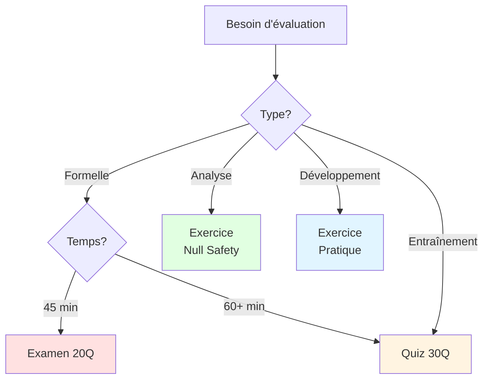

# Outils d'Évaluation - Guide Rapide pour Professeurs

## Vue d'ensemble

4 outils d'évaluation différents disponibles selon vos besoins.

---

## Comparaison des outils

| Outil | Type | Durée | Points | Niveau | Utilisation |
|-------|------|-------|--------|--------|-------------|
| **Examen 20Q** | QCM | 45 min | 20 pts | Facile | Évaluation formelle |
| **Quiz 30Q** | QCM mixte | 60 min | 60 pts | Mixte | Entraînement |
| **Null Safety** | Analyse code | 60 min | 20 pts | Moyen | Pratique avancée |
| **Développement** | Coder 3 apps | 90 min | 30 pts | Moyen | Compétences pratiques |

---

## OUTIL 1 : Examen 20 Questions

### Fichiers
- **Sujet** : [EXAMEN_STREAMBUILDER_20Q.md](EXAMEN_STREAMBUILDER_20Q.md)
- **Corrigé** : [EXAMEN_STREAMBUILDER_CORRIGE.md](EXAMEN_STREAMBUILDER_CORRIGE.md)

### Caractéristiques
- **Format** : QCM (4 choix par question)
- **Questions** : 20 questions faciles
- **Notation** : 1 point par question = 20 points
- **Durée** : 45 minutes
- **Niveau** : Débutant à Intermédiaire

### Structure
- Partie 1 : Concepts de base (7 questions)
- Partie 2 : Gestion des états (5 questions)
- Partie 3 : Code pratique (5 questions)
- Partie 4 : Firestore (3 questions)

### Quand l'utiliser ?
- Évaluation formelle mi-semestre
- Test de connaissances de base
- Certification niveau débutant
- Après 4 semaines de cours

### Points forts
- Correction rapide (grille fournie)
- Questions claires et directes
- Pas de piège
- Feuille de réponses incluse

---

## OUTIL 2 : Quiz 30 Questions

### Fichier
- **Sujet** : [03-quiz_streambuilder.md](03-quiz_streambuilder.md)

### Caractéristiques
- **Format** : QCM progressif
- **Questions** : 30 questions (10 facile + 10 moyen + 10 difficile)
- **Notation** : Facile=1pt, Moyen=2pts, Difficile=3pts = 60 points
- **Durée** : 60 minutes
- **Niveau** : Tous niveaux

### Structure
- Niveau 1 : Questions faciles (10 pts)
- Niveau 2 : Questions moyennes (20 pts)
- Niveau 3 : Questions difficiles (30 pts)

### Quand l'utiliser ?
- Entraînement personnel
- Révision avant examen
- Auto-évaluation
- Devoir à la maison

### Points forts
- Progressif (facile → difficile)
- Réponses détaillées
- 5 exercices pratiques bonus
- Identifie niveau précis

---

## OUTIL 3 : Exercice Null Safety

### Fichier
- **Sujet** : [EXERCICE_NULL_SAFETY.md](EXERCICE_NULL_SAFETY.md)

### Caractéristiques
- **Format** : Analyse de code
- **Codes** : 5 codes réels à analyser
- **Notation** : 4 points par code = 20 points
- **Durée** : 60 minutes
- **Niveau** : Intermédiaire

### Structure par code
1. Expliquer ce que fait le code
2. Interpréter les symboles (`?.`, `!`, `??`, `??=`)
3. Critiquer (bon ou mauvais ?)
4. Améliorer (proposer correction)

### Quand l'utiliser ?
- Après avoir vu null-safety
- Exercice pratique de debugging
- Évaluation compétences analytiques
- Préparation au code review

### Points forts
- Codes réels (pas théorique)
- Développe pensée critique
- Corrections détaillées
- Apprend à déboguer

---

## OUTIL 4 : Exercice Pratique Développement

### Fichier
- **Sujet** : [EXERCICE_PRATIQUE_DEVELOPPER.md](EXERCICE_PRATIQUE_DEVELOPPER.md)

### Caractéristiques
- **Format** : Développement de code
- **Exercices** : 3 applications à coder de zéro
- **Notation** : 10 points par app = 30 points
- **Durée** : 90 minutes
- **Niveau** : Intermédiaire

### Structure
- Partie 1 : Compteur avec Stream.periodic (10 pts)
- Partie 2 : Horloge digitale avec DateTime (10 pts)
- Partie 3 : Liste de tâches avec Firestore (10 pts)
- Bonus : 3 défis supplémentaires (7 pts)

### Quand l'utiliser ?
- Évaluation des compétences de codage
- Examen pratique en salle informatique
- Projet de fin de module
- Certification développeur

### Points forts
- Les étudiants CODENT vraiment
- Évalue compétences pratiques réelles
- Squelette de code fourni (guidance)
- Solutions complètes pour auto-correction
- Défis bonus pour étudiants avancés

---

## PROGRESSION PÉDAGOGIQUE

### Semaine 1-4 : Apprentissage
**Contenu** : Cours théorique + pratique
**Évaluation** : Aucune (apprentissage)

---

### Semaine 5 : Première évaluation
**Outil recommandé** : Examen 20Q
**Objectif** : Vérifier acquisition des bases
**Seuil** : 12/20 pour continuer

---

### Semaine 6-8 : Approfondissement
**Contenu** : Architecture, optimisation
**Évaluation** : Quiz 30Q en devoir maison

---

### Semaine 9 : Évaluation pratique
**Outil recommandé** : Exercice Null Safety
**Objectif** : Compétences de debugging
**Seuil** : 12/20

---

### Semaine 10-12 : Projet
**Évaluation** : Projet personnel
**Avec** : Études de cas pour décisions

---

## FORMATS D'UTILISATION

### Format 1 : Examen en classe
**Outil** : Examen 20Q
**Déroulement** :
1. Distribution du sujet (5 min)
2. Examen (45 min)
3. Ramassage des copies
4. Correction avec grille (30 min)
5. Retour aux étudiants (session suivante)

**Total** : 1h30 (dont 1h avec étudiants)

---

### Format 2 : Devoir maison
**Outil** : Quiz 30Q
**Déroulement** :
1. Distribution vendredi
2. Étudiants font chez eux (1 semaine)
3. Retour copies lundi suivant
4. Correction
5. Discussion en classe des questions difficiles

**Total** : 1 semaine

---

### Format 3 : Atelier pratique
**Outil** : Exercice Null Safety
**Déroulement** :
1. Travail en binômes (30 min)
2. Mise en commun (20 min)
3. Révélation réponses (10 min)
4. Discussion et débriefing (20 min)

**Total** : 1h20

---

## COMBINAISONS SUGGÉRÉES

### Évaluation complète (semestre)

**Mi-semestre** :
- Examen 20Q (coefficient 1)
- Quiz 30Q en devoir (coefficient 0.5)

**Fin de semestre** :
- Exercice Null Safety (coefficient 1)
- Projet personnel (coefficient 2)

**Note finale** : (Examen + 0.5×Quiz + NullSafety + 2×Projet) / 4.5

---

### Évaluation rapide (cours court)

**Séance 1-3** : Apprentissage  
**Séance 4** : Examen 20Q uniquement  
**Séance 5** : Correction et discussion

---

### Évaluation approfondie (cursus long)

**Mois 1** :
- Semaine 2 : Quiz 30Q (auto-évaluation)
- Semaine 4 : Examen 20Q (note)

**Mois 2** :
- Semaine 6 : Exercice Null Safety (note)
- Semaine 8 : Études de cas 06 (note)

**Mois 3** :
- Projet final avec présentation

---

## GRILLE COMPARATIVE

### Par difficulté

```
Facile          Moyen           Difficile
  ↓               ↓                 ↓
Examen 20Q    Quiz 30Q    Exercice Null Safety
  45 min        60 min           60 min
```

### Par compétence évaluée

| Compétence | Examen 20Q | Quiz 30Q | Null Safety | Développement |
|------------|-----------|----------|-------------|---------------|
| Concepts théoriques | ✅✅✅ | ✅✅ | ✅ | ✅ |
| Gestion d'états | ✅✅ | ✅✅✅ | ✅✅ | ✅✅✅ |
| Lecture de code | ✅✅ | ✅✅ | ✅✅✅ | ✅✅ |
| Debugging | ✅ | ✅✅ | ✅✅✅ | ✅✅✅ |
| Code review | ❌ | ✅ | ✅✅✅ | ✅ |
| Amélioration code | ❌ | ✅ | ✅✅✅ | ✅✅ |
| Écrire du code | ❌ | ❌ | ❌ | ✅✅✅ |
| Créer Stream | ❌ | ❌ | ❌ | ✅✅✅ |
| Utiliser Firestore | ❌ | ✅ | ✅ | ✅✅✅ |

---

## UTILISATION COMBINÉE

### Scénario : Classe de 30 étudiants

**Semaine 4 : Examen 20Q**
- En classe, surveillé
- Tous les étudiants
- Note officielle

**Résultats** :
- 20 étudiants : >12/20 (passent)
- 10 étudiants : <12/20 (rattrapage)

**Semaine 5 : Différenciation**

**Groupe A** (20 étudiants ayant réussi) :
- Exercice Null Safety en autonomie
- Projet avancé

**Groupe B** (10 étudiants en difficulté) :
- Révision avec Quiz 30Q (guidé)
- Tutorat
- Examen de rattrapage semaine 6

---

## ADAPTATION SELON CONTEXTE

### Cours intensif (1 semaine)
**Jour 1-3** : Cours  
**Jour 4** : Examen 20Q  
**Jour 5** : Correction + Quiz 30Q (optionnel maison)

---

### Cours standard (semestre)
**Semaine 1-4** : Cours + pratique  
**Semaine 5** : Examen 20Q  
**Semaine 6-8** : Approfondissement  
**Semaine 9** : Exercice Null Safety  
**Semaine 10-12** : Projet  
**Semaine 13** : Études de cas + débat  
**Semaine 14** : Présentation projets

---

### Formation professionnelle (2 jours)
**Jour 1 matin** : Théorie  
**Jour 1 après-midi** : Pratique + Examen 20Q  
**Jour 2 matin** : Correction + Exercice Null Safety  
**Jour 2 après-midi** : Études de cas + débat architecture

---

## RESSOURCES ASSOCIÉES

### Pour l'Examen 20Q
- Corrigé : EXAMEN_STREAMBUILDER_CORRIGE.md
- Révision : 02-explication_streambuilder.md

### Pour le Quiz 30Q
- Révision : 02-explication_streambuilder.md + 01-arbre_widgets.md
- Approfondissement : 04-navigation_view_all.md

### Pour Exercice Null Safety
- Théorie : 02-explication_streambuilder.md (section bonnes pratiques)
- Exemples : Tous les documents de code
- Discussion : En classe après l'exercice

---

## CONSEILS PRATIQUES

### Avant l'évaluation
- Annoncer 1 semaine à l'avance
- Donner documents de révision
- Session Q&R la veille
- Vérifier que tous ont accès aux documents

### Pendant l'évaluation
- Examen 20Q : Surveillé, sans documents
- Quiz 30Q : Peut être fait maison
- Null Safety : Peut être en binômes

### Après l'évaluation
- Correction rapide (48h max)
- Discussion des questions ratées
- Identifier patterns d'erreurs
- Adapter cours futur

---

## STATISTIQUES ATTENDUES

### Examen 20Q (après cours normal)
- Moyenne attendue : 14-15/20
- Écart-type : 3-4 points
- Taux de réussite : 70-80%

### Quiz 30Q (devoir maison)
- Moyenne attendue : 40-45/60
- Écart-type : 8-10 points
- Taux de réussite : 65-75%

### Exercice Null Safety (plus difficile)
- Moyenne attendue : 12-14/20
- Écart-type : 4-5 points
- Taux de réussite : 60-70%

---

## CHECKLIST ORGANISATION

### Pour Examen 20Q
- [ ] Imprimer copies (30 + 3 de réserve)
- [ ] Préparer feuilles de réponses
- [ ] Timer visible (45 min)
- [ ] Salle arrangée (espacement)
- [ ] Grille de correction imprimée

### Pour Quiz 30Q
- [ ] Envoyer lien/fichier aux étudiants
- [ ] Date limite claire
- [ ] Format de rendu défini
- [ ] Plagiat : rappeler règles

### Pour Exercice Null Safety
- [ ] Décider : individuel ou binômes
- [ ] Préparer tableau blanc pour discussion
- [ ] Avoir projecteur pour montrer codes
- [ ] Prévoir 20 min discussion après

---

## RÉCAPITULATIF RAPIDE

```
┌─────────────────────────────────────────┐
│    CHOISIR LE BON OUTIL D'ÉVALUATION    │
└─────────────────────────────────────────┘

Évaluation formelle rapide ?
    → Examen 20Q (45 min)

Entraînement complet ?
    → Quiz 30Q (60 min)

Analyse de code ?
    → Exercice Null Safety (60 min)

Compétences de développement ?
    → Exercice Pratique (90 min)

Tout évaluer ?
    → Les 4 combinés (3-4 semaines)
```

---

## TABLEAU DE DÉCISION



---

**Guide créé pour faciliter le choix et l'utilisation des outils d'évaluation**  
*4 outils complémentaires pour évaluer StreamBuilder à tous les niveaux*

