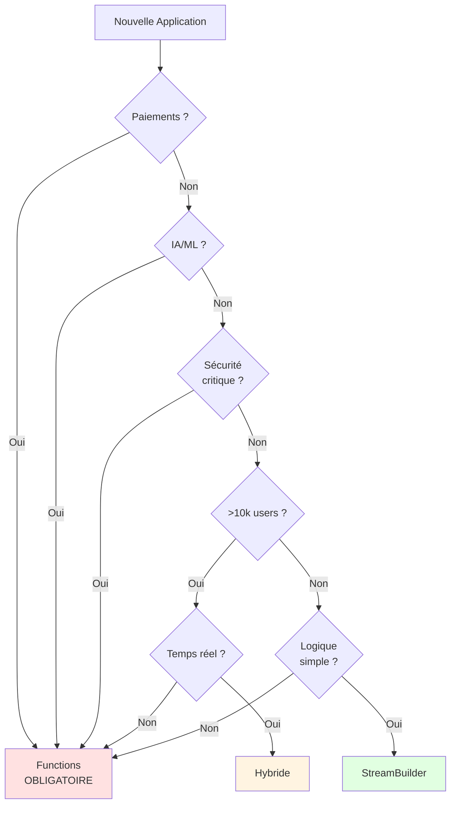

# Synthèse Rapide : Les 15 Études de Cas

## Référence Ultra-Rapide

### StreamBuilder Direct (3 cas - 20%)

| Cas | Raison principale | Complexité |
|-----|-------------------|------------|
| 1. TodoList Collaborative | Temps réel simple | ★☆☆☆☆ |
| 3. App Recettes | Apprentissage | ★☆☆☆☆ |
| 7. Portfolio | Très simple | ★☆☆☆☆ |

---

### Approche Hybride (4 cas - 27%)

| Cas | StreamBuilder pour | Functions pour | Complexité |
|-----|-------------------|----------------|------------|
| 5. Réseau Social | Feed, chat | Modération, recherche géo | ★★★☆☆ |
| 9. Météo | Signalements | Agrégations zones | ★★★☆☆ |
| 11. App Rencontre | Chat | Matching, likes, modération | ★★★★☆ |
| 12. Livraison | Tracking livreur | Attribution, paiements | ★★★★☆ |

---

### Firebase Functions (8 cas - 53%)

| Cas | Raison principale | Complexité |
|-----|-------------------|------------|
| 2. Marketplace | Paiements sécurisés | ★★★★☆ |
| 4. App Bancaire | Sécurité CRITIQUE | ★★★★★ |
| 6. Fitness | IA et calculs complexes | ★★★★☆ |
| 8. E-learning | Certificats, quiz, analytics | ★★★★☆ |
| 10. Restaurants | Gestion conflits | ★★★★☆ |
| 13. Covoiturage | Split paiement | ★★★★☆ |
| 14. Streaming | IA, millions users | ★★★★★ |
| 15. Événements | QR uniques, anti-fraude | ★★★★☆ |

---

## Critères décisifs par cas

### Paiements = Functions OBLIGATOIRE
- Cas 2 : Marketplace
- Cas 4 : Bancaire
- Cas 6 : Fitness (abonnements)
- Cas 8 : E-learning
- Cas 11 : Rencontre (premium)
- Cas 12 : Livraison
- Cas 13 : Covoiturage
- Cas 15 : Événements

**Règle** : JAMAIS gérer paiements côté client

---

### Temps réel critique = StreamBuilder
- Cas 1 : TodoList (collaboration)
- Cas 5 : Réseau Social (feed)
- Cas 11 : Rencontre (chat)
- Cas 12 : Livraison (tracking)

**Règle** : StreamBuilder imbattable pour temps réel

---

### IA / ML = Functions
- Cas 6 : Fitness (plans personnalisés)
- Cas 11 : Rencontre (matching)
- Cas 14 : Streaming (recommandations)

**Règle** : Calculs lourds toujours côté serveur

---

### Transactions atomiques = Functions
- Cas 4 : Bancaire (virements)
- Cas 10 : Restaurants (réservations)
- Cas 12 : Livraison (attribution)
- Cas 13 : Covoiturage (réservations)
- Cas 15 : Événements (billets)

**Règle** : Conflits possibles = logique serveur

---

### Modération contenu = Functions
- Cas 5 : Réseau Social
- Cas 11 : Rencontre

**Règle** : Sécurité et conformité nécessitent serveur

---

## Diagramme : Quand utiliser quoi ?



---

## Exemples par industrie

### Social / Communication
- Cas 5 : Réseau Social (Hybride)
- Cas 11 : Rencontre (Hybride)
→ Temps réel + modération

### Commerce / Marketplace
- Cas 2 : Marketplace Services (Functions)
- Cas 10 : Restaurants (Functions)
- Cas 12 : Livraison (Hybride)
→ Paiements = Functions obligatoire

### Transport / Mobilité
- Cas 12 : Livraison (Hybride)
- Cas 13 : Covoiturage (Functions)
→ Géolocalisation + paiements

### Santé / Fitness
- Cas 6 : Fitness (Functions)
→ IA et calculs complexes

### Éducation
- Cas 1 : TodoList (StreamBuilder)
- Cas 8 : E-learning (Functions)
→ Simple vs complexe

### Divertissement
- Cas 14 : Streaming (Functions)
- Cas 15 : Événements (Functions)
→ Grande échelle nécessite Functions

### Personnel
- Cas 3 : Recettes (StreamBuilder)
- Cas 7 : Portfolio (StreamBuilder)
→ Simplicité d'abord

---

## Cas par difficulté

### Niveau 1 - Débutant (★☆☆☆☆)
- Cas 1 : TodoList
- Cas 3 : App Recettes
- Cas 7 : Portfolio

**Utilisez pour** : Introduction, premiers exercices

---

### Niveau 2 - Intermédiaire (★★★☆☆)
- Cas 5 : Réseau Social
- Cas 9 : Météo

**Utilisez pour** : Approche hybride, compromis

---

### Niveau 3 - Avancé (★★★★☆)
- Cas 2 : Marketplace
- Cas 6 : Fitness
- Cas 8 : E-learning
- Cas 10 : Restaurants
- Cas 11 : Rencontre
- Cas 12 : Livraison
- Cas 13 : Covoiturage
- Cas 15 : Événements

**Utilisez pour** : Évaluations, projets finaux

---

### Niveau 4 - Expert (★★★★★)
- Cas 4 : App Bancaire
- Cas 14 : Streaming Musical

**Utilisez pour** : Cas extrêmes, discussions avancées

---

## Sélection rapide pour exercice en classe

### Exercice court (30 min) - Choisir 3 cas
**Suggestion** :
1. Cas 3 (Recettes) - Simple
2. Cas 5 (Réseau Social) - Hybride
3. Cas 4 (Bancaire) - Complexe

**Objectif** : Voir la progression simple → complexe

---

### Exercice moyen (60 min) - Choisir 6 cas
**Suggestion** :
1. Cas 1 (TodoList) - StreamBuilder
2. Cas 7 (Portfolio) - StreamBuilder
3. Cas 5 (Réseau Social) - Hybride
4. Cas 11 (Rencontre) - Hybride
5. Cas 2 (Marketplace) - Functions
6. Cas 4 (Bancaire) - Functions

**Objectif** : Couvrir les 3 approches

---

### Exercice complet (90 min) - Choisir 10 cas
**Suggestion** :
1-7 : Cas originaux (1, 2, 3, 4, 5, 7, 8)
8-10 : Nouveaux cas intéressants (11, 12, 14)

**Objectif** : Analyse approfondie avec variété

---

### Examen (45 min) - Format suggéré

**Partie 1 : QCM (15 min)**
- 5 cas en choix multiple
- Cas suggérés : 1, 3, 4, 7, 11
- 1 point par bonne réponse

**Partie 2 : Analyse détaillée (30 min)**
- 1 cas parmi 2 au choix
- Cas suggérés : 11 (Rencontre) ou 12 (Livraison)
- Justification complète requise

---

## Points de discussion par nouveau cas

### Cas 11 : Application de Rencontre

**Questions à poser** :
- Pourquoi pas tout StreamBuilder si on veut du temps réel ?
- Où mettre la limite de 50 swipes/jour ?
- Comment éviter qu'un utilisateur triche avec les likes ?

**Débat** : "L'algorithme de matching pourrait être côté client"
**Contre-argument** : Sécurité, tricherie, optimisation

---

### Cas 12 : Livraison de Nourriture

**Questions à poser** :
- Peut-on attribuer le livreur côté client ?
- Pourquoi le tracking DOIT être temps réel ?
- Commission calculée où et pourquoi ?

**Débat** : "StreamBuilder suffit pour tout"
**Contre-argument** : Paiements, optimisation livreur

---

### Cas 13 : Covoiturage

**Questions à poser** :
- Qu'est-ce qu'un split de paiement ?
- Pourquoi vérification documents côté serveur ?
- Recherche de trajets : complexité ?

**Point clé** : Aspect légal (transport personnes)

---

### Cas 14 : Streaming Musical

**Questions à poser** :
- Peut-on gérer millions de chansons avec StreamBuilder ?
- Recommandations IA : pourquoi serveur ?
- Mode hors ligne : comment synchroniser ?

**Débat** : "Spotify utilise sûrement Functions"
**Réponse** : Architecture complexe (CDN + Functions + Cache)

---

### Cas 15 : Gestion d'Événements

**Questions à poser** :
- Comment éviter qu'un billet soit scanné 2 fois ?
- QR code unique : généré où ?
- Transaction atomique : c'est quoi ?

**Point clé** : Anti-fraude critique pour billets

---

## Résumé statistique

### Répartition des réponses (15 cas)

```
StreamBuilder Direct : 20% (3/15)
├─ Applications simples
├─ Contexte apprentissage
└─ Petit dataset

Approche Hybride : 27% (4/15)
├─ Temps réel + logique complexe
├─ Scale moyenne
└─ Optimisation coûts

Firebase Functions : 53% (8/15)
├─ Paiements
├─ Grande échelle
├─ IA/ML
└─ Sécurité critique
```

**Tendance claire** : Plus de 50% des applications réelles nécessitent Functions

**Mais** : Pour apprendre, commencez avec les 20% StreamBuilder !

---

## Utilisation en débat

### Sujet de débat suggéré

**Affirmation** : "On devrait toujours utiliser Firebase Functions en production"

**Pour** (utiliser cas 2, 4, 6, 8, 13, 14, 15) :
- 53% des cas nécessitent Functions
- Sécurité
- Scalabilité
- Paiements

**Contre** (utiliser cas 1, 3, 7) :
- 20% suffisent avec StreamBuilder
- Complexité inutile pour apps simples
- Coût de développement
- Sur-engineering

**Conclusion** : Dépend du contexte (montrer grille d'analyse)

---

## Cas similaires à comparer

### Comparaison 1 : App simple vs complexe
- Cas 3 (Recettes) vs Cas 8 (E-learning)
- Même concept (contenu éducatif)
- Différence : certificats, paiements, quiz

### Comparaison 2 : Deux approches hybrides
- Cas 11 (Rencontre) vs Cas 12 (Livraison)
- Tous deux hybrides
- Différence : Matching vs Attribution livreur

### Comparaison 3 : Sécurité maximale
- Cas 4 (Bancaire) vs Cas 14 (Streaming)
- Tous deux Functions obligatoire
- Différence : Légal vs Scale

---

## Checklist rapide pour choisir

### StreamBuilder Direct si TOUS vrais :
- [ ] Logique métier simple
- [ ] Pas de paiements
- [ ] Dataset < 10k documents
- [ ] Pas d'IA/ML
- [ ] Pas d'agrégations complexes
- [ ] Budget très limité
- [ ] Temps réel important

**Si UN seul est faux → Considérer Functions**

---

### Functions si UN seul vrai :
- [ ] Paiements nécessaires
- [ ] Sécurité critique
- [ ] >10k utilisateurs prévus
- [ ] IA/ML nécessaire
- [ ] Agrégations complexes
- [ ] Intégrations multiples
- [ ] Conformité réglementaire

**Si plusieurs vrais → Functions OBLIGATOIRE**

---

## Pour aller plus loin

### Document complet
Voir [06-etudes_de_cas_pratiques.md](06-etudes_de_cas_pratiques.md) pour :
- Descriptions détaillées
- Réponses complètes
- Code d'exemple
- Justifications approfondies

### Guide professeur
Voir [GUIDE_PROFESSEUR.md](GUIDE_PROFESSEUR.md) pour :
- Comment utiliser en classe
- Formats d'exercice
- Grilles d'évaluation

---

**Synthèse rapide des 15 études de cas**  
*Référence ultra-rapide pour révision et aide-mémoire*

