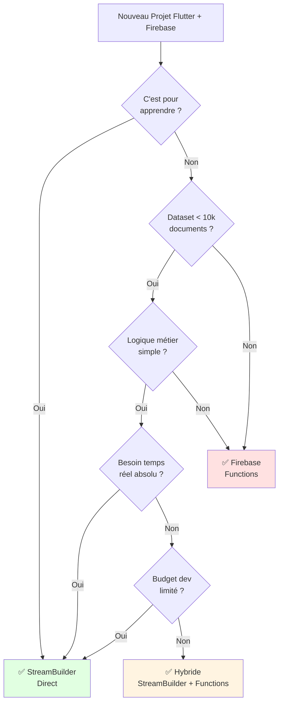

# Décision Rapide : Quelle Architecture Choisir ?

## Question simple

**Dois-je utiliser StreamBuilder Direct ou Firebase Functions ?**

---

## Flowchart de décision

---

## Tableau de décision ultra-rapide

| Votre situation | Recommandation |
|----------------|----------------|
| Étudiant | StreamBuilder Direct ✅ |
| MVP / Prototype | StreamBuilder Direct ✅ |
| < 1,000 utilisateurs | StreamBuilder Direct ✅ |
| Chat / Temps réel critique | StreamBuilder Direct ✅ |
| Portfolio / Blog | StreamBuilder Direct ✅ |
| | |
| > 10,000 utilisateurs | Firebase Functions ✅ |
| E-commerce | Firebase Functions ✅ |
| Validation complexe | Firebase Functions ✅ |
| Application bancaire | Firebase Functions ✅ |
| Agrégations/Stats | Firebase Functions ✅ |
| | |
| Startup qui scale | Hybride ✅ |
| Réseau social | Hybride ✅ |

---

## Réponse en 30 secondes

### Utilisez StreamBuilder Direct si :
- Vous apprenez
- Projet simple
- Besoin de rapidité
- Temps réel essentiel

### Utilisez Firebase Functions si :
- Production à grande échelle
- Logique métier complexe
- Sécurité critique
- Agrégations nécessaires

### Utilisez Hybride si :
- Application qui commence à scaler
- Besoin de temps réel ET logique complexe
- Budget disponible

---

## Phrase clé

**"Start simple, scale when needed"**

Commencez avec StreamBuilder.  
Ajoutez Functions quand vous en avez vraiment besoin.

---

## Pour en savoir plus

Lisez la documentation complète :  
**[05-approche_critique_firebase_functions.md](05-approche_critique_firebase_functions.md)**

40 minutes de lecture avec :
- Analyse comparative détaillée
- Exemples de code complets
- Analyse des coûts
- Stratégie de migration

---

**Décision rapide pour votre architecture Flutter + Firebase**

