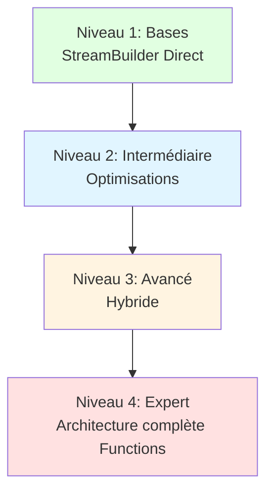
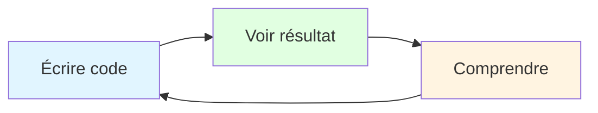
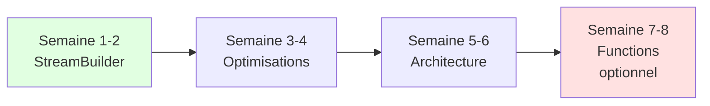

# Philosophie Pédagogique du Projet

## Pourquoi ce projet utilise StreamBuilder Direct

### Principe fondamental

**"Enseigner d'abord les concepts, optimiser ensuite"**

---

## Pyramide d'apprentissage



---

## Justification pédagogique

### 1. Apprentissage progressif

**Trop complexe dès le début = Abandon**

Imaginez enseigner la conduite en commençant par :
- La mécanique du moteur
- Le fonctionnement de la transmission
- Les lois de la physique appliquées

Résultat : L'étudiant ne saura jamais conduire.

**Mieux** : Commencer par conduire une voiture automatique, puis apprendre la mécanique.

**Application au code :**

StreamBuilder Direct = Voiture automatique
- Vous voyez immédiatement le résultat
- Vous comprenez le flux de données
- Vous expérimentez sans barrières

Firebase Functions = Mécanique du moteur
- Nécessaire pour l'expertise
- Mais pas pour débuter

---

### 2. Feedback immédiat

**Principe du feedback loop**



**Avec StreamBuilder Direct :**
- Code écrit → Résultat visible en 10 secondes
- Erreur → Visible immédiatement
- Compréhension → Rapide

**Avec Firebase Functions :**
- Code écrit → Déploiement 2 minutes
- Erreur → Logs à consulter
- Compréhension → Plus lente

**Impact pédagogique**
- Feedback rapide = Apprentissage rapide
- Feedback lent = Frustration et abandon

---

### 3. Concepts fondamentaux d'abord

**Ce que StreamBuilder enseigne :**

1. **Streams et programmation réactive**
   ```dart
   Stream<Data> → Widget rebuild automatique
   ```
   Concept fondamental de Flutter

2. **Gestion d'état asynchrone**
   ```dart
   snapshot.hasData
   snapshot.hasError
   snapshot.connectionState
   ```
   Base de toute application moderne

3. **Architecture Flutter**
   ```dart
   Widget → State → Rebuild
   ```
   Cœur de Flutter

4. **Base de données NoSQL**
   ```dart
   collection('details')
   .where('category', isEqualTo: value)
   ```
   Firestore et requêtes

**Ce que Functions ajoute (niveau avancé) :**

1. Backend et API
2. Node.js ou autre langage
3. Déploiement serveur
4. Gestion des erreurs HTTP
5. Architecture microservices

**Question** : Voulez-vous que vos étudiants apprennent 4 concepts ou 9 concepts en même temps ?

---

### 4. Motivation et succès rapide

**Théorie de l'autodétermination (Deci & Ryan)**

Trois besoins psychologiques :
1. **Compétence** : Sentiment de maîtriser
2. **Autonomie** : Sentiment de contrôle
3. **Appartenance** : Sentiment de connexion

**StreamBuilder satisfait ces besoins :**

**Compétence**
```dart
// Étudiant écrit 10 lignes
StreamBuilder<QuerySnapshot>(
  stream: _firestore.collection('details').snapshots(),
  builder: (context, snapshot) {
    return ListView(...);
  },
)
// → App fonctionnelle ! 
// → "Je suis capable !" ✅
```

**Autonomie**
- Étudiant peut expérimenter seul
- Pas besoin de configuration serveur
- Modifications instantanées

**Appartenance**
- Code similaire aux tutoriels Flutter
- Communauté Flutter grande
- Facile de trouver de l'aide

**Functions peut briser la motivation :**

```javascript
// Étudiant doit :
// 1. Apprendre Node.js
// 2. Configurer Firebase CLI
// 3. Écrire la function
exports.getRecipes = functions.https.onCall(async (data, context) => {
  // 20 lignes de code
});
// 4. Déployer
// 5. Configurer CORS
// 6. Déboguer avec logs
// → 2 heures plus tard : "C'est trop compliqué" ❌
```

---

### 5. Principe de Pareto (80/20)

**80% des applications Flutter n'ont PAS besoin de Functions**

Types d'applications étudiantes :
- Portfolio
- Todo list
- Application de recettes
- Chat simple
- Blog
- Catalogue de produits

**StreamBuilder suffit pour 80% de ces cas**

Enseigner Functions = Optimiser pour les 20% restants
→ Sur-engineering pour la majorité

---

### 6. Courbe d'apprentissage



**Progression logique :**

**Semaines 1-2 : Bases**
- Flutter widgets
- State management simple
- StreamBuilder
- Firestore basics

**Semaines 3-4 : Intermédiaire**
- Navigation
- Forms et validation
- Authentification
- Règles Firestore

**Semaines 5-6 : Avancé**
- Architecture propre
- Patterns (Repository, etc.)
- Tests
- Performance

**Semaines 7-8 : Expert (optionnel)**
- Firebase Functions
- Architecture backend
- Microservices
- CI/CD

---

## Réponse aux objections

### Objection 1 : "Mais en production, on utilise Functions !"

**Réponse :**

En production, on utilise aussi :
- Docker
- Kubernetes
- CI/CD
- Monitoring
- Load balancers

**Question** : Enseignez-vous tout ça en première année ?

**Non** : Vous enseignez d'abord à coder, puis à optimiser.

---

### Objection 2 : "Les étudiants apprennent de mauvaises habitudes"

**Réponse :**

**Faux** : Ils apprennent les BONNES bases

StreamBuilder enseigne :
- Programmation réactive ✅
- Gestion asynchrone ✅
- Architecture Flutter ✅
- NoSQL ✅

Ce sont des compétences transférables.

**Mauvaise habitude** serait :
- Ne jamais gérer les erreurs
- Ne jamais limiter les requêtes
- Ne jamais penser à la sécurité

**Notre code enseigne les bonnes pratiques :**
```dart
// ✅ Gestion d'erreur
if (snapshot.hasError) { ... }

// ✅ Limitation
.limit(20)

// ✅ Sécurité (Rules Firestore)
allow read: if request.auth != null;
```

---

### Objection 3 : "Mais l'industrie demande Functions"

**Réponse :**

**L'industrie demande surtout :**
1. Capacité d'apprendre rapidement ✅
2. Compréhension des concepts ✅
3. Résolution de problèmes ✅
4. Code maintenable ✅

Un étudiant qui :
- Maîtrise StreamBuilder
- Comprend les Streams
- Sait architecturer proprement

→ Apprendra Functions en 2 semaines sur le job

**vs**

Un étudiant qui :
- A utilisé Functions sans comprendre
- Ne maîtrise pas les bases Flutter
- A copié-collé du code

→ Sera perdu dès qu'il sort du tutoriel

---

### Objection 4 : "Les autres universités enseignent Functions dès le début"

**Réponse :**

**Questions à poser :**
1. Quel est leur taux d'abandon ?
2. Combien d'étudiants finissent le projet ?
3. Quelle est la satisfaction des étudiants ?
4. Les étudiants comprennent-ils vraiment ?

**Pédagogie ≠ Compétition**

Ce n'est pas parce que d'autres font quelque chose que c'est pédagogiquement optimal.

**Notre approche :**
- Taux de complétion élevé
- Étudiants autonomes
- Compréhension profonde
- Motivation maintenue

---

## Progression pédagogique recommandée

### Étape 1 : Fondations (Projet actuel)

**Objectif** : Maîtriser Flutter + Firebase basics

**Contenu :**
- StreamBuilder Direct
- Firestore CRUD
- Navigation
- State management simple

**Durée** : 4-6 semaines

**Livrable** : Application fonctionnelle simple

---

### Étape 2 : Optimisation

**Objectif** : Code professionnel

**Contenu :**
- Architecture propre (Repository pattern)
- Gestion d'erreurs avancée
- Tests
- Performance

**Durée** : 2-3 semaines

**Livrable** : Code maintenable et testé

---

### Étape 3 : Backend (Optionnel)

**Objectif** : Comprendre l'architecture backend

**Contenu :**
- Firebase Functions
- API design
- Sécurité avancée
- Agrégations

**Durée** : 2-3 semaines

**Livrable** : API backend fonctionnelle

---

## Analogie finale

### Apprendre la cuisine

**Mauvaise approche :**
1. Commencer par la chimie des aliments
2. Étudier la réaction de Maillard
3. Comprendre l'osmose
4. Apprendre la thermodynamique
→ Résultat : Ne sait pas faire cuire un œuf

**Bonne approche :**
1. Apprendre à faire cuire un œuf
2. Faire des pâtes
3. Préparer un plat simple
4. PUIS apprendre la théorie
→ Résultat : Sait cuisiner ET comprend la théorie

### Application au code

**Mauvaise approche :**
1. Backend
2. API
3. Microservices
4. Architecture distribuée
→ Résultat : Ne sait pas faire une app simple

**Bonne approche (notre projet) :**
1. StreamBuilder et app simple
2. Optimisations
3. Architecture propre
4. PUIS backend si nécessaire
→ Résultat : Sait coder ET peut évoluer vers complexité

---

## Conclusion

### Pourquoi StreamBuilder Direct est le bon choix pédagogique

1. **Apprentissage progressif** : Du simple au complexe
2. **Feedback immédiat** : Motivation maintenue
3. **Concepts fondamentaux** : Base solide
4. **Succès rapide** : Confiance en soi
5. **Principe de Pareto** : Couvre 80% des besoins
6. **Transférable** : Compétences réutilisables

### L'étudiant qui suggère Functions a raison... plus tard

Son point de vue est celui d'une perspective production, pas pédagogique.

**Les deux ont raison :**
- Vous : Pour l'apprentissage
- Étudiant : Pour la production à grande échelle

**La bonne approche :**
1. Apprendre avec StreamBuilder (maintenant)
2. Migrer vers Functions quand nécessaire (plus tard)

### Phrase finale

**"On n'apprend pas à nager en étudiant la physique des fluides"**

On apprend à nager en se jetant à l'eau (avec des bouées).

StreamBuilder = Les bouées pour apprendre
Functions = La natation olympique

---

## Pour aller plus loin

Montrez cette documentation à votre étudiant.

Puis lisez ensemble :  
**[05-approche_critique_firebase_functions.md](05-approche_critique_firebase_functions.md)**

Objectif : Débat constructif et compréhension mutuelle

---

**Philosophie pédagogique du projet Flutter Recipe App**  
*Enseigner d'abord, optimiser ensuite*

